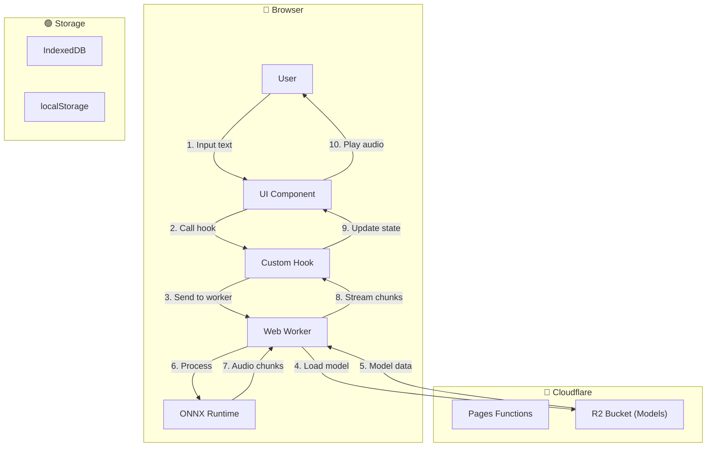

# SDLC Builder Skill (TTS Project)

> This skill helps AI agents create feature specifications for the TTS Project
> Project following the Spec-Driven Development (SDD) methodology.

---

## 🎯 Purpose

This skill enables the AI agent to:

1. **Create structured feature specifications** following the SDLC framework
2. **Run effective brainstorming sessions** with human stakeholders
3. **Maintain consistency** across all feature specs
4. **Follow the AI-DLC workflow** (Bolts, Mob Elaboration, Mob Construction,
   Verification)

---

## 📋 When to Use This Skill

Use this skill when:

- ✅ Creating a **new feature** (TTS generation, model loading, audio playback)
- ✅ Adding **significant functionality** to existing feature
- ✅ Creating a **bug fix** that requires architectural changes
- ✅ Planning **refactoring** that affects multiple modules
- ✅ Designing **API changes** or new integrations

**Do NOT use** for:

- ❌ Small bug fixes (just fix directly)
- ❌ Documentation updates only
- ❌ Minor UI/text changes
- ❌ Adding comments or JSDoc

---

## 🔄 SDLC Workflow

### Step 1: Understand Context

Before creating any spec, always:

```
1. Read .sdlc/AGENTS.md - Understand AI agent boundaries
2. Read .sdlc/context/architecture.md - Understand TTS system architecture
3. Read .sdlc/context/conventions.md - Understand Next.js + vertical slice patterns
4. Read .sdlc/context/security.md - Understand client-side security requirements
```

### Step 2: Create Spec Structure

Create the following folder structure for each new feature:

```
.sdlc/specs/REQ-XXX-{feature-name}/
├── SPEC.md                    # Main specification document
├── decisions/
│   └── ADR-001-{topic}.md    # Architecture Decision Records
└── notes/
    └── meeting-001-{topic}.md # Meeting notes & brainstorming
```

### Step 3: Fill Template

Use `.sdlc/templates/feature-spec.md` as the base template. Required sections:

1. **Metadata** - Feature ID, name, status, priority, owner
2. **Mermaid Data Flow** - **REQUIRED** - Quick visual flow at the top of spec
3. **Overview** - Problem statement, goals, non-goals
4. **User Stories** - At least 2-3 stories with acceptance criteria
5. **Technical Design** - Component structure, state management, API design
6. **Flow Diagrams** - Main flow, error flow
7. **Edge Cases** - At least 5 common edge cases
8. **Security** - Input validation, model loading, content safety
9. **Testing Strategy** - Component tests, integration tests
10. **Dependencies** - Internal and external

---

## 🔀 Mermaid Chart Requirement

### Why Mermaid?

- **Human can understand instantly** - No need to read through all details
- **Quick context** - See the big picture before diving in
- **Visual validation** - Easier to spot missing steps or wrong flows

### Required Mermaid Elements

Every spec MUST include a Mermaid flowchart at the TOP (after Metadata section).
Use the client-side TTS flow pattern:



### Styling Legend

| Box Color | Meaning                                        |
| --------- | ---------------------------------------------- |
| Blue      | Actor/Client/External                          |
| Purple    | Internal Layer (Component/Hook/Service/Worker) |
| Green     | Storage (IndexedDB/localStorage/R2)            |
| Red       | Error/Exception                                |

### When Adding Mermaid

- ✅ Add AFTER Metadata section
- ✅ Include all actors in the flow (User → UI → Worker → ONNX → R2)
- ✅ Show data flow direction
- ✅ Include external integrations if any (Cloudflare R2, Genation SDK)
- ✅ Add legend explaining box colors

---

## 💡 Brainstorming Guide

### Before Brainstorming

**Agent must prepare:**

- [ ] Draft SPEC.md with all known information
- [ ] List specific questions needing human input
- [ ] Identify areas with ambiguity
- [ ] Prepare comparison options if needed

### Brainstorming Format

**Start with this template:**

```
## 🎯 Brainstorming Session: {Feature Name}

### Context
[Brief description of what we're building and why]

### AI's Current Understanding
1. [What I understand about the feature]
2. [What I understand about the technical requirements]

### Questions for Human

#### Question 1: [Specific question]
- Context: [Why this is important]
- Options considered: [If any]
- Need: [What specifically I need to know]

#### Question 2: [Specific question]
...

### Technical Considerations

| Aspect | My Suggestion | Need Validation |
|--------|--------------|-----------------|
| [Aspect 1] | [Suggestion] | [Yes/No] |
| [Aspect 2] | [Suggestion] | [Yes/No] |

### Next Steps (after human responds)
- [ ] Update SPEC.md with decisions
- [ ] Validate technical approach
- [ ] Proceed to implementation
```

### During Brainstorming

**AI should:**

- ✅ Ask **specific, focused questions** (not vague)
- ✅ Provide **options** when appropriate
- ✅ **Listen actively** to human responses
- ✅ **Summarize** key decisions made
- ✅ **Confirm understanding** before proceeding

**AI should NOT:**

- ❌ Ask too many questions at once (limit to 5-7)
- ❌ Ask questions already answered in docs
- ❌ Make assumptions without validation
- ❌ Push for implementation before alignment

### After Brainstorming

**AI must:**

1. Update SPEC.md with all decisions
2. Create ADR if significant architectural decision was made
3. Document meeting notes
4. Confirm next steps with human

---

## 📝 Spec Quality Checklist

Before marking spec as "Ready for Implementation", verify:

- [ ] **Feature ID** assigned (REQ-XXX format)
- [ ] **Mermaid Data Flow** included at top (after Metadata)
- [ ] **Problem Statement** clear and specific
- [ ] **Goals** measurable and achievable
- [ ] **User Stories** have clear acceptance criteria (checkboxes)
- [ ] **Component Structure** defined (features/{feature}/)
- [ ] **State Management** documented
- [ ] **API Design** defined (if needed)
- [ ] **Flow Diagrams** included
- [ ] **Edge Cases** cover at least 5 scenarios
- [ ] **Security** considerations addressed
- [ ] **Testing Strategy** defined
- [ ] **Dependencies** documented
- [ ] **Definition of Done** clear

---

## 🔗 Quick Reference

| Need             | Go To                             |
| ---------------- | --------------------------------- |
| Feature template | `.sdlc/templates/feature-spec.md` |
| PR template      | `.sdlc/templates/pull-request.md` |
| Architecture     | `.sdlc/context/architecture.md`   |
| Conventions      | `.sdlc/context/conventions.md`    |
| Security         | `.sdlc/context/security.md`       |
| Agent guidelines | `.sdlc/AGENTS.md`                 |

---

## 🚀 Starting a New Feature

When human asks to create a new feature, follow this workflow:

### Phase 1: Discovery (Agent does alone)

```
 the feature request with human
2. Explore codebase for similar features
3.1. Clarify Read relevant context docs
4. Create initial SPEC.md draft
5. Identify gaps and questions
```

### Phase 2: Mob Elaboration (with Human)

```
1. Present initial understanding to human
2. Ask clarifying questions
3. Discuss technical approach
4. Validate assumptions
5. Document decisions
```

### Phase 3: Refinement (Agent does alone)

```
1. Update SPEC.md with all decisions
2. Create necessary ADRs
3. Prepare implementation plan
4. Present final spec to human for approval
```

### Phase 4: Implementation (after approval)

```
1. Human approves SPEC.md
2. Agent proceeds with implementation
3. Follow conventions in .sdlc/context/
4. Write tests alongside code
5. Create PR with all required info
```

---

## 📌 Remember

> **Spec first, code second** - A well-written spec prevents costly rewrites

> **Ask, don't assume** - When in doubt, clarify with human

> **Follow the format** - Consistency makes specs searchable and maintainable

> **Client-side first** - This is a browser-based TTS app, not server-side
