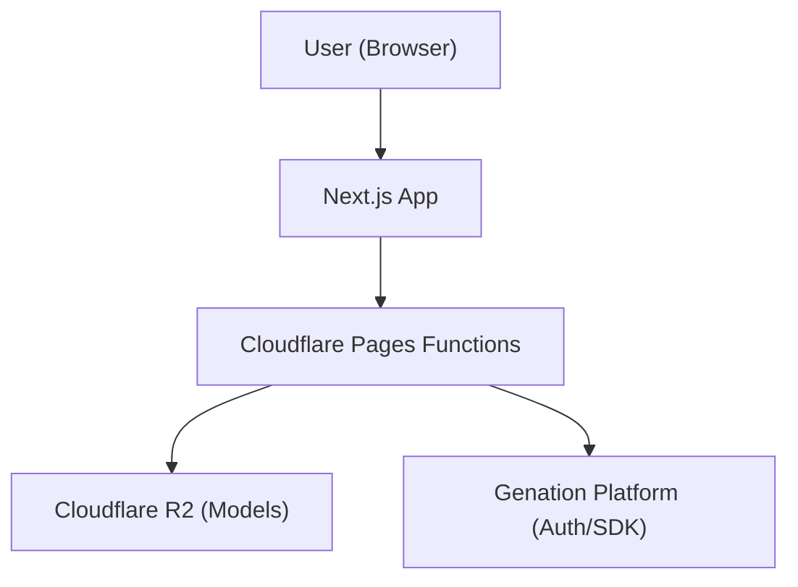
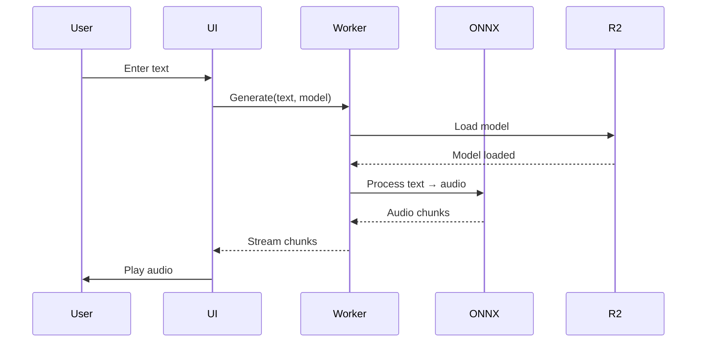

# Architecture Context - TTS App (Next.js)

> **Important**: Read this file before designing any feature for TTS Intern
> Project.

---

## 🎯 Project Overview

| Aspect           | Details                                            |
| ---------------- | -------------------------------------------------- |
| **Project Type** | Web Application (Client-side TTS)                  |
| **Framework**    | Next.js (App Router)                               |
| **Deployment**   | Cloudflare Pages + R2                              |
| **Target**       | Browser-based Text-to-Speech for Vietnamese        |
| **Reference**    | [nghists](https://github.com/nghimestudio/nghitts) |

---

## 🏗️ System Architecture

### High-Level Architecture



### Tech Stack

| Layer      | Technology                     |
| ---------- | ------------------------------ |
| Frontend   | Next.js 16 (App Router), React |
| Styling    | Tailwind CSS                   |
| State      | Zustand / React Context        |
| TTS Engine | Piper TTS (ONNX)               |
| Runtime    | ONNX Runtime Web (WASM)        |
| Storage    | Cloudflare R2                  |
| Edge       | Cloudflare Pages Functions     |
| Auth       | Genation SDK (simple login)    |

---

## 📁 Project Structure (Vertical Slice)

```
src/
├── app/                    # Next.js App Router
│   ├── (routes)/
│   │   ├── page.tsx        # Home - TTS main
│   │   ├── asr/            # ASR (future)
│   │   └── api/            # API routes
│   ├── layout.tsx
│   └── globals.css
├── components/             # Shared UI components
│   ├── ui/
│   └── tts/
├── features/               # Vertical slices (domain-driven)
│   └── tts/
│       ├── components/     # Feature-specific components
│       ├── hooks/          # Feature-specific hooks
│       ├── services/       # Feature-specific services
│       ├── types.ts        # Feature types
│       └── index.ts        # Barrel export
├── lib/                   # Utilities
│   ├── piper/             # TTS engine wrapper
│   ├── text-processing/   # Vietnamese text processing
│   └── storage/            # IndexedDB, localStorage
├── workers/               # Web Workers
│   └── tts-worker.ts
└── config.ts              # App configuration
```

---

## 🔌 External Integrations

### Cloudflare R2 (Model Storage)

| Resource   | R2 Path                           | Purpose            |
| ---------- | --------------------------------- | ------------------ |
| TTS Models | `piper/vi/{model-name}.onnx`      | Vietnamese TTS     |
| TTS Config | `piper/vi/{model-name}.onnx.json` | Model config       |
| ASR Models | `asr/{model-name}/`               | Speech recognition |

### Genation Platform

| Integration | Purpose                     |
| ----------- | --------------------------- |
| Auth        | Simple login (prevent DDoS) |
| SDK         | Future: credit system       |

---

## ⚡ Performance Considerations

### Client-Side TTS

- **Model Loading**: Lazy load from R2, cache in memory
- **Web Workers**: Offload TTS processing to avoid UI blocking
- **Streaming**: Stream audio chunks as generated
- **IndexedDB**: Cache generated audio history

### Edge Functions

- **API Routes**: Use Cloudflare Pages Functions for model discovery
- **Caching**: 1-year immutable cache for model files

---

## 🔄 Data Flow (TTS Generation)



---

## 📊 State Management

| State        | Solution      | Reason                  |
| ------------ | ------------- | ----------------------- |
| User session | React Context | Simple auth state       |
| TTS settings | Zustand       | Model, voice, speed     |
| History      | IndexedDB     | Persist across sessions |
| UI state     | React local   | Component-specific      |

---

## 🎨 UI/UX Patterns

- **Tab-based navigation**: Tiếng Việt | English | Indonesia
- **Slide-out panels**: History, settings
- **Real-time feedback**: Loading states, progress
- **Dark mode**: Built-in theme toggle

---

## 🔗 Quick Reference

| Need               | Location                   |
| ------------------ | -------------------------- |
| Component patterns | `src/features/`            |
| TTS engine         | `src/lib/piper/`           |
| Text processing    | `src/lib/text-processing/` |
| API routes         | `src/app/api/`             |
| Config             | `src/config.ts`            |

---

_Last updated: 2026-03-05_
