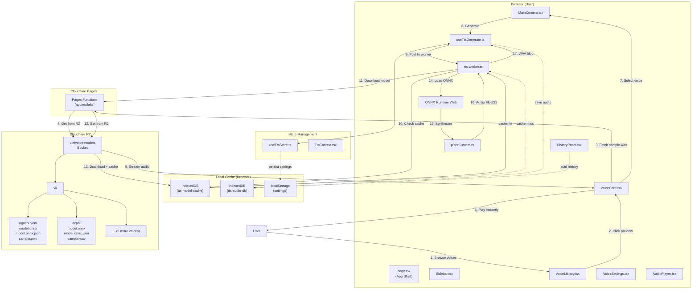

# Feature Specification - Piper TTS Engine

## 📋 Metadata

| Field              | Value                               |
| ------------------ | ----------------------------------- |
| **Feature ID**     | REQ-001                             |
| **Feature Name**   | Piper TTS Engine with Cloudflare R2 |
| **Status**         | ✅ Implemented                      |
| **Priority**       | P1 (High)                           |
| **Owner**          | Development Team                    |
| **Created**        | 2026-03-10                          |
| **Last Updated**   | 2026-03-11                          |
| **Target Release** | v1.2.0                              |

### Architecture Summary (v1.2)

| Component         | Technology       | Notes                                    |
| ----------------- | ---------------- | ---------------------------------------- |
| **Hosting**       | Cloudflare Pages | Same ecosystem as R2, better integration |
| **Model Storage** | Cloudflare R2    | Lazy-load on-demand, ~550GB free tier    |
| **Model Loading** | IndexedDB Cache  | Cache downloaded models locally          |
| **Voice Preview** | Pre-rendered WAV | Instant playback, no generation needed   |
| **Audio History** | IndexedDB        | Blobs stored locally                     |

### Implemented Features (v1.2)

| Tính năng                 | Status | Notes                                           |
| ------------------------- | ------ | ----------------------------------------------- |
| Multi-language TTS        | ✅     | Vietnamese only (custom models)                 |
| Custom Voice Models       | ✅     | 11 voices in Cloudflare R2                      |
| Voice Selection UI        | ✅     | VoiceCard, VoiceSelection components            |
| Audio Customization       | ✅     | Speed (0.5-2.0x), Pitch (-12 to +12)            |
| History (IndexedDB)       | ✅     | Audio blobs, replay, refill text                |
| Settings Panel            | ✅     | Personal, Subscription, Customization, Security |
| Dark Mode                 | ✅     | useTheme hook + Tailwind dark:                  |
| Vietnamese Normalizer     | ✅     | vietnameseNormalizer.ts                         |
| New UI (Sidebar)          | ✅     | Dashboard, Voice Library, History, Settings     |
| Preview Voice             | ✅     | Pre-rendered samples from R2                    |
| Share Button              | ✅     | Copy URL to clipboard                           |
| **Cloudflare R2 Storage** | ✅     | Lazy-load models, IndexedDB cache               |
| **Model Caching**         | ✅     | IndexedDB for downloaded models                 |

---

## 🔀 Mermaid Data Flow (v1.2)

> **REQUIRED** - Mermaid flowchart at the TOP so human can understand data flow instantly.

### Flow Legend

| Box Color | Meaning                                 |
| --------- | --------------------------------------- |
| Blue      | Actor/Client/External                   |
| Purple    | Internal Layer (Component/Hook/Service) |
| Green     | Storage (IndexedDB/localStorage)        |
| Red       | Error/Exception                         |
| Orange    | CDN/External Services                   |

### Cloudflare R2 Architecture (v1.2)



---

## 1. Overview

**Feature Name:** Piper TTS Engine  
**One-paragraph summary:** Client-side text-to-speech engine using Piper neural TTS with WebAssembly, enabling browser-based multi-language (Vietnamese, English, Indonesian) speech synthesis with Vietnamese text normalization, dark mode, IndexedDB history, and share—without server dependencies.

### Problem Statement

Users need to convert Vietnamese text to speech directly in the browser for:

- Offline accessibility when network is unavailable
- Reduced latency compared to server-side API calls
- Zero API costs for high-volume usage
- Privacy: audio processing stays on-device

### Goals

- Ensure all TTS processing runs **client-side** (no server API calls)
- Integrate Piper TTS engine (via `@mintplex-labs/piper-tts-web`) for client-side speech synthesis
- Support **multi-language**: Vietnamese (default), English, Indonesian with locale-aware UI and model selection
- **Vietnamese text processing**: normalize numbers, dates, times, currency, phone numbers, Roman numerals to spoken form before synthesis
- **Dark mode**: theme toggle (light/dark/system) persisted in localStorage
- **History in IndexedDB**: store last N items with audio blobs; better quota and binary support than localStorage
- **Share**: copy current page URL (with optional query params) to clipboard
- Support multiple voices per language with on-demand downloading
- Provide progress feedback during model loading and synthesis
- Cache downloaded voice models for faster subsequent loads
- Convert WAV output for Web Audio API playback

### Non-Goals

- Server-side TTS processing
- Real-time streaming synthesis in v1.1 (batch only; real-time chunks P2)
- Custom voice training or fine-tuning
- Multi-speaker voice synthesis
- ASR (speech-to-text) and SRT export — see REQ-002 (ASR)
- Server-side storage or database (all data stays client-side)

### Success Criteria (Updated v1.2 - Cloudflare R2)

| Metric                                | Target                                            | Status |
| ------------------------------------- | ------------------------------------------------- | ------ |
| First-generation latency (short text) | < 10 seconds (includes R2 download)               | ✅     |
| Cached voice load time                | < 1 second (from IndexedDB)                       | ✅     |
| Generation success rate               | > 95%                                             | ✅     |
| Bundle size increase                  | < 5MB (WASM only, no models in build)             | ✅     |
| Browser compatibility                 | Chrome, Firefox, Safari, Edge (latest 2 versions) | ✅     |
| Cloudflare Pages compatibility        | Works on Cloudflare Pages (Edge runtime)          | ✅     |
| Custom voice models                   | 11 Vietnamese voices in R2 bucket                 | ✅     |
| History persistence                   | IndexedDB with audio blobs                        | ✅     |
| Dark mode                             | Theme persisted in localStorage                   | ✅     |
| **R2 Model lazy loading**             | Only download selected model (~50MB)              | ✅     |
| **IndexedDB model cache**             | Cache downloaded models for reuse                 | ✅     |
| **Pre-rendered voice samples**        | Instant preview (< 1s, 5-10s WAV from R2)         | ✅     |
| **R2 free tier**                      | ~550GB storage, 1M Class A, 10M Class B ops       | ✅     |

---

## 2. User Stories

### Story 1: Generate Vietnamese Speech

**As a** Vietnamese user **I want** to enter text and hear it spoken **So that** I can preview TTS output in my native language

**Acceptance Criteria:**

- [ ] Textarea accepts up to 5000 characters (configurable via `config.tts.maxTextLength`)
- [ ] Voice dropdown shows at minimum: Vietnamese (vi_VN-mid-ori), English Female, English Male
- [ ] Generate button disabled when text is empty or only whitespace
- [ ] Progress percentage displayed during generation (0-100%)
- [ ] Audio auto-plays after successful generation
- [ ] Error toast shows friendly message on failure (not raw error)

**Priority:** P0 (Must Have)

---

### Story 2: Playback Controls

**As a** user **I want** to control audio playback **So that** I can review the generated speech

**Acceptance Criteria:**

- [ ] Play/Pause toggle button visible after generation
- [ ] Stop button resets playback to beginning
- [ ] Audio continues playing if user scrolls page
- [ ] Multiple generations create new audio (not replace)

**Priority:** P0 (Must Have)

---

### Story 3: Generation History

**As a** user **I want** to access previously generated audio **So that** I can replay or reuse them

**Acceptance Criteria:**

- [ ] History panel shows last 50 generations
- [ ] Each entry displays: text preview (truncated), voice name, timestamp
- [ ] Click on history item replays that audio
- [ ] "Refill" button loads history text back into textarea
- [ ] History persists across browser sessions (IndexedDB)

**Priority:** P1 (High)

---

### Story 4: Voice Model Caching

**As a** user **I want** downloaded voice models cached locally **So that** subsequent uses are faster

**Acceptance Criteria:**

- [ ] First use triggers voice model download from CDN
- [ ] Download progress shown to user
- [ ] Cached voices load without network on return visits
- [ ] Settings panel shows list of cached voices with sizes
- [ ] User can delete individual cached voices

**Priority:** P1 (High)

---

### Story 5: Settings Persistence

**As a** user **I want** my preferences saved **So that** I don't need to re-select them each visit

**Acceptance Criteria:**

- [ ] Selected voice persists after page reload
- [ ] Speech speed (0.5x - 2.0x) persists
- [ ] Settings stored in localStorage key: `tts-settings`

**Priority:** P1 (High)

---

### Story 6: Multi-Language (Vietnamese, English, Indonesian)

**As a** user **I want** to switch language/locale and use voices for Vietnamese, English, and Indonesian **So that** I can generate speech in the language I need.

**Acceptance Criteria:**

- [ ] App supports routes/locale: Vietnamese (default `/`), English (`/en`), Indonesian (`/id`) — or single page with locale selector
- [ ] Voice list filtered or labeled by language; at least one voice per supported language
- [ ] UI labels (buttons, placeholders) respect selected locale where applicable
- [ ] Selected language persists in settings (localStorage)

**Priority:** P1 (High)

---

### Story 7: Vietnamese Text Processing (Normalization)

**As a** Vietnamese user **I want** numbers, dates, times, currency, and phone numbers in my text to be spoken correctly **So that** TTS output sounds natural (e.g. "1.500.000" → "một triệu năm trăm nghìn").

**Acceptance Criteria:**

- [ ] Pre-processing step before sending text to TTS: numbers (integer, decimal), currency (VND, USD), dates (dd/mm/yyyy), times (HH:mm), phone numbers, Roman numerals
- [ ] Normalization implemented in `src/lib/text-processing/` (e.g. `vietnameseNormalizer.ts`); unit tests for each pattern
- [ ] Optional UI toggle "Chuẩn hóa văn bản" (default on for Vietnamese) to enable/disable normalization
- [ ] No regression for plain text; performance impact minimal (< 50ms for typical input)

**Priority:** P1 (High)

---

### Story 8: Dark Mode

**As a** user **I want** to switch between light and dark theme **So that** I can use the app comfortably in low light.

**Acceptance Criteria:**

- [ ] Theme toggle in header or settings: Light / Dark / System
- [ ] Theme applied via `class` on `html` or `body` (e.g. `dark`) with Tailwind `dark:` variants
- [ ] Preference persisted in localStorage (e.g. `app-theme`)
- [ ] System preference respected when "System" is selected (prefers-color-scheme)

**Priority:** P1 (High)

---

### Story 9: History in IndexedDB

**As a** user **I want** my generation history stored in IndexedDB **So that** audio blobs and larger history are supported without localStorage limits.

**Acceptance Criteria:**

- [ ] History (metadata + audio blob URLs or blobs) stored in IndexedDB; DB name e.g. `tts-app`, object store `history`
- [ ] Cap history at configurable N items (e.g. 50); evict oldest on overflow
- [ ] Existing HistoryPanel reads from IndexedDB; replay/refill/delete unchanged
- [ ] Migration path: on first load after upgrade, migrate existing localStorage history to IndexedDB if present, then clear localStorage history key

**Priority:** P1 (High)

---

### Story 10: Share Button

**As a** user **I want** to copy the current page URL (e.g. with locale or state) to clipboard **So that** I can share the app link with others.

**Acceptance Criteria:**

- [ ] "Share" or "Copy link" button in UI (e.g. header or near history)
- [ ] On click: copy `window.location.href` (or canonical URL) to clipboard via Clipboard API
- [ ] Toast or brief message: "Link copied" on success; show error if clipboard fails (e.g. not secure context)

**Priority:** P2 (Medium)

---

### Story 11: Cloudflare R2 Lazy Model Loading & Voice Preview

**As a** user **I want** to preview voices instantly and only download models on-demand **So that** I don't have to wait for all models to load and the app stays fast.

**Acceptance Criteria:**

- [ ] Voice preview button plays pre-rendered sample from R2 (instant, ~1s for 5-10s audio)
- [ ] When generating, model is downloaded from R2 if not cached locally
- [ ] Downloaded models are cached in IndexedDB for offline reuse
- [ ] Progress shown during model download (e.g., "Đang tải model: 50%")
- [ ] After first download, subsequent generations use cached model (< 1s load time)
- [ ] Models stored in Cloudflare R2 bucket, not in app bundle
- [ ] Pre-rendered samples stored in R2 for each voice

**Technical Implementation:**

- [ ] R2 bucket structure: `vi/{voiceId}/model.onnx`, `vi/{voiceId}/sample.wav`
- [ ] IndexedDB cache for downloaded models (`tts-model-cache` DB)
- [ ] API route: `/api/models/[voiceId]/model.onnx` proxies to R2
- [ ] voiceData.ts includes `sampleUrl` for each voice pointing to R2

**Priority:** P0 (Must Have)

---

## 3. Technical Design

### 3.1 Architecture Diagram

See **Mermaid Data Flow** at the top of this document for the full client-side flow (UI → Hook → Worker → PiperLib → ONNX/CDN → audio playback and persistence).

### 3.1.1 Technical Constraints

| Constraint              | Requirement                                                         |
| ----------------------- | ------------------------------------------------------------------- |
| **Deployment Target**   | Cloudflare Pages                                                    |
| **Processing Location** | Client-side only (browser)                                          |
| **Worker Support**      | Must work with Cloudflare Workers (Edge runtime restrictions apply) |
| **No Node.js APIs**     | Cannot use `fs`, `path`, `crypto` - use Web APIs only               |
| **WASM Compatibility**  | Must work with Cloudflare's WASM limits                             |
| **Storage**             | Use `localStorage` / `IndexedDB` - no server-side storage           |

> **Note:** Since TTS runs client-side, Cloudflare Pages serves only static assets (HTML/JS/CSS). All TTS processing happens in user's browser, so Edge runtime limitations don't directly affect TTS performance.

### 3.2 Data Model (Updated)

```typescript
// src/features/tts/types.ts

interface TtsRequest {
  text: string;
  model: string;
  voice?: string;
  speed?: number;
}

interface TtsResponse {
  audio: Blob;
  duration: number;
  format: "wav";
}

interface TtsVoice {
  id: string;
  name: string;
  gender: "male" | "female";
}

interface TtsModel {
  name: string;
  size: number;
  voices: TtsVoice[];
}

interface TtsSettings {
  model: string;
  voice: string;
  speed: number;
  volume: number;
  pitch: number; // NEW: -12 to +12
  normalizeText: boolean; // NEW: Vietnamese text normalization
}

type TtsStatus =
  | "idle"
  | "loading"
  | "generating"
  | "playing"
  | "previewing"
  | "error";

// src/features/tts/store.ts
interface TtsHistoryItem {
  id: string;
  text: string;
  model: string;
  voice: string;
  speed: number;
  audioUrl: string; // blob URL from IndexedDB
  duration: number;
  createdAt: number;
}

// Theme (dark mode)
type Theme = "light" | "dark" | "system";

// Custom voice model configuration
// src/config.ts
interface CustomModel {
  id: string; // e.g., "ngochuyen", "lacphi", "anhkhoi"
  name: string; // e.g., "Ngọc Huyền (custom)"
}

interface Config {
  tts: {
    maxTextLength: number;
    defaultModel: string;
    defaultVoice: string;
    defaultSpeed: number;
    defaultVolume: number;
    historyLimit: number;
    customModelBaseUrl: string;
  };
  storage: {
    settingsKey: string;
    historyKey: string;
  };
  activeVoiceIds: string[]; // IDs of voices with .onnx in public/tts-model/vi/
  customModels: CustomModel[];
  voices: []; // Built-in voices removed (custom-only)
}
```

### Custom Voice Models (v1.0)

| Voice ID    | Name        | Gender | Region     | Status    |
| ----------- | ----------- | ------ | ---------- | --------- |
| ngochuyen   | Ngọc Huyền  | Female | Miền Nam   | ✅ Active |
| banmai      | Ban Mai     | Female | Miền Nam   | ✅ Active |
| manhdung    | Mạnh Dũng   | Male   | Miền Bắc   | ✅ Active |
| minhquang   | Minh Quang  | Male   | Miền Bắc   | ✅ Active |
| duyoryx3175 | Duy Oryx    | Male   | Miền Nam   | ✅ Active |
| maiphuong   | Mai Phương  | Female | Miền Nam   | ✅ Active |
| lacphi      | Lạc Phi     | Female | Miền Trung | ✅ Active |
| minhkhang   | Minh Khang  | Male   | Miền Bắc   | ✅ Active |
| chieuthanh  | Chiếu Thành | Male   | Miền Trung | ✅ Active |
| mytam2794   | Mỹ Tâm      | Female | Miền Nam   | ✅ Active |
| anhkhoi     | Anh Khôi    | Male   | Miền Bắc   | ✅ Active |

Models are stored in `public/tts-model/vi/` directory:

- `{voiceId}.onnx` - ONNX model file
- `{voiceId}.onnx.json` - Model config (sample rate, etc.)

### 3.3 Module Structure (Updated v1.2)

```
src/
├── app/
│   ├── layout.tsx               # Root layout with ThemeProvider
│   ├── page.tsx                 # Main app shell with tabs
│   └── api/
│       └── models/
│           └── [voiceId]/
│               └── route.ts     # R2 model download API
├── components/
│   ├── layout/
│   │   ├── Header.tsx           # Top header with notifications, user menu
│   │   ├── Sidebar.tsx          # Navigation sidebar
│   │   └── index.ts
│   ├── tts/
│   │   ├── MainContent.tsx      # TTS generator form
│   │   ├── VoiceLibrary.tsx     # All voices grid with filters
│   │   ├── AudioPlayer.tsx      # Fixed bottom audio player
│   │   ├── VoiceCard.tsx        # Individual voice card with sample preview
│   │   └── index.ts
│   ├── ui/
│   │   ├── Toast.tsx            # Toast notifications
│   │   └── index.ts
│   ├── ShareButton.tsx          # Copy URL to clipboard
│   ├── ThemeProvider.tsx         # Theme context provider
│   └── ThemeToggle.tsx          # Light/Dark toggle
├── features/
│   └── tts/
│       ├── components/
│       │   ├── HistoryPanel.tsx
│       │   ├── VoiceSettings.tsx
│       │   ├── DemoSamples.tsx
│       │   └── index.ts
│       ├── context/
│       │   └── TtsContext.tsx
│       ├── hooks/
│       │   └── useTtsGenerate.ts
│       ├── types.ts
│       ├── store.ts
│       └── index.ts
├── lib/
│   ├── piper/
│   │   ├── piperTts.ts          # Piper wrapper class
│   │   └── piperCustom.ts       # Custom ONNX model loader (R2-aware)
│   ├── text-processing/
│   │   ├── textProcessor.ts
│   │   └── vietnameseNormalizer.ts
│   ├── storage/
│   │   ├── history.ts           # IndexedDB history operations
│   │   └── modelCache.ts        # NEW: IndexedDB model cache
│   ├── hooks/
│   │   ├── useTheme.ts
│   │   └── useLocale.ts
│   └── utils.ts
├── workers/
│   └── tts-worker.ts            # Web Worker for TTS
├── config.ts                     # App configuration
└── config/
    └── voiceData.ts             # Voice metadata with sample URLs
```

### 3.4 Cloudflare R2 Configuration (NEW)

```typescript
// src/config.ts

interface R2Config {
  /** R2 bucket binding name in Cloudflare Pages */
  bucketBinding: string;
  /** Base path in R2 bucket */
  basePath: string;
  /** Public URL for R2 (for samples) */
  publicUrl: string;
}

export const r2Config: R2Config = {
  bucketBinding: "VIETVOICE_MODELS",
  basePath: "vi",
  publicUrl:
    process.env.NEXT_PUBLIC_R2_PUBLIC_URL || "https://models.vietvoice.ai",
};

// R2 Bucket Structure
// vietvoice-models/
// ├── vi/
// │   ├── ngochuyen/
// │   │   ├── model.onnx       (~50MB)
// │   │   ├── model.onnx.json
// │   │   └── sample.wav       (5-10s pre-rendered)
// │   ├── lacphi/
// │   │   ├── model.onnx
// │   │   ├── model.onnx.json
// │   │   └── sample.wav
// │   └── ... (9 more voices)
```

### 3.5 Model Cache API (NEW)

```typescript
// src/lib/storage/modelCache.ts

const MODEL_CACHE_DB = "tts-model-cache";
const MODEL_STORE = "models";

interface ModelCacheEntry {
  voiceId: string;
  data: ArrayBuffer;
  downloadedAt: number;
  size: number;
}

export async function saveModelToCache(
  voiceId: string,
  data: ArrayBuffer,
): Promise<void> {
  const db = await openDB(MODEL_CACHE_DB, 1, {
    upgrade(db) {
      if (!db.objectStoreNames.contains(MODEL_STORE)) {
        db.createObjectStore(MODEL_STORE, { keyPath: "voiceId" });
      }
    },
  });
  await db.put(MODEL_STORE, {
    voiceId,
    data,
    downloadedAt: Date.now(),
    size: data.byteLength,
  } as ModelCacheEntry);
}

export async function loadModelFromCache(
  voiceId: string,
): Promise<ArrayBuffer | null> {
  const db = await openDB(MODEL_CACHE_DB, 1);
  const entry = (await db.get(MODEL_STORE, voiceId)) as
    | ModelCacheEntry
    | undefined;
  return entry?.data ?? null;
}

export async function getCachedModels(): Promise<string[]> {
  const db = await openDB(MODEL_CACHE_DB, 1);
  const all = await db.getAll(MODEL_STORE);
  return all.map((e) => e.voiceId);
}

export async function clearModelCache(): Promise<void> {
  const db = await openDB(MODEL_CACHE_DB, 1);
  await db.clear(MODEL_STORE);
}
```

### 3.6 API Route for R2 (NEW)

```typescript
// src/app/api/models/[voiceId]/[file]/route.ts

import { R2Bucket } from "@cloudflare/workers-types";

export async function GET(
  request: Request,
  { params }: { params: Promise<{ voiceId: string; file: string }> },
) {
  const { voiceId, file } = await params;

  // R2 bucket binding from wrangler.toml
  const bucket = process.env.VIETVOICE_MODELS as unknown as R2Bucket;

  const object = await bucket.get(`vi/${voiceId}/${file}`);
  if (!object) {
    return new Response("File not found", { status: 404 });
  }

  const contentType = file.endsWith(".json")
    ? "application/json"
    : "application/octet-stream";

  return new Response(object.body, {
    headers: {
      "Content-Type": contentType,
      "Cache-Control": "public, max-age=31536000, immutable",
    },
  });
}
```

### 3.7 Piper R2 Loader (NEW)

```typescript
// src/lib/piper/piperR2.ts

export class PiperR2Loader {
  private cache = new Map<string, PiperCustomSession>();

  async loadModel(
    voiceId: string,
    onProgress?: (p: number) => void,
  ): Promise<PiperCustomSession> {
    // 1. Memory cache
    if (this.cache.has(voiceId)) {
      return this.cache.get(voiceId)!;
    }

    // 2. IndexedDB cache
    onProgress?.(5);
    const cachedData = await loadModelFromCache(voiceId);
    if (cachedData) {
      const session = await this.initSessionFromArrayBuffer(
        cachedData,
        voiceId,
      );
      this.cache.set(voiceId, session);
      return session;
    }

    // 3. Download from R2
    onProgress?.(10);
    const [modelData, configData] = await Promise.all([
      this.downloadFromR2(voiceId, "model.onnx", onProgress),
      this.downloadFromR2(voiceId, "model.onnx.json"),
    ]);

    // 4. Cache for next time
    await saveModelToCache(voiceId, modelData);

    // 5. Initialize session
    const session = await this.initSessionFromArrayBuffer(modelData, voiceId);
    this.cache.set(voiceId, session);

    return session;
  }

  private async downloadFromR2(
    voiceId: string,
    file: string,
    onProgress?: (p: number) => void,
  ): Promise<ArrayBuffer> {
    const response = await fetch(`/api/models/${voiceId}/${file}`);
    if (!response.ok) {
      throw new Error(`Failed to download ${file}: ${response.statusText}`);
    }

    const reader = response.body?.getReader();
    const contentLength = +response.headers.get("Content-Length")!;
    let receivedLength = 0;
    const chunks: Uint8Array[] = [];

    while (true) {
      const { done, value } = await reader!.read();
      if (done) break;
      chunks.push(value);
      receivedLength += value.length;
      onProgress?.(10 + Math.round((receivedLength / contentLength) * 60));
    }

    const allChunks = new Uint8Array(receivedLength);
    let position = 0;
    for (const chunk of chunks) {
      allChunks.set(chunk, position);
      position += chunk.length;
    }

    return allChunks.buffer;
  }
}
```

| Component              | File                                        | Description                                             |
| ---------------------- | ------------------------------------------- | ------------------------------------------------------- |
| **App Shell**          | `src/app/page.tsx`                          | Main layout with Sidebar, Header, tab routing           |
| **Sidebar**            | `components/layout/Sidebar.tsx`             | Navigation: Dashboard, Voice Library, History, Settings |
| **Header**             | `components/layout/Header.tsx`              | Title, notifications dropdown, user menu                |
| **MainContent**        | `components/tts/MainContent.tsx`            | TTS form: TextInput, VoiceSelection, GenerateButton     |
| **TextInput**          | `components/tts/MainContent.tsx`            | Textarea with char count, progress bar                  |
| **VoiceSelection**     | `components/tts/MainContent.tsx`            | Voice cards with preview                                |
| **VoiceCard**          | `components/tts/VoiceCard.tsx`              | Individual voice with avatar, preview button            |
| **VoiceLibrary**       | `components/tts/VoiceLibrary.tsx`           | Grid of all voices with filters                         |
| **AudioCustomization** | `components/tts/MainContent.tsx`            | Speed/Pitch sliders                                     |
| **GenerateButton**     | `components/tts/MainContent.tsx`            | Generate button with progress                           |
| **AudioPlayer**        | `components/tts/AudioPlayer.tsx`            | Fixed bottom player with waveform                       |
| **HistoryPanel**       | `features/tts/components/HistoryPanel.tsx`  | History list with play/refill/delete                    |
| **VoiceSettings**      | `features/tts/components/VoiceSettings.tsx` | Settings with 4 tabs                                    |
| **ShareButton**        | `components/ShareButton.tsx`                | Copy URL to clipboard                                   |
| **Toast**              | `components/ui/Toast.tsx`                   | Toast notifications                                     |

### 3.8 Voice Data with R2 Samples

```typescript
// src/config/voiceData.ts

export interface VoiceMetadata {
  id: string;
  name: string;
  region: "Miền Bắc" | "Miền Trung" | "Miền Nam";
  gender: "Nam" | "Nữ";
  style: string;
  description: string;
  avatarColor: string;
  /** Pre-rendered sample from R2 - instant playback */
  sampleUrl: string;
  isCached?: boolean;
}

export const voiceMetadata: VoiceMetadata[] = [
  {
    id: "ngochuyen",
    name: "Ngọc Huyền",
    region: "Miền Bắc",
    gender: "Nữ",
    style: "Truyền cảm",
    description: "Giọng đọc nhẹ nhàng, phù hợp cho podcast",
    avatarColor: "#ec4899",
    sampleUrl: "https://models.vietvoice.ai/vi/ngochuyen/sample.wav",
  },
  {
    id: "banmai",
    name: "Ban Mai",
    region: "Miền Bắc",
    gender: "Nữ",
    style: "Tin tức",
    description: "Tròn vành rõ chữ, giọng đọc chuẩn bản tin",
    avatarColor: "#ec4899",
    sampleUrl: "https://models.vietvoice.ai/vi/banmai/sample.wav",
  },
  {
    id: "manhdung",
    name: "Mạnh Dũng",
    region: "Miền Nam",
    gender: "Nam",
    style: "Doanh nghiệp",
    description: "Trầm ấm, uy tín",
    avatarColor: "#3b82f6",
    sampleUrl: "https://models.vietvoice.ai/vi/manhdung/sample.wav",
  },
  {
    id: "minhquang",
    name: "Minh Quang",
    region: "Miền Trung",
    gender: "Nam",
    style: "Truyền cảm",
    description: "Giọng đọc truyền cảm",
    avatarColor: "#3b82f6",
    sampleUrl: "https://models.vietvoice.ai/vi/minhquang/sample.wav",
  },
  {
    id: "duyoryx3175",
    name: "Duy Oryx",
    region: "Miền Nam",
    gender: "Nam",
    style: "Công nghệ",
    description: "Năng động và trẻ trung",
    avatarColor: "#3b82f6",
    sampleUrl: "https://models.vietvoice.ai/vi/duyoryx3175/sample.wav",
  },
  {
    id: "maiphuong",
    name: "Mai Phương",
    region: "Miền Bắc",
    gender: "Nữ",
    style: "Quảng cáo",
    description: "Tốc độ đọc nhanh",
    avatarColor: "#ec4899",
    sampleUrl: "https://models.vietvoice.ai/vi/maiphuong/sample.wav",
  },
  {
    id: "lacphi",
    name: "Lạc Phi",
    region: "Miền Trung",
    gender: "Nữ",
    style: "Du lịch",
    description: "Ngọt ngào và trong trẻo",
    avatarColor: "#ec4899",
    sampleUrl: "https://models.vietvoice.ai/vi/lacphi/sample.wav",
  },
  {
    id: "minhkhang",
    name: "Minh Khang",
    region: "Miền Bắc",
    gender: "Nam",
    style: "Giáo dục",
    description: "Giọng đọc trầm và vang",
    avatarColor: "#3b82f6",
    sampleUrl: "https://models.vietvoice.ai/vi/minhkhang/sample.wav",
  },
  {
    id: "chieuthanh",
    name: "Chiếu Thành",
    region: "Miền Nam",
    gender: "Nam",
    style: "Truyền thống",
    description: "Giọng ông lão miền Tây",
    avatarColor: "#3b82f6",
    sampleUrl: "https://models.vietvoice.ai/vi/chieuthanh/sample.wav",
  },
  {
    id: "mytam2794",
    name: "Mỹ Tâm",
    region: "Miền Nam",
    gender: "Nữ",
    style: "Ca hát",
    description: "Giọng hát trong sáng",
    avatarColor: "#ec4899",
    sampleUrl: "https://models.vietvoice.ai/vi/mytam2794/sample.wav",
  },
  {
    id: "anhkhoi",
    name: "Anh Khôi",
    region: "Miền Bắc",
    gender: "Nam",
    style: "Hiện đại",
    description: "Trẻ trung và năng động",
    avatarColor: "#3b82f6",
    sampleUrl: "https://models.vietvoice.ai/vi/anhkhoi/sample.wav",
  },
];
```

#### PiperTts Class API

```typescript
// src/lib/piper/piperTts.ts

class PiperTts {
  async loadModel(config?: PiperConfig): Promise<void>;
  async getAvailableVoices(): Promise<PiperVoice[]>;
  async synthesize(
    text: string,
    options: PiperTtsOptions,
    onProgress?: (progress: number) => void,
  ): Promise<Float32Array>;
  async downloadVoice(
    voiceId: string,
    onProgress?: (progress: number) => void,
  ): Promise<void>;
  async getStoredVoices(): Promise<string[]>;
  async removeVoice(voiceId: string): Promise<void>;
  async terminate(): Promise<void>;
}
```

#### Zustand Store (Updated)

```typescript
// src/features/tts/store.ts

interface TtsState {
  settings: TtsSettings;
  status: TtsStatus;
  progress: number;
  currentAudio: Blob | null;
  currentAudioUrl: string | null;
  nowPlaying: TtsHistoryItem | null; // NEW: track what's playing
  history: TtsHistoryItem[];
  error: string | null;
  isHistoryLoaded: boolean;

  // Actions
  setSettings: (settings: Partial<TtsSettings>) => void;
  setStatus: (status: TtsStatus) => void;
  setProgress: (progress: number) => void;
  setCurrentAudio: (audio: Blob | null, url: string | null) => void;
  setNowPlaying: (item: TtsHistoryItem | null) => void; // NEW
  addToHistory: (item: TtsHistoryItem, audioBlob: Blob) => void;
  removeFromHistory: (id: string) => void;
  clearHistory: () => void;
  setError: (error: string | null) => void;
  reset: () => void;
  loadHistory: () => Promise<void>;
}

// TtsSettings includes pitch and normalizeText
interface TtsSettings {
  model: string;
  voice: string;
  speed: number;
  volume: number;
  pitch: number; // NEW: -12 to +12
  normalizeText: boolean; // NEW: Vietnamese text normalization
}
```

#### TtsContext (New in v1.0)

```typescript
// src/features/tts/context/TtsContext.tsx

type TtsContextValue = ReturnType<typeof useTtsGenerate>;

const TtsContext = createContext<TtsContextValue | null>(null);

export function TtsProvider({ children }: { children: React.ReactNode }) {
  const value = useTtsGenerate();
  return (
    <TtsContext.Provider value={value}>
      {children}
    </TtsContext.Provider>
  );
}

export function useTts(): TtsContextValue {
  const ctx = useContext(TtsContext);
  if (!ctx) {
    throw new Error("useTts must be used within a TtsProvider");
  }
  return ctx;
}
```

#### Vietnamese Normalizer API

```typescript
// src/lib/text-processing/vietnameseNormalizer.ts

export function normalizeVietnamese(text: string): string;
// Applies: numbers, currency (VND/USD), dates (dd/mm/yyyy), times (HH:mm),
// phone numbers, Roman numerals → spoken Vietnamese form.
```

#### Theme API

```typescript
// features/theme/useTheme.ts (or equivalent)

export function useTheme(): {
  theme: Theme;
  setTheme: (theme: Theme) => void;
};
// Persists to localStorage key "app-theme"; applies class "dark" on documentElement.
```

#### IndexedDB History API

```typescript
// src/lib/storage/history.ts

export async function initHistoryDb(): Promise<IDBDatabase>;
export async function addHistoryItem(
  item: TtsHistoryItem,
  audioBlob: Blob,
): Promise<void>;
export async function getHistoryItems(limit: number): Promise<TtsHistoryItem[]>;
export async function getHistoryAudio(id: string): Promise<Blob | null>;
export async function removeHistoryItem(id: string): Promise<void>;
export async function migrateFromLocalStorage(): Promise<{ migrated: number }>;
```

### 3.5 Business Logic

#### Text Validation Flow

```
1. User enters text
2. isTextValid(text, maxTextLength) called
3. If invalid: show alert with error message, disable Generate button
4. If valid: enable Generate button
```

#### Vietnamese Normalization Flow (Story 7)

```
1. Before sending text to worker: if locale is "vi" and "Chuẩn hóa văn bản" is on, call normalizeVietnamese(text)
2. normalizeVietnamese() applies: numbers → words, currency (VND/USD), dates (dd/mm/yyyy), times (HH:mm), phone digits, Roman numerals
3. Resulting string is sent to TTS; original text kept for display/history
```

#### Generation Flow

```
1. User clicks "Generate"
2. Optional: normalize text (Vietnamese) per settings
3. Set status to "generating", reset progress to 0
4. Post message to worker with { type: "generate", payload: {...} }
5. Worker calls piperTtsEngine.synthesize()
6. Progress updates via onProgress callback (0-100%)
7. On completion: worker returns Float32Array audio
8. Convert to Blob with type "audio/wav"
9. Save to history via IndexedDB (addHistoryItem); store blob or blob URL
10. Set currentAudio in store, auto-play
11. Set status to "playing"
```

#### Theme Flow (Story 8)

```
1. On load: read theme from localStorage ("app-theme"); apply class to document.documentElement
2. If "system": use matchMedia("prefers-color-scheme: dark").matches to set class
3. On toggle: update localStorage, apply class, re-render
```

#### Share Flow (Story 10)

```
1. User clicks Share → navigator.clipboard.writeText(window.location.href)
2. On success: show toast "Link copied"; on failure: show "Copy failed" (e.g. non-HTTPS)
```

#### Error Handling

```typescript
function toFriendlyErrorMessage(raw: string): string {
  if (/Entry not found|not valid JSON/i.test(raw)) {
    return "Voice or model data could not be loaded. The selected voice may be unavailable or the CDN returned an error.";
  }
  return raw;
}
```

---

## 4. Edge Cases & Error Handling

| Case                          | Handling                                                             | Error Code           |
| ----------------------------- | -------------------------------------------------------------------- | -------------------- |
| Empty text input              | Disable Generate button, show validation                             | N/A                  |
| Text exceeds maxLength (5000) | Show alert: "Text exceeds maximum length"                            | `TEXT_TOO_LONG`      |
| Voice model load failure      | Show friendly error, offer retry button                              | `MODEL_LOAD_FAILED`  |
| CDN network failure           | Show error: "Unable to download voice model. Check your connection." | `CDN_ERROR`          |
| Browser doesn't support WASM  | Show compatibility error in UI                                       | `WASM_UNSUPPORTED`   |
| Audio playback fails          | Offer download as WAV fallback                                       | `PLAYBACK_FAILED`    |
| IndexedDB quota exceeded      | Warning toast, suggest clearing history                              | `STORAGE_FULL`       |
| Worker initialization fails   | Show error, disable generation                                       | `WORKER_INIT_FAILED` |
| Clipboard API unavailable     | Show "Copy link not available" (e.g. non-secure context)             | `SHARE_UNAVAILABLE`  |
| Theme preference not applied  | Fallback to light; log warning                                       | N/A                  |
| Normalization throws          | Fall back to raw text; log error                                     | `NORMALIZE_ERROR`    |
| IndexedDB migration fails     | Keep localStorage history; toast "Could not migrate history"         | `IDB_MIGRATE_FAILED` |

---

## 5. Security Considerations

| Concern           | Mitigation                                                                          |
| ----------------- | ----------------------------------------------------------------------------------- |
| Input validation  | Text length limited to 5000 chars, no special character restrictions needed for TTS |
| CDN trust         | Only load from jsDelivr (trusted CDN), voices from Piper project                    |
| Data exposure     | Audio processed in-memory only; history in user's IndexedDB (client-side only)      |
| XSS via text      | Text passed directly to TTS engine (not rendered as HTML)                           |
| Share / clipboard | Only copy URL; no user content in clipboard                                         |
| Normalization     | No eval or remote code; regex/string only for number/date/currency rules            |

---

## 📊 Monitoring & Logging

### Key Metrics

- Generation success rate (successful generations / total attempts)
- Average generation time by text length
- Voice model download success rate
- Cache hit rate for cached voices

### Logs Required

- Event: TTS session create start/success/fail
- Event: Synthesis start/complete/error
- Event: Voice download start/complete/error
- Event: Worker init success/fail

---

## 6. Testing Strategy

### Unit Tests

| Test                  | File                                       | Scenario                  |
| --------------------- | ------------------------------------------ | ------------------------- |
| `convertWavToFloat32` | `src/lib/piper/piperTts.ts`                | Handles 8/16/32-bit WAV   |
| `convertWavToFloat32` | `src/lib/piper/piperTts.ts`                | Stereo to mono conversion |
| `isTextValid`         | `src/lib/text-processing/textProcessor.ts` | Empty/valid/too long      |

### Component Tests

| Test                                       | File                                              |
| ------------------------------------------ | ------------------------------------------------- |
| Renders with voice dropdown                | `src/features/tts/components/TtsGenerator.tsx`    |
| Generate disabled when text empty          | `src/features/tts/components/TtsGenerator.tsx`    |
| Progress indicator shows during generation | `src/features/tts/components/TtsGenerator.tsx`    |
| Error state displays correctly             | `src/features/tts/components/TtsGenerator.tsx`    |
| History panel shows items                  | `src/features/tts/components/HistoryPanel.tsx`    |
| Theme toggle applies dark/light class      | `ThemeToggle.tsx` or layout                       |
| Share button copies URL                    | `ShareButton.tsx` or integration test             |
| Vietnamese normalizer (numbers, dates)     | `src/lib/text-processing/vietnameseNormalizer.ts` |

### Integration Tests

| Test        | Scenario                                              |
| ----------- | ----------------------------------------------------- |
| Full flow   | Enter text → Generate → Audio plays                   |
| Persistence | Change voice → Reload page → Voice selected           |
| Offline     | Download voice → Disconnect network → Generate works  |
| History     | Generate 2x → Check history shows 2 items (IndexedDB) |
| Theme       | Toggle dark → Reload → Theme persisted                |
| Share       | Click Share → Clipboard contains current URL          |

---

## 7. Implementation Plan

### Phase 1: Core Infrastructure (Est. 6 hours)

| Step | Task                                   | Files                                             | Dependency | Status  |
| ---- | -------------------------------------- | ------------------------------------------------- | ---------- | ------- |
| 1.1  | Install dependencies                   | `@mintplex-labs/piper-tts-web`, `onnxruntime-web` | -          | ✅ Done |
| 1.2  | Create PiperTts wrapper class          | `src/lib/piper/piperTts.ts`                       | 1.1        | ✅ Done |
| 1.3  | Create Web Worker for TTS              | `src/workers/tts-worker.ts`                       | 1.2        | ✅ Done |
| 1.4  | Add WASM/ONNX config to next.config.ts | `next.config.ts`                                  | 1.1        | ✅ Done |

### Phase 2: State Management (Est. 3 hours)

| Step | Task                       | Files                                      | Dependency | Status  |
| ---- | -------------------------- | ------------------------------------------ | ---------- | ------- |
| 2.1  | Define TypeScript types    | `src/features/tts/types.ts`                | -          | ✅ Done |
| 2.2  | Create Zustand store       | `src/features/tts/store.ts`                | 2.1        | ✅ Done |
| 2.3  | Create useTtsGenerate hook | `src/features/tts/hooks/useTtsGenerate.ts` | 2.2, 1.3   | ✅ Done |
| 2.4  | Create TtsContext          | `src/features/tts/context/TtsContext.tsx`  | 2.3        | ✅ Done |

### Phase 3: UI Components (Est. 5 hours)

| Step | Task                          | Files                                           | Dependency | Status  |
| ---- | ----------------------------- | ----------------------------------------------- | ---------- | ------- |
| 3.1  | Create MainContent component  | `src/components/tts/MainContent.tsx`            | 2.3        | ✅ Done |
| 3.2  | Create AudioPlayer component  | `src/components/tts/AudioPlayer.tsx`            | -          | ✅ Done |
| 3.3  | Create HistoryPanel component | `src/features/tts/components/HistoryPanel.tsx`  | 2.2        | ✅ Done |
| 3.4  | Create Settings panel         | `src/features/tts/components/VoiceSettings.tsx` | -          | ✅ Done |
| 3.5  | Create VoiceLibrary           | `src/components/tts/VoiceLibrary.tsx`           | -          | ✅ Done |
| 3.6  | Create VoiceCard              | `src/components/tts/VoiceCard.tsx`              | -          | ✅ Done |

### Phase 4: App Shell & Layout (Est. 3 hours) - **NEW PHASE**

| Step | Task                     | Files                               | Dependency | Status  |
| ---- | ------------------------ | ----------------------------------- | ---------- | ------- |
| 4.1  | Create Sidebar component | `src/components/layout/Sidebar.tsx` | -          | ✅ Done |
| 4.2  | Create Header component  | `src/components/layout/Header.tsx`  | -          | ✅ Done |
| 4.3  | Create App Shell page    | `src/app/page.tsx`                  | 3.1-3.6    | ✅ Done |
| 4.4  | Integrate TtsProvider    | `src/app/layout.tsx`                | 2.4        | ✅ Done |

### Phase 5: Utilities & Integration (Est. 3 hours)

| Step | Task                      | Files                                      | Dependency | Status  |
| ---- | ------------------------- | ------------------------------------------ | ---------- | ------- |
| 5.1  | Add text validation       | `src/lib/text-processing/textProcessor.ts` | -          | ✅ Done |
| 5.2  | Implement history storage | `src/lib/storage/history.ts`               | -          | ✅ Done |
| 5.3  | Add config defaults       | `src/config.ts`                            | -          | ✅ Done |
| 5.4  | Add voice data            | `src/config/voiceData.ts`                  | -          | ✅ Done |
| 5.5  | Add ShareButton           | `src/components/ShareButton.tsx`           | -          | ✅ Done |

### Phase 6: Extended Features (v1.1)

| Step | Task                                  | Files / Scope                                     | Dependency | Status  |
| ---- | ------------------------------------- | ------------------------------------------------- | ---------- | ------- |
| 6.1  | Vietnamese text normalizer            | `src/lib/text-processing/vietnameseNormalizer.ts` | -          | ✅ Done |
| 6.2  | Integrate normalizer in TTS flow      | `useTtsGenerate`, config toggle                   | 6.1        | ✅ Done |
| 6.3  | IndexedDB history service             | `src/lib/storage/history.ts` (IDB backend)        | -          | ✅ Done |
| 6.4  | Migrate localStorage history → IDB    | Migration on first load, clear LS key             | 6.3        | ✅ Done |
| 6.5  | Theme store + ThemeToggle component   | `lib/hooks/useTheme` + toggle in layout           | -          | ✅ Done |
| 6.6  | Apply theme class (dark) in layout    | `app/layout.tsx`, Tailwind `dark:`                | 6.5        | ✅ Done |
| 6.7  | Multi-language: locale + voice filter | Config locales (vi/en/id), voice list by locale   | -          | ✅ Done |
| 6.8  | Unit tests for normalizer + IDB       | `vietnameseNormalizer.test.ts`, history.test.ts   | 6.1, 6.3   | ✅ Done |

### Phase 7: Cloudflare R2 Migration (v1.2)

| Step | Task                                | Files / Scope                             | Dependency | Status  |
| ---- | ----------------------------------- | ----------------------------------------- | ---------- | ------- |
| 7.1  | Setup Cloudflare R2 bucket          | wrangler.toml, R2 console                 | -          | Pending |
| 7.2  | Upload models to R2                 | 11 .onnx + .json files to vi/             | 7.1        | Pending |
| 7.3  | Pre-render voice samples            | 5-10s WAV per voice                       | 7.2        | Pending |
| 7.4  | Create R2 API routes                | `src/app/api/models/[voiceId]/*/route.ts` | 7.1        | Pending |
| 7.5  | Implement IndexedDB model cache     | `src/lib/storage/modelCache.ts`           | -          | Pending |
| 7.6  | Update piperCustom for R2 loading   | `src/lib/piper/piperCustom.ts`            | 7.4, 7.5   | Pending |
| 7.7  | Update voiceData with sample URLs   | `src/config/voiceData.ts`                 | 7.3        | Pending |
| 7.8  | Update VoiceCard for sample preview | Use pre-rendered sample                   | 7.7        | Pending |
| 7.9  | Remove public/tts-model from build  | Delete folder, update .gitignore          | 7.6        | Pending |
| 7.10 | Configure Cloudflare Pages          | Add R2 binding, setup domain              | 7.1        | Pending |

### Suggested PRs

| PR         | Scope                | Files                                                                         | Est. Size |
| ---------- | -------------------- | ----------------------------------------------------------------------------- | --------- |
| **PR #1**  | PiperTts Core        | `piperTts.ts`, `tts-worker.ts`, `next.config.ts`                              | Medium    |
| **PR #2**  | Types + Store + Hook | `types.ts`, `store.ts`, `useTtsGenerate.ts`, `TtsContext.tsx`                 | Small     |
| **PR #3**  | UI Components        | `MainContent.tsx`, `AudioPlayer.tsx`, `HistoryPanel.tsx`, `VoiceSettings.tsx` | Large     |
| **PR #4**  | Integration + Utils  | `page.tsx`, `textProcessor.ts`, `history.ts`, `config.ts`                     | Medium    |
| **PR #5**  | Tests + Polish       | Test files, error handling                                                    | Medium    |
| **PR #6**  | Vietnamese + IDB     | vietnameseNormalizer, history IndexedDB, migration                            | Medium    |
| **PR #7**  | Theme + Share        | ThemeToggle, useTheme, ShareButton, layout                                    | Small     |
| **PR #8**  | Voice Library        | VoiceLibrary, VoiceCard, voiceData                                            | Medium    |
| **PR #9**  | App Shell            | Sidebar, Header, page.tsx                                                     | Medium    |
| **PR #10** | Cloudflare R2 Setup  | wrangler.toml, R2 bucket, API routes                                          | Medium    |
| **PR #11** | Model Caching        | modelCache.ts, update piperCustom, VoiceCard sample preview                   | Medium    |
| **PR #12** | R2 Migration         | Remove public/tts-model, final integration, deploy to Cloudflare Pages        | Medium    |

### ⏱️ Implementation Timeline

| Week   | Phase     | Focus                                   |
| ------ | --------- | --------------------------------------- |
| Week 1 | Phase 1-2 | Core infrastructure + state management  |
| Week 2 | Phase 3   | UI components                           |
| Week 3 | Phase 4   | App Shell + Layout                      |
| Week 4 | Phase 5   | Integration + utilities                 |
| Week 5 | Phase 6   | Extended: normalizer, IDB, theme, share |

---

## 8. Open Questions

1. **Voice Preview:** Should we add a "preview" button to hear a sample before generating full text?
2. **Concurrent Requests:** Should we support queueing multiple generation requests?
3. **Text Preprocessing:** Do we need SSML-like tag support for pronunciation hints?
4. **Analytics:** Should we add anonymous usage analytics to track popular voices/languages?
5. **Mobile Optimization:** Is the current UI optimized for touch devices?
6. **Multi-language routing:** Use path-based locales (`/en`, `/id`) or single page with dropdown?
7. **Real-time streaming:** Prioritize real-time audio chunks (like NGHI-TTS) in v1.2?
8. **Model source:** Add Cloudflare R2 as optional model source alongside current CDN?

---

## Dependencies

### External

| Library                      | Version | Purpose                      |
| ---------------------------- | ------- | ---------------------------- |
| @mintplex-labs/piper-tts-web | ^1.0    | Piper TTS WebAssembly engine |
| onnxruntime-web              | ^1.24   | ONNX Runtime for inference   |
| zustand                      | ^5.0    | State management             |

### Internal

| Module                   | Dependency Reason                      |
| ------------------------ | -------------------------------------- |
| features/tts/store       | Zustand state management               |
| features/tts/components  | UI rendering                           |
| lib/text-processing      | Text validation, Vietnamese normalizer |
| lib/storage/history      | History operations (IndexedDB)         |
| features/theme (or hook) | Dark mode state and persistence        |

---

## ✅ Definition of Done

- [ ] Code implemented following `.sdlc/context/conventions.md`
- [ ] All tests pass (`npm run test`)
- [ ] No lint errors (`npm run lint`)
- [ ] Code formatted (`npm run format`)
- [ ] Build passes (`npm run build`)
- [ ] Documentation updated (JSDoc, README if needed)
- [ ] Human reviewed and approved
