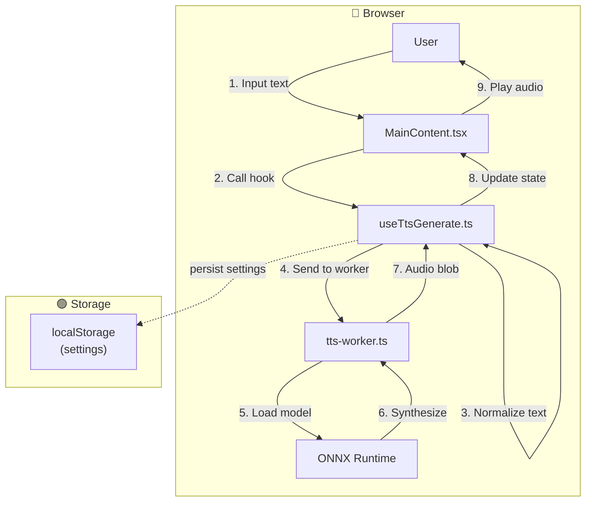

# Feature Specification - TTS Generation

## 📋 Metadata

| Field              | Value            |
| ------------------ | ---------------- |
| **Feature ID**     | REQ-002          |
| **Feature Name**   | TTS Generation   |
| **Status**         | ✅ Completed     |
| **Priority**       | P0 (Critical)    |
| **Owner**          | Development Team |
| **Created**        | 2026-03-10       |
| **Target Release** | v1.0.0           |

---

## 🔀 Mermaid Data Flow

---

## 🎯 Overview

### Problem Statement

Users need to convert Vietnamese text to speech in the browser without server-side processing.

### Goals

- Convert Vietnamese text to speech using Piper TTS
- Support multiple Vietnamese voices
- Display generation progress
- Auto-play after generation

### Non-Goals

- Server-side TTS processing
- Real-time streaming (batch only)

---

## 👥 User Stories

### Story 1: Generate Vietnamese Speech

**As a** Vietnamese user **I want** to enter text and hear it spoken **So that** I can preview TTS output in my native language

**Acceptance Criteria:**

- [x] Textarea accepts up to 5000 characters (configurable via `config.tts.maxTextLength`)
- [x] Voice dropdown shows at minimum: Vietnamese (vi_VN-mid-ori), English Female, English Male
- [x] Generate button disabled when text is empty or only whitespace
- [x] Progress percentage displayed during generation (0-100%)
- [x] Audio auto-plays after successful generation
- [x] Error toast shows friendly message on failure (not raw error)

**Priority:** P0 (Must Have)

---

## 🏗️ Technical Design

### Files Created

| File                                       | Description              |
| ------------------------------------------ | ------------------------ |
| `src/lib/piper/piperTts.ts`                | Piper wrapper class      |
| `src/lib/piper/piperCustom.ts`             | Custom ONNX model loader |
| `src/workers/tts-worker.ts`                | Web Worker for TTS       |
| `src/features/tts/hooks/useTtsGenerate.ts` | Main generation hook     |
| `src/components/tts/MainContent.tsx`       | Main UI component        |

### State Management

| State               | Solution       | Justification            |
| ------------------- | -------------- | ------------------------ |
| Text input          | React useState | Simple, component-level  |
| Voice selection     | Zustand store  | Shared across components |
| Generation progress | React useState | Real-time updates        |
| Generated audio     | Zustand store  | Shared for playback      |

### Dependencies

| Library                      | Version | Purpose        |
| ---------------------------- | ------- | -------------- |
| @mintplex-labs/piper-tts-web | ^1.0    | TTS engine     |
| onnxruntime-web              | ^1.16   | ONNX inference |

---

## ⚠️ Edge Cases

| Case                         | Handling                      |
| ---------------------------- | ----------------------------- |
| Empty text                   | Disable generate button       |
| Model loading fails          | Show error toast, allow retry |
| Browser doesn't support WASM | Show compatibility error      |
| Generation timeout           | Cancel after 60s, show error  |

---

## ✅ Definition of Done

- [x] Code implemented following conventions
- [x] All tests pass
- [x] No lint errors
- [x] Code formatted
- [x] Documentation updated
- [x] Human approved
