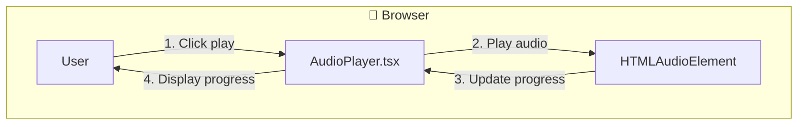

# Feature Specification - Playback Controls

## 📋 Metadata

| Field              | Value                                                  |
| ------------------ | ------------------------------------------------------ |
| **Feature ID**     | REQ-003                                               |
| **Feature Name**   | Playback Controls                                     |
| **Status**         | ✅ Completed                                          |
| **Priority**       | P0 (Critical)                                         |
| **Owner**          | Development Team                                      |
| **Created**        | 2026-03-10                                           |
| **Target Release** | v1.0.0                                               |

---

## 🔀 Mermaid Data Flow

---

## 🎯 Overview

### Problem Statement

Users need to control audio playback to review generated speech.

### Goals

- Play/Pause toggle
- Stop/Reset functionality
- Progress tracking
- Multiple audio support

---

## 👥 User Stories

### Story 1: Playback Controls

**As a** user **I want** to control audio playback **So that** I can review the generated speech

**Acceptance Criteria:**

- [x] Play/Pause toggle button visible after generation
- [x] Stop button resets playback to beginning
- [x] Audio continues playing if user scrolls page
- [x] Multiple generations create new audio (not replace)

**Priority:** P0 (Must Have)

---

## 🏗️ Technical Design

### Files Created

| File | Description |
| ---- | ----------- |
| `src/components/tts/AudioPlayer.tsx` | Fixed bottom audio player |

### State Management

| State | Solution | Justification |
| ----- | -------- | ------------- |
| Current audio | Zustand store | Shared state |
| Playing status | React useState | Real-time updates |
| Progress | HTMLAudioElement events | Direct DOM |

---

## ✅ Definition of Done

- [x] Code implemented
- [x] All tests pass
- [x] No lint errors
- [x] Code formatted
