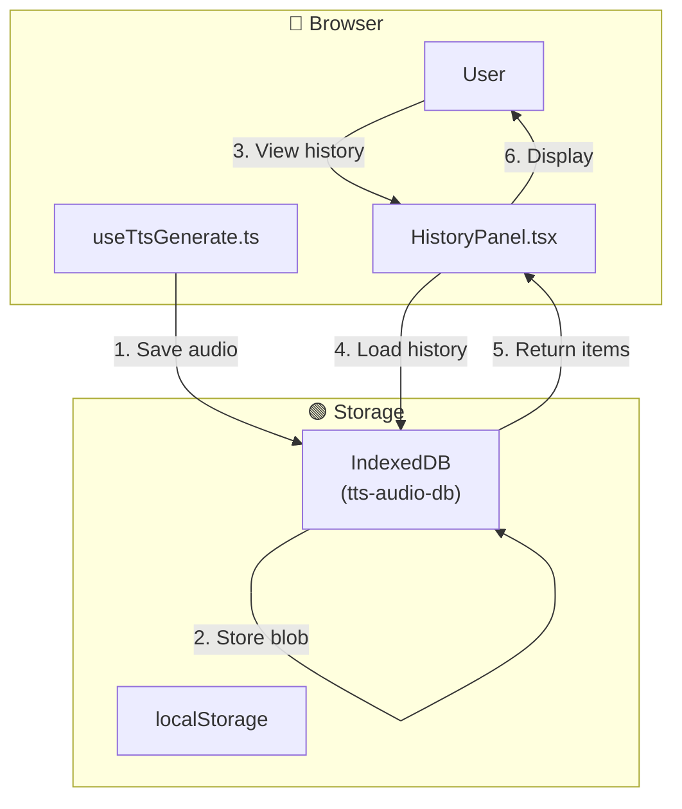

# Feature Specification - Generation History

## 📋 Metadata

| Field              | Value                                                  |
| ------------------ | ------------------------------------------------------ |
| **Feature ID**     | REQ-004                                               |
| **Feature Name**   | Generation History                                     |
| **Status**         | ✅ Completed                                          |
| **Priority**       | P1 (High)                                             |
| **Owner**          | Development Team                                      |
| **Created**        | 2026-03-10                                           |
| **Target Release** | v1.0.0                                               |

---

## 🔀 Mermaid Data Flow

---

## 🎯 Overview

### Problem Statement

Users need to access previously generated audio for replay or reuse.

### Goals

- Show last 50 generations
- Display text preview, voice name, timestamp
- Replay functionality
- Refill text to textarea

---

## 👥 User Stories

### Story 1: Generation History

**As a** user **I want** to access previously generated audio **So that** I can replay or reuse them

**Acceptance Criteria:**

- [x] History panel shows last 50 generations
- [x] Each entry displays: text preview (truncated), voice name, timestamp
- [x] Click on history item replays that audio
- [x] "Refill" button loads history text back into textarea
- [x] History persists across browser sessions (IndexedDB)

**Priority:** P1 (High)

---

## 🏗️ Technical Design

### Files Created

| File | Description |
| ---- | ----------- |
| `src/features/tts/components/HistoryPanel.tsx` | History list component |
| `src/lib/storage/history.ts` | IndexedDB history operations |

### State Management

| State | Solution | Justification |
| ----- | -------- | ------------- |
| History items | React useState + IDB | Persistence + reactivity |

---

## ✅ Definition of Done

- [x] Code implemented
- [x] All tests pass
- [x] No lint errors
