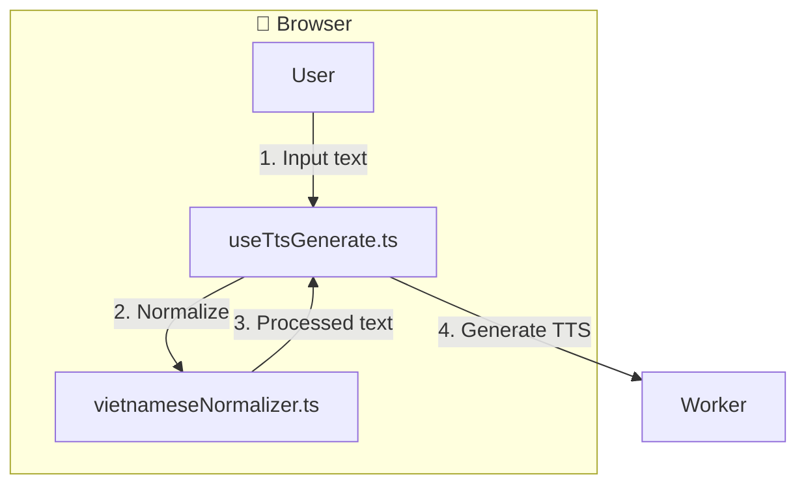

# Feature Specification - Vietnamese Text Processing

## 📋 Metadata

| Field              | Value                                                  |
| ------------------ | ------------------------------------------------------ |
| **Feature ID**     | REQ-008                                               |
| **Feature Name**   | Vietnamese Text Processing                             |
| **Status**         | ✅ Completed                                          |
| **Priority**       | P1 (High)                                             |
| **Owner**          | Development Team                                      |
| **Created**        | 2026-03-10                                           |
| **Target Release** | v1.1.0                                               |

---

## 🔀 Mermaid Data Flow

---

## 🎯 Overview

### Problem Statement

Vietnamese numbers, dates, times, currency need to be spoken naturally.

### Goals

- Convert numbers to words
- Convert dates/times to spoken form
- Handle currency (VND, USD)
- Handle phone numbers

---

## 👥 User Stories

### Story 1: Vietnamese Text Processing

**As a** Vietnamese user **I want** numbers, dates, times, currency, and phone numbers in my text to be spoken correctly **So that** TTS output sounds natural (e.g. "1.500.000" → "một triệu năm trăm nghìn").

**Acceptance Criteria:**

- [x] Pre-processing step before sending text to TTS: numbers (integer, decimal), currency (VND, USD), dates (dd/mm/yyyy), times (HH:mm), phone numbers, Roman numerals
- [x] Normalization implemented in `src/lib/text-processing/` (e.g. `vietnameseNormalizer.ts`); unit tests for each pattern
- [x] Optional UI toggle "Chuẩn hóa văn bản" (default on for Vietnamese) to enable/disable normalization
- [x] No regression for plain text; performance impact minimal (< 50ms for typical input)

**Priority:** P1 (High)

---

## 🏗️ Technical Design

### Files Created

| File | Description |
| ---- | ----------- |
| `src/lib/text-processing/vietnameseNormalizer.ts` | Text normalization |
| `src/lib/text-processing/textProcessor.ts` | Text validation |

### Dependencies

| Library | Version | Purpose |
| -------- | ------- | --------|
| vitest | ^2.0 | Unit testing |

---

## ✅ Definition of Done

- [x] Code implemented
- [x] Unit tests for each pattern
- [x] Performance < 50ms
