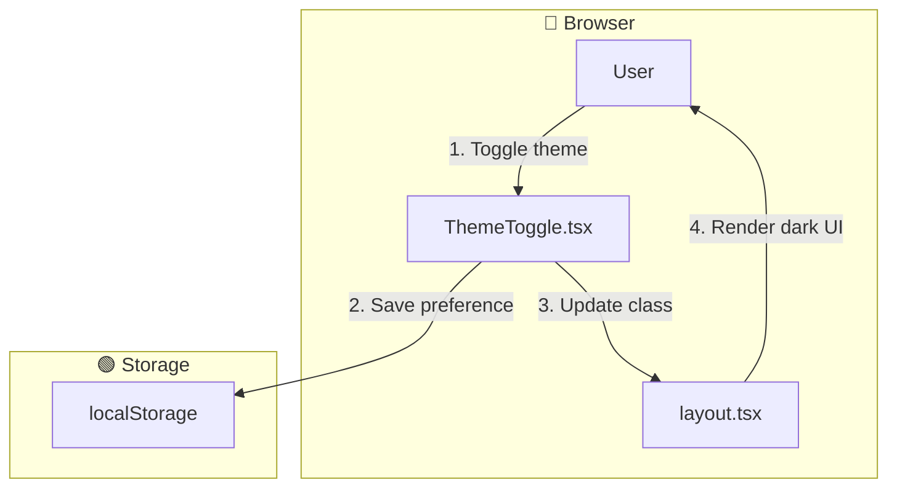

# Feature Specification - Dark Mode

## 📋 Metadata

| Field              | Value            |
| ------------------ | ---------------- |
| **Feature ID**     | REQ-009          |
| **Feature Name**   | Dark Mode        |
| **Status**         | ✅ Completed     |
| **Priority**       | P1 (High)        |
| **Owner**          | Development Team |
| **Created**        | 2026-03-10       |
| **Target Release** | v1.1.0           |

---

## 🔀 Mermaid Data Flow

---

## 🎯 Overview

### Problem Statement

Users need to switch between light and dark theme for comfortable use in different lighting conditions.

### Goals

- Light/Dark/System theme options
- Persist preference
- Apply theme via Tailwind

---

## 👥 User Stories

### Story 1: Dark Mode

**As a** user **I want** to switch between light and dark theme **So that** I can use the app comfortably in low light.

**Acceptance Criteria:**

- [x] Theme toggle in header or settings: Light / Dark / System
- [x] Theme applied via `class` on `html` or `body` (e.g. `dark`) with Tailwind `dark:` variants
- [x] Preference persisted in localStorage (e.g. `app-theme`)
- [x] System preference respected when "System" is selected (prefers-color-scheme)

**Priority:** P1 (High)

---

## 🏗️ Technical Design

### Files Created

| File                             | Description                |
| -------------------------------- | -------------------------- |
| `src/lib/hooks/useTheme.ts`      | Theme management hook      |
| `src/components/ThemeToggle.tsx` | Theme toggle button        |
| `src/app/layout.tsx`             | Theme provider integration |

---

## ✅ Definition of Done

- [x] Code implemented
- [x] Theme persists across sessions
- [x] System preference works
