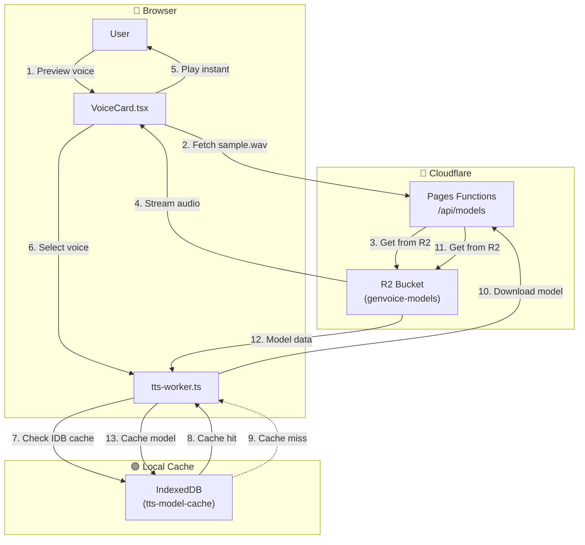

# Feature Specification - Cloudflare R2 Model Storage

## 📋 Metadata

| Field              | Value                                                  |
| ------------------ | ------------------------------------------------------ |
| **Feature ID**     | REQ-012                                               |
| **Feature Name**   | Cloudflare R2 Lazy Model Loading                      |
| **Status**         | ✅ Implemented (Phase 1-2)                            |
| **Priority**       | P0 (Critical)                                         |
| **Owner**          | Development Team                                      |
| **Created**        | 2026-03-11                                           |
| **Target Release** | v1.2.0                                               |
| **MVP Constraints**| No auth required; TTS only; Ship fast               |

---

## 🔀 Mermaid Data Flow



---

## 🎯 Overview

### Problem Statement

Models are currently bundled with the app, increasing bundle size. Need to store models in R2 and lazy-load on demand.

### Goals

- Move models to Cloudflare R2
- Lazy-load models only when needed
- Cache downloaded models in IndexedDB
- Pre-render voice samples for instant preview
- Reduce bundle size

### Non-Goals (MVP)

- Real-time streaming
- Server-side TTS
- Authentication (deferred to future)
- Model version management
- Analytics/usage tracking
- Multi-language support (Vietnamese only for MVP)

---

## 👥 User Stories

### Story 1: Cloudflare R2 Lazy Model Loading

**As a** user **I want** to preview voices instantly and only download models on-demand **So that** I don't have to wait for all models to load and the app stays fast.

**Acceptance Criteria:**

- [ ] Voice preview button plays pre-rendered sample from R2 (instant, ~1s for 5-10s audio)
- [ ] When generating, model is downloaded from R2 if not cached locally
- [ ] Downloaded models are cached in IndexedDB for offline reuse
- [ ] Progress shown during model download (e.g., "Đang tải model: 50%")
- [ ] After first download, subsequent generations use cached model (< 1s load time)
- [ ] Models stored in Cloudflare R2 bucket, not in app bundle
- [ ] Pre-rendered samples stored in R2 for each voice

**Priority:** P0 (Must Have)

---

## 🏗️ Technical Design

### R2 Bucket Structure

```
genvoice-models/       # R2 Bucket Name (user-created)
├── vi/                    # Language folder
│   ├── ngochuyen/         # Voice ID
│   │   ├── model.onnx       (~50MB)
│   │   ├── model.onnx.json
│   │   └── sample.wav       (5-10s pre-rendered, shared text)
│   ├── lacphi/
│   │   ├── model.onnx
│   │   ├── model.onnx.json
│   │   └── sample.wav
│   └── ... (9 more voices)
```

### Voice Preview Sample

| Aspect | Decision |
|--------|----------|
| Text content | Shared across all voices: "Xin chào, đây là giọng nói AI. Chúc bạn một ngày tốt lành!" |
| Duration | 5-10 seconds |
| Format | WAV (uncompressed for quality) |
| Storage | Stored in R2 as `sample.wav` per voice folder |

### Files Created

| File | Description | Status |
| ---- | ----------- | ------ |
| `src/app/api/models/[voiceId]/[file]/route.ts` | API route for R2 proxy | ✅ Created |
| `src/lib/storage/modelCache.ts` | IndexedDB model cache | ✅ Created |
| `src/lib/piper/piperR2.ts` | R2-aware Piper loader | ✅ Created |

### Cloudflare Pages Configuration

```toml
# wrangler.toml
name = "vietvoice-ai"
compatibility_date = "2024-01-01"
pages_build_output_dir = ".next"

[[r2_buckets]]
binding = "VIETVOICE_MODELS"
bucket_name = "genvoice-models"
```

### Environment Variables

| Variable | Description | Required |
| -------- | ----------- | -------- |
| `NEXT_PUBLIC_R2_PUBLIC_URL` | Public URL for R2 bucket (for direct access) | Optional |

### API Route

```typescript
// src/app/api/models/[voiceId]/[file]/route.ts
// NOTE: Public access (no auth) for MVP - R2 bucket is public readable
// Rate limiting will be handled by Cloudflare

export async function GET(
  request: Request,
  { params }: { params: Promise<{ voiceId: string; file: string }> }
) {
  const { voiceId, file } = await params;
  
  // Validate voiceId to prevent path traversal
  const allowedVoiceIds = ['ngochuyen', 'lacphi', /* ... other voices */];
  if (!allowedVoiceIds.includes(voiceId)) {
    return new Response('Not Found', { status: 404 });
  }

  const bucket = process.env.VIETVOICE_MODELS as unknown as R2Bucket;
  const object = await bucket.get(`vi/${voiceId}/${file}`);
  
  if (!object) {
    return new Response('Not Found', { status: 404 });
  }

  // Return with appropriate headers for caching
  return new Response(object.body, {
    headers: {
      'Content-Type': getContentType(file),
      'Cache-Control': 'public, max-age=31536000, immutable', // Cache for 1 year
    },
  });
}

function getContentType(file: string): string {
  if (file.endsWith('.onnx')) return 'application/octet-stream';
  if (file.endsWith('.json')) return 'application/json';
  if (file.endsWith('.wav')) return 'audio/wav';
  return 'application/octet-stream';
}
```

### Model Cache API

```typescript
// src/lib/storage/modelCache.ts
interface ModelCacheEntry {
  voiceId: string;
  data: ArrayBuffer;
  downloadedAt: number;
  size: number;
}

export async function saveModelToCache(voiceId: string, data: ArrayBuffer): Promise<void>;
export async function loadModelFromCache(voiceId: string): Promise<ArrayBuffer | null>;
export async function getCachedModels(): Promise<string[]>;
export async function clearModelCache(): Promise<void>;
```

---

## 📦 Dependencies

### External

| Library | Version | Purpose |
| -------- | ------- | --------|
| @cloudflare/workers-types | ^4.0 | R2 types |
| wrangler | ^3.0 | Deployment |

---

## ⏱️ Implementation Plan

> **Note**: Cloudflare setup (Phase 0) is done by the user. Em provides code support only.

### Cloudflare Setup (User does - NOT included in estimate)

1. Create free Cloudflare account
2. Create R2 bucket named `vietvoice-models`
3. Install wrangler: `npm install -D wrangler`
4. Configure `wrangler.toml`
5. Upload models to R2 using wrangler
6. Configure CORS for public access

---

| Phase | Tasks | Estimated |
| ---- | ----- | --------- |
| Phase 0 | Cloudflare Setup (User does) | ~30-45 min |
| Phase 1 | Create API routes, model cache | 3 hours |
| Phase 2 | Update piper loader, VoiceCard preview | 2 hours |
| Phase 3 | Deploy to Cloudflare Pages | 1 hour |

---

## ✅ Definition of Done

- [ ] R2 bucket configured with 11 voice models
- [ ] Pre-rendered samples available for each voice
- [ ] API routes proxy to R2 correctly
- [ ] IndexedDB cache works
- [ ] Bundle size reduced
- [ ] Build passes
