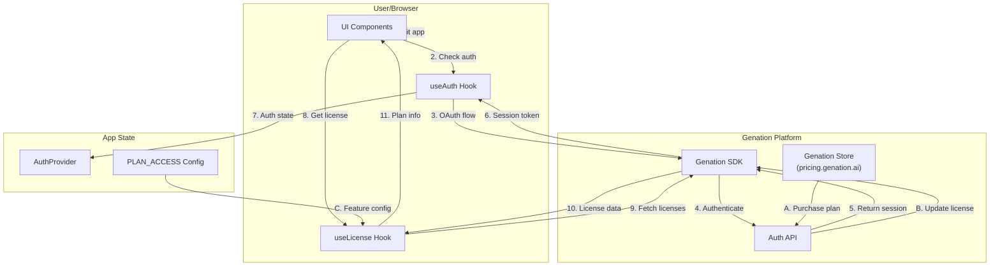

# Feature Specification - Plan & License Management

## 📋 Metadata

| Field | Value |
| ------------------ | ------------------------------------------------------ |
| **Feature ID** | REQ-013 |
| **Feature Name** | Plan & License Management with Genation SDK |
| **Status** | ✅ Completed |
| **Priority** | P0 (High) |
| **Owner** | Development Team |
| **Created** | 2026-03-16 |
| **Last Updated** | 2026-03-17 |
| **Target Release** | v1.2.0 |

---

## 🎯 Overview

### Problem Statement

Users need to purchase plans to access premium features. Currently, there is no way to:
1. Display available plans and pricing to users
2. Integrate with Genation store for payments
3. Check user plan status and activate features accordingly

### Goals

- Display pricing plans (Free, Pro) in the app
- Integrate with Genation SDK for authentication and license management
- Check user plan status and apply feature restrictions/activations
- Show user's current plan and usage in sidebar
- Handle Genation plan codes (e.g., "PRO_1_Month", "PRO_1_Year") as Pro tier

---

## 🔄 Data Flow



### Flow Description

1. **Authentication Flow**: User clicks "Đăng nhập" → redirected to Genation OAuth → returns with session
2. **License Check Flow**: useLicense hook fetches user's licenses from Genation SDK
3. **Feature Access Flow**: App checks `activePlanCode` against `PLAN_ACCESS` config
4. **Purchase Flow**: User clicks upgrade → redirected to Genation store → purchases plan → returns with updated license

### Plan Code Handling

Genation returns various plan codes depending on subscription type:
- `"PRO"` - Pro tier (exact match)
- `"PRO_1_Month"` - Pro monthly subscription
- `"PRO_1_Year"` - Pro yearly subscription

The app normalizes all `"PRO_*"` codes to `"PRO"` for consistent feature gating.

---

## 👥 User Stories

### Story 1: View Pricing Plans

**As a** visitor **I want** to see available plans and pricing **So that** I can choose a suitable plan.

**Acceptance Criteria:**

- [x] Pricing page shows Free, Pro plans with prices
- [x] Each plan shows included features
- [x] Current plan is highlighted for logged-in users
- [x] "Mua ngay" button redirects to Genation store

### Story 2: Login with Genation

**As a** user **I want** to log in using Genation account **So that** I can access my purchased plans.

**Acceptance Criteria:**

- [x] "Đăng nhập" button triggers Genation OAuth flow
- [x] After login, user info displayed in header
- [x] Session persists across page refreshes
- [x] "Đăng xuất" button signs out user

### Story 3: Check Plan Status

**As a** logged-in user **I want** to see my current plan and usage **So that** I know what features I can access.

**Acceptance Criteria:**

- [x] Sidebar shows current plan (Free/Pro)
- [x] Shows plan expiry date
- [x] Plan badge shown next to user name
- [x] Auto-refresh when returning from purchase (detect `?signed_in=true`)

### Story 4: Feature Access Control

**As a** user **I want** to have features unlocked based on my plan **So that** I can use premium features.

**Acceptance Criteria:**

- [x] Free users: chỉ tạo được 1 giọng nam + 1 giọng nữ (các giọng khác chỉ nghe sample)
- [x] Pro users: tạo được tất cả giọng
- [x] Feature restrictions enforced at UI level

### Story 5: Upgrade Plan

**As a** free/pro user **I want** to upgrade my plan **So that** I can access more features.

**Acceptance Criteria:**

- [x] "Nâng cấp" button in sidebar opens upgrade modal/page
- [x] Clicking upgrade redirects to Genation store
- [x] After purchase, user redirected back to app
- [x] License automatically refreshes after return

---

## 🏗️ Technical Design

### Architecture

| Layer | Implementation |
|-------|---------------|
| Auth | Genation OAuth 2.1 with PKCE |
| License | Genation SDK `getLicenses()` |
| State | React Context (AuthProvider) + Suspense boundary |
| Config | `PLAN_ACCESS` constant |

### Files Structure

```
src/
├── lib/genation/
│   ├── config.ts          # ✅ Existing - Genation config
│   ├── client.ts          # ✅ Existing - SDK wrapper
│   └── index.ts           # ✅ Existing - Exports
├── lib/hooks/
│   ├── useAuth.ts         # ✅ Existing - Auth state
│   ├── useLicense.ts      # ✅ Existing - License state + isProPlanCode()
│   └── index.ts           # ✅ Existing - Exports
├── components/
│   ├── LoginButton.tsx    # ✅ Existing - Login UI
│   ├── AuthProvider.tsx   # ✅ Existing - Auth context with Suspense
│   └── layout/
│       └── Sidebar.tsx    # ✅ Existing - Shows real plan + expiry
└── app/
    └── pricing/
        └── page.tsx       # ✅ Existing - Pricing page
```

### Key Functions

#### isProPlanCode (src/lib/genation/client.ts)

```typescript
/**
 * Genation may return plan codes like "PRO_1_Month", "PRO_1_Year".
 * Treat any code that equals "PRO" or starts with "PRO_" as Pro tier.
 */
export function isProPlanCode(code: string | null): boolean {
  if (!code) return false;
  return code === PRO_PLAN_CODE || code.startsWith("PRO_");
}
```

#### getActivePlanCode (src/lib/genation/client.ts)

```typescript
/**
 * Get the highest active plan code for the user.
 * Normalizes Genation plan codes (e.g. "PRO_1_Month") to "PRO" so app logic stays simple.
 */
export async function getActivePlanCode(): Promise<string | null> {
  try {
    const licenses = await getLicenses();
    const activeLicense = licenses.find((l) => l.status === "active");
    const raw = activeLicense?.plan.code || null;
    if (!raw) return null;
    return isProPlanCode(raw) ? PRO_PLAN_CODE : raw;
  } catch {
    return null;
  }
}
```

### Plan Configuration

```typescript
// src/lib/hooks/useLicense.ts
export const PLAN_ACCESS = {
  FREE: {
    code: "FREE",
    name: "Miễn phí",
    features: {
      maxVoiceModels: 2,
      allowedVoiceIds: ["manhdung", "ngochuyen"],
      exportFormat: ["wav"],
    },
  },
  PRO: {
    code: "PRO",
    name: "Pro",
    features: {
      maxVoiceModels: -1,
      exportFormat: ["wav", "mp3"],
      prioritySupport: true,
    },
  },
} as const;
```

### Suspense Boundary for useSearchParams

Due to Next.js static generation requirements, `useSearchParams()` must be wrapped in Suspense:

```typescript
// src/components/AuthProvider.tsx
export function AuthProvider({ children }: { children: ReactNode }) {
  const auth = useAuth();

  return (
    <Suspense fallback={<AuthContext.Provider value={getDefaultAuthContextValue()}>...</div></AuthContext.Provider>}>
      <LicenseProvider auth={auth}>
        {children}
      </LicenseProvider>
    </Suspense>
  );
}
```

---

## ✅ Definition of Done

### Authentication
- [x] useAuth hook implemented
- [x] OAuth flow with Genation
- [x] Session persistence
- [x] Sign out functionality
- [x] Client-side callback page (/auth/callback)

### License Management
- [x] useLicense hook implemented
- [x] Fetch licenses from SDK
- [x] Check active plan
- [x] Plan feature configuration
- [x] Handle "PRO_*" plan codes (PRO_1_Month, PRO_1_Year)
- [x] Suspense boundary for useSearchParams

### UI Updates
- [x] Sidebar shows real plan data (not hardcoded)
- [x] Pricing page created
- [x] Plan upgrade flow

### Integration
- [x] Connect sidebar to useLicense
- [x] Add "Mua plan" link to Genation store
- [x] Handle OAuth callback after purchase (client-side)
- [x] Auto-refresh license after purchase (detect `?signed_in=true`)

---

## 🔗 Dependencies

### Internal
- Genation SDK (`@genation/sdk`)
- Auth hooks (`useAuth`, `useLicense`)
- PLAN_ACCESS configuration
- isProPlanCode utility

### External
- Genation OAuth endpoint
- Genation Store (external)

---

## 📝 Notes

### Genation SDK Setup Required
1. Create app in Genation developer portal
2. Get `GENATION_CLIENT_ID` and `GENATION_CLIENT_SECRET`
3. Configure redirect URI
4. Set environment variables in `.env.local`

### Environment Variables
```
NEXT_PUBLIC_GENATION_CLIENT_ID=your_client_id
# Secret: có thể dùng client-side (NEXT_PUBLIC_) hoặc server-only (GENATION_CLIENT_SECRET)
GENATION_CLIENT_SECRET=your_client_secret
# hoặc NEXT_PUBLIC_GENATION_CLIENT_SECRET=your_client_secret
NEXT_PUBLIC_GENATION_REDIRECT_URI=http://localhost:3000/auth/callback
NEXT_PUBLIC_GENATION_STORE_URL=https://genation.ai
```

### Security Considerations
- **Client secret**: Theo quyết định sản phẩm, secret có thể để client-side (`NEXT_PUBLIC_GENATION_CLIENT_SECRET`). Config hỗ trợ cả hai.
- Validate license on server-side cho thao tác quan trọng (nếu cần).
- Sanitize user input before TTS processing.

### Technical Notes

#### OAuth Callback Implementation
- **Approach**: Client-side callback page (`/auth/callback`) instead of API route
- **Reason**: Avoids `async_hooks` module error on Cloudflare Pages Edge runtime
- **Flow**: Genation OAuth → redirect to `/auth/callback?code=...&state=...` → client-side `handleCallback()`
- **Redirect URI**: Must be configured in Genation Dashboard as `/auth/callback` (not `/api/v1/auth/callback`)

#### Post-Purchase Flow
1. User purchases on Genation Store
2. Genation redirects to app: `https://app.com/?signed_in=true`
3. useLicense detects `signed_in=true` in URL
4. Calls `refreshLicenses()` to fetch new license data
5. Cleans up URL with `router.replace("/", { scroll: false })`

#### Plan Code Normalization
Genation returns various plan codes for Pro tier:
- `"PRO"` - Direct Pro
- `"PRO_1_Month"` - Monthly subscription
- `"PRO_1_Year"` - Yearly subscription

All are normalized to `"PRO"` in `getActivePlanCode()` for consistent app logic.

#### Environment Variables
```
# Development
NEXT_PUBLIC_GENATION_CLIENT_ID=your_client_id
NEXT_PUBLIC_GENATION_CLIENT_SECRET=your_client_secret
NEXT_PUBLIC_GENATION_REDIRECT_URI=http://localhost:3000/auth/callback

# Production (Cloudflare Pages)
NEXT_PUBLIC_GENATION_CLIENT_ID=your_client_id
NEXT_PUBLIC_GENATION_CLIENT_SECRET=your_client_secret
NEXT_PUBLIC_GENATION_REDIRECT_URI=https://your-app.pages.dev/auth/callback
```
