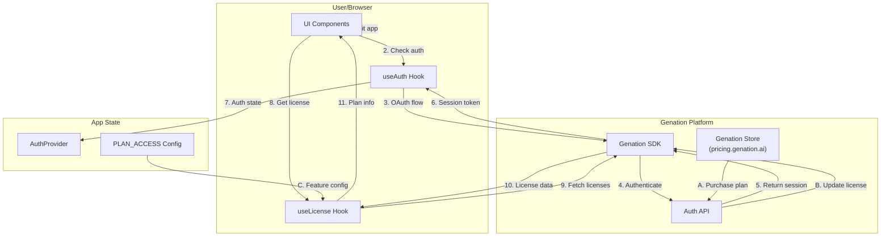

# Feature Specification - Plan & License Management

## 📋 Metadata

| Field | Value |
| ------------------ | ------------------------------------------------------ |
| **Feature ID** | REQ-013 |
| **Feature Name** | Plan & License Management with Genation SDK |
| **Status** | 🔄 In Progress |
| **Priority** | P0 (High) |
| **Owner** | Development Team |
| **Created** | 2026-03-16 |
| **Target Release** | v1.2.0 |

---

## 🎯 Overview

### Problem Statement

Users need to purchase plans to access premium features. Currently, there is no way to:
1. Display available plans and pricing to users
2. Integrate with Genation store for payments
3. Check user plan status and activate features accordingly

### Goals

- Display pricing plans (Free, Pro) in the app
- Integrate with Genation SDK for authentication and license management
- Check user plan status and apply feature restrictions/activations
- Show user's current plan and usage in sidebar

---

## 🔄 Data Flow



### Flow Description

1. **Authentication Flow**: User clicks "Đăng nhập" → redirected to Genation OAuth → returns with session
2. **License Check Flow**: useLicense hook fetches user's licenses from Genation SDK
3. **Feature Access Flow**: App checks `activePlanCode` against `PLAN_ACCESS` config
4. **Purchase Flow**: User clicks upgrade → redirected to Genation store → purchases plan → returns with updated license

---

## 👥 User Stories

### Story 1: View Pricing Plans

**As a** visitor **I want** to see available plans and pricing **So that** I can choose a suitable plan.

**Acceptance Criteria:**

- [ ] Pricing page shows Free, Pro plans with prices
- [ ] Each plan shows included features
- [ ] Current plan is highlighted for logged-in users
- [ ] "Mua ngay" button redirects to Genation store

### Story 2: Login with Genation

**As a** user **I want** to log in using Genation account **So that** I can access my purchased plans.

**Acceptance Criteria:**

- [ ] "Đăng nhập" button triggers Genation OAuth flow
- [ ] After login, user info displayed in header
- [ ] Session persists across page refreshes
- [ ] "Đăng xuất" button signs out user

### Story 3: Check Plan Status

**As a** logged-in user **I want** to see my current plan and usage **So that** I know what features I can access.

**Acceptance Criteria:**

- [ ] Sidebar shows current plan (Free/Pro)
- [ ] Usage stats displayed (credits used/available)
- [ ] Plan badge shown next to user name
- [ ] Auto-refresh when returning from purchase

### Story 4: Feature Access Control

**As a** user **I want** to have features unlocked based on my plan **So that** I can use premium features.

**Acceptance Criteria:**

- [ ] Free users: chỉ tạo được 1 giọng nam + 1 giọng nữ (các giọng khác chỉ nghe sample)
- [ ] Pro users: tạo được tất cả giọng
- [ ] Feature restrictions enforced at UI level

### Story 5: Upgrade Plan

**As a** free/pro user **I want** to upgrade my plan **So that** I can access more features.

**Acceptance Criteria:**

- [ ] "Nâng cấp" button in sidebar opens upgrade modal/page
- [ ] Clicking upgrade redirects to Genation store
- [ ] After purchase, user redirected back to app
- [ ] License automatically refreshes after return

---

## 🏗️ Technical Design

### Architecture

| Layer | Implementation |
|-------|---------------|
| Auth | Genation OAuth 2.1 with PKCE |
| License | Genation SDK `getLicenses()` |
| State | React Context (AuthProvider) |
| Config | `PLAN_ACCESS` constant |

### Files Structure

```
src/
├── lib/genation/
│   ├── config.ts          # ✅ Existing - Genation config
│   ├── client.ts          # ✅ Existing - SDK wrapper
│   └── index.ts           # ✅ Existing - Exports
├── lib/hooks/
│   ├── useAuth.ts         # ✅ Existing - Auth state
│   ├── useLicense.ts      # ✅ Existing - License state
│   └── index.ts           # ✅ Existing - Exports
├── components/
│   ├── LoginButton.tsx    # ✅ Existing - Login UI
│   ├── AuthProvider.tsx   # ✅ Existing - Auth context
│   └── layout/
│       └── Sidebar.tsx    # ⚠️ Need update - Show real plan
└── app/
    └── pricing/
        └── page.tsx       # 🆕 New - Pricing page
```

### Plan Configuration (Existing)

```typescript
// src/lib/hooks/useLicense.ts
export const PLAN_ACCESS = {
  FREE: {
    code: "FREE",
    name: "Miễn phí",
    features: {
      maxVoiceModels: 2,
      allowedVoiceIds: ["manhdung", "ngochuyen"],
      exportFormat: ["wav"],
    },
  },
  PRO: {
    code: "PRO",
    name: "Pro",
    features: {
      maxVoiceModels: -1,
      exportFormat: ["wav", "mp3"],
      prioritySupport: true,
    },
  },
} as const;
```

### API Integration

```typescript
// Genation SDK methods used
import { 
  getSession,        // Get current user session
  getLicenses,       // Get user licenses
  hasActivePlan,    // Check specific plan
  getActivePlanCode, // Get highest plan
  signIn,           // Start OAuth flow
  signOut,          // Sign out
  onAuthStateChange, // Listen to auth changes
} from "@/lib/genation";
```

---

## ✅ Definition of Done

### Authentication
- [x] useAuth hook implemented
- [x] OAuth flow with Genation
- [x] Session persistence
- [x] Sign out functionality

### License Management
- [x] useLicense hook implemented
- [x] Fetch licenses from SDK
- [x] Check active plan
- [x] Plan feature configuration

### UI Updates Needed
- [ ] Sidebar shows real plan data (not hardcoded)
- [ ] Pricing page created
- [ ] Plan upgrade flow

### Integration
- [ ] Connect sidebar to useLicense
- [ ] Add "Mua plan" link to Genation store
- [ ] Handle OAuth callback after purchase

---

## 🔗 Dependencies

### Internal
- Genation SDK (`@genation/sdk`)
- Auth hooks (`useAuth`, `useLicense`)
- PLAN_ACCESS configuration

### External
- Genation OAuth endpoint
- Genation Store (external)

---

## 📝 Notes

### Genation SDK Setup Required
1. Create app in Genation developer portal
2. Get `GENATION_CLIENT_ID` and `GENATION_CLIENT_SECRET`
3. Configure redirect URI
4. Set environment variables in `.env.local`

### Environment Variables
```
NEXT_PUBLIC_GENATION_CLIENT_ID=your_client_id
# Secret: có thể dùng client-side (NEXT_PUBLIC_) hoặc server-only (GENATION_CLIENT_SECRET)
GENATION_CLIENT_SECRET=your_client_secret
# hoặc NEXT_PUBLIC_GENATION_CLIENT_SECRET=your_client_secret
NEXT_PUBLIC_GENATION_REDIRECT_URI=http://localhost:3000/auth/callback
```

### Security Considerations
- **Client secret**: Theo quyết định sản phẩm, secret có thể để client-side (`NEXT_PUBLIC_GENATION_CLIENT_SECRET`). Config hỗ trợ cả hai.
- Validate license on server-side cho thao tác quan trọng (nếu cần).
- Sanitize user input before TTS processing.
