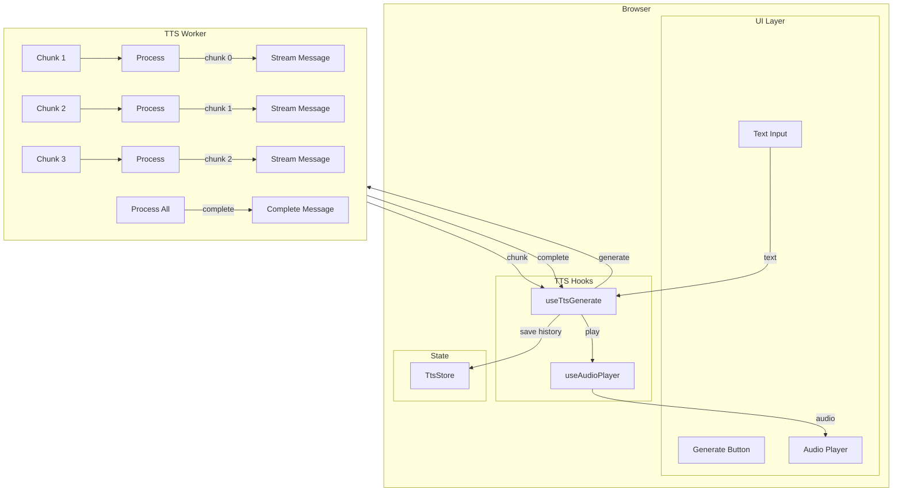
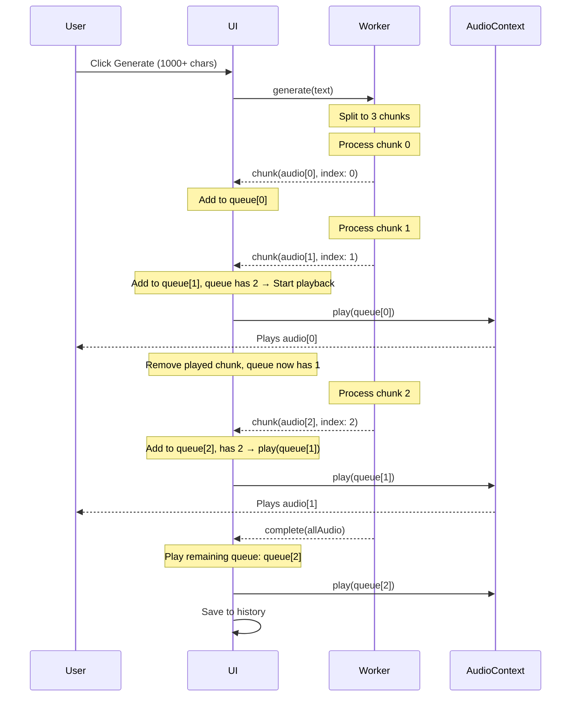

# Feature Specification - Streaming Audio Playback

## 📋 Metadata

| Field | Value |
| ----- | ----- |
| **Feature ID** | REQ-014 |
| **Feature Name** | Streaming Audio Playback |
| **Status** | ⏳ Pending Approval |
| **Priority** | P1 (High) |
| **Owner** | Development Team |
| **Created** | 2026-03-19 |
| **Target Release** | v1.2.0 |

---

## 🎯 Overview

### Problem Statement

Currently, users must wait for the entire TTS generation to complete (4-8 seconds for long text) before hearing any audio. This creates a poor UX experience with perceived slowness.

### Goals

- User can hear audio as soon as the first chunk is generated (~1-2 seconds)
- Maintain audio quality - no degradation from streaming
- Simple implementation - reuse existing chunking logic
- Backward compatible - text < 1000 chars uses existing flow

### Non-Goals

- Real-time streaming at sample level (too complex for MVP)
- Changing storage behavior - history still saves after complete
- Modifying chunk size - keep at 500 chars

### Success Criteria

| Metric | Target | Measurement |
|--------|--------|-------------|
| Time to first audio | < 2s for 1000+ char text | User perceives audio sooner |
| Audio quality | Same as non-streaming | No degradation |
| Implementation complexity | Medium | 4-6 files changed |
| Backward compatibility | 100% | Short text unchanged |

---

## 👥 User Stories

### Story 1: Stream Audio for Long Text

**As a** user **I want** to hear audio immediately after the first chunk is generated **So that** I don't have to wait for the entire text to be processed.

**Acceptance Criteria:**

- [ ] Text > 1000 chars triggers streaming mode
- [ ] First audio chunk plays within 1-2 seconds of generation start
- [ ] Buffer 2 chunks before starting playback (prevent audio gaps)
- [ ] Subsequent chunks play as they complete (no gaps or artifacts)
- [ ] Last chunk(s) played from queue on "complete" message
- [ ] User can stop playback at any time

**Priority:** P0 (Must Have)

### Story 2: Fallback for Short Text

**As a** user **I want** the existing behavior for short text **So that** there's no unnecessary complexity for quick generations.

**Acceptance Criteria:**

- [ ] Text ≤ 1000 chars uses existing "generate then play" flow
- [ ] Progress indicator shows completion normally
- [ ] No visible difference in UI for short text

**Priority:** P0 (Must Have)

### Story 3: Stop During Streaming

**As a** user **I want** to stop playback mid-stream **So that** I can cancel unwanted audio.

**Acceptance Criteria:**

- [ ] Stop button works during streaming
- [ ] All pending chunks are cancelled
- [ ] Playback stops immediately
- [ ] No audio plays after stop

**Priority:** P1 (High)

### Story 4: Error Handling During Stream

**As a** user **I want** to see clear errors if streaming fails **So that** I know what happened and can retry.

**Acceptance Criteria:**

- [ ] If a chunk fails, error is displayed
- [ ] User can retry generation
- [ ] Partial audio is not saved to history

**Priority:** P1 (High)

---

## 🏗️ Technical Design

### Architecture Diagram



### Data Flow - Streaming Mode (with Buffer)



### Files to Modify

| File | Change | Priority |
|------|--------|----------|
| `src/features/tts/types.ts` | Add `TtsWorkerChunk` type | Required |
| `src/workers/tts-worker.ts` | Add chunk streaming logic with threshold | Required |
| `src/features/tts/hooks/useTtsGenerate.ts` | Handle chunk messages, streaming state | Required |
| `src/lib/audio/useAudioPlayer.ts` | Add `queueChunk()` method | Required |
| `src/features/tts/components/AudioPlayer.tsx` | Update playback logic | Required |

### Type Definitions

```typescript
// src/features/tts/types.ts - Add new types
export interface TtsWorkerChunk {
  type: "chunk";
  audio: ArrayBuffer; // WAV audio for single chunk
  index: number; // 0, 1, 2, ...
  isStreaming: boolean; // true if streaming mode
}

export interface TtsWorkerComplete {
  type: "complete";
  audio: ArrayBuffer;
  duration: number;
  wasStreaming: boolean; // true if was streaming, for history
}

// Update union type
export type TtsWorkerOutgoingMessage =
  | TtsWorkerProgress
  | TtsWorkerChunk
  | TtsWorkerComplete
  | TtsWorkerError
  | TtsWorkerReady;
```

### Configuration

```typescript
// src/config.ts - Add streaming config
export const config = {
  // ... existing config
  
  // Streaming settings
  streaming: {
    /** Minimum number of chunks to trigger streaming mode */
    minChunksForStreaming: 2,
    /** Approximate chars per chunk (500) */
    charsPerChunk: 500,
    /** Buffer this many chunks before starting playback to prevent gaps */
    bufferChunks: 2,
  },
} as const;

/** Calculate minimum text length for streaming: minChunks * charsPerChunk */
export const STREAMING_THRESHOLD_CHARS = 
  config.streaming.minChunksForStreaming * 
  config.streaming.charsPerChunk; // = 1000 chars
```

### Worker Changes

```typescript
// src/workers/tts-worker.ts - Pseudo code for streaming

const CHUNK_SIZE = 500;

function splitIntoChunks(text: string): string[] {
  const chunks: string[] = [];
  for (let i = 0; i < text.length; i += CHUNK_SIZE) {
    chunks.push(text.slice(i, i + CHUNK_SIZE));
  }
  return chunks;
}

function shouldStream(textLength: number): boolean {
  const numChunks = Math.ceil(textLength / CHUNK_SIZE);
  return numChunks >= config.streaming.minChunksForStreaming;
}

async function handleGenerate(payload: TtsRequest) {
  const chunks = splitIntoChunks(payload.text);
  
  if (shouldStream(chunks)) {
    // Streaming mode: send each chunk as it completes
    const allAudio: Float32Array[] = [];
    
    for (let i = 0; i < chunks.length; i++) {
      const audio = await processSingleChunk(chunks[i]);
      allAudio.push(audio);
      
      // Stream chunk immediately
      postMessage({
        type: "chunk",
        audio: float32ToWav(audio),
        index: i,
        isStreaming: true,
      } as TtsWorkerChunk);
    }
    
    // Send complete with all audio combined for history
    const fullAudio = concatenateFloat32Arrays(allAudio);
    postMessage({
      type: "complete",
      audio: float32ToWav(fullAudio),
      duration: fullAudio.length / sampleRate,
      wasStreaming: true,
    });
  } else {
    // Fallback: process all at once (existing behavior)
    const fullAudio = await processAllChunks(chunks);
    postMessage({
      type: "complete",
      audio: float32ToWav(fullAudio),
      duration: fullAudio.length / sampleRate,
      wasStreaming: false,
    });
  }
}
```

### Audio Player Interface

```typescript
// src/lib/audio/useAudioPlayer.ts
export interface AudioPlayerState {
  isPlaying: boolean;
  currentTime: number;
  duration: number;
}

export interface UseAudioPlayerReturn {
  // ... existing methods
  
  /** Queue a chunk to play after current audio finishes */
  queueChunk: (audioBuffer: ArrayBuffer) => void;
  
  /** Play a chunk immediately and set up queue for subsequent chunks */
  playChunkNow: (audioBuffer: ArrayBuffer, onEnded?: () => void) => void;
  
  /** Clear all queued chunks (for stop/cancel) */
  clearQueue: () => void;
  
  /** Check if currently in streaming playback mode */
  isStreaming: boolean;
  
  /** Number of chunks currently in queue */
  queueLength: number;
}
```

### Chunk Queue State Management

```typescript
// In useTtsGenerate hook
interface StreamingState {
  chunkQueue: ArrayBuffer[];
  isStreaming: boolean;
  isPlaying: boolean;
}

const MIN_CHUNKS_TO_START = config.streaming.bufferChunks;

const handleChunkMessage = (msg: TtsWorkerChunk) => {
  const queue = [...chunkQueueRef.current, msg.audio];
  chunkQueueRef.current = queue;
  
  // Start streaming when buffer is full
  if (queue.length >= MIN_CHUNKS_TO_START && !isPlayingRef.current) {
    startPlayback();
  }
};

const startPlayback = () => {
  const chunk = chunkQueueRef.current[0];
  playAudio(chunk, () => {
    // On chunk ended
    chunkQueueRef.current.shift();
    
    // Continue if more chunks in queue
    if (chunkQueueRef.current.length > 0) {
      startPlayback();
    }
  });
};
```

---

## ✅ Edge Cases & Error Handling

### Primary Edge Cases (Buffer-Based Streaming)

| # | Case | Handling | User Feedback |
|---|------|----------|---------------|
| 1 | **Gap between chunks** | Buffer 2 chunks before starting playback | Smooth continuous audio |
| 2 | **Last chunk(s)** | On "complete" message, play all remaining in queue | All audio played |
| 3 | **Stop mid-stream** | Clear queue + cancel worker + stop playback | UI returns to idle |
| 4 | **Error mid-stream** | Show error, don't save partial to history | Error toast |

### Secondary Edge Cases

| # | Case | Handling | User Feedback |
|---|------|----------|---------------|
| 5 | **Text exactly 1000 chars** (2 chunks) | Buffer 1 chunk + wait complete → play last | Slight delay but works |
| 6 | **Device too fast** (inference < audio duration) | Queue fills up - acceptable memory impact | No issue |
| 7 | **Browser tab inactive** | Resume AudioContext on visible | Auto-resume audio |
| 8 | **User generate again** during stream | Disable button or auto-cancel previous | Clean restart |
| 9 | **AudioContext interrupted** (notification, call) | Let browser handle, resume on interaction | Audio resumes |
| 10 | **Memory management** | Release AudioBuffer after play, keep ArrayBuffer for history | Normal memory use |

### Detailed Solutions

#### 1. Gap Prevention (Buffer 2 Chunks)

```typescript
// src/features/tts/hooks/useTtsGenerate.ts
const MIN_CHUNKS_TO_START = 2;

const handleChunkMessage = (chunk: TtsWorkerChunk) => {
  chunkQueueRef.current.push(chunk.audio);
  
  // Start playback only when queue has 2+ chunks
  if (chunkQueueRef.current.length >= MIN_CHUNKS_TO_START) {
    playAudio(chunkQueueRef.current[0]);
    chunkQueueRef.current.shift();
  }
};
```

#### 2. Last Chunk(s) Handling

```typescript
const handleCompleteMessage = (msg: TtsWorkerComplete) => {
  // Play all remaining chunks in queue
  while (chunkQueueRef.current.length > 0) {
    playAudio(chunkQueueRef.current.shift()!);
  }
  
  // Then save full audio to history
  saveToHistory(msg.audio);
};
```

#### 3. Stop Mid-Stream

```typescript
// In worker
let isCancelled = false;

const handleStop = () => {
  isCancelled = true;
  // Skip remaining chunks, don't post more messages
};

// In hook
const handleStop = () => {
  stopAudio();
  chunkQueueRef.current = [];
  isCancelledRef.current = true;
  terminateWorker();
};
```

#### 4. Error Mid-Stream

```typescript
const handleError = (error: TtsWorkerError) => {
  // Don't save partial audio to history
  clearAudioHistory();
  
  // Show error
  toast.error(error.message);
  
  // Reset state
  chunkQueueRef.current = [];
  setStatus('error');
};
```

### Configuration for Buffering

```typescript
// src/config.ts
export const config = {
  // ... existing config
  
  streaming: {
    minChunksForStreaming: 2,
    charsPerChunk: 500,
    /** Buffer this many chunks before starting playback */
    bufferChunks: 2,
  },
} as const;
```

---

## 🔐 Security Considerations

- **Input validation**: Text length already validated (max 5000 chars)
- **Audio validation**: Verify WAV header before playback
- **Memory**: Streaming should use less memory (chunks released after play)
- **No new attack vectors**: All processing remains client-side

---

## 🧪 Testing Strategy

| Type | What to Test | Files |
|------|--------------|-------|
| Unit | `shouldStream()` logic | `tts-worker.test.ts` |
| Unit | Chunk splitting | `text-processing.test.ts` |
| Integration | Full streaming flow | Manual test |
| Integration | Stop during stream | Manual test |
| Integration | Short text fallback | Manual test |

### Manual Test Scenarios

1. **Long text (1500+ chars)**: Should stream - first audio < 2s, no gaps
2. **Short text (500 chars)**: Should NOT stream - wait for complete
3. **Click stop mid-stream**: Should stop immediately, queue cleared
4. **Error mid-stream**: Should show error, not save partial
5. **Text exactly 1000 chars** (2 chunks): Buffer 1, wait complete, play last
6. **Generate again during stream**: Should cancel previous, start fresh
7. **Tab hidden then visible**: AudioContext should resume

---

## 📋 Implementation Plan

| Step | Task | Dependency | Status |
|------|------|------------|--------|
| 1 | Add types (`TtsWorkerChunk`) to `types.ts` | - | Pending |
| 2 | Add streaming config to `config.ts` | - | Pending |
| 3 | Implement chunk streaming in `tts-worker.ts` | 1, 2 | Pending |
| 4 | Update `useTtsGenerate` to handle chunk messages | 1, 3 | Pending |
| 5 | Add `queueChunk`/`playChunk` to `useAudioPlayer` | - | Pending |
| 6 | Update `AudioPlayer.tsx` for streaming playback | 5 | Pending |
| 7 | Manual testing | All | Pending |
| 8 | Build & lint check | All | Pending |

### PR Breakdown

**PR 1: Worker Streaming** (Step 1-3)
- Types and config changes
- Worker streaming logic

**PR 2: UI Streaming** (Step 4-6)
- Hook and player updates
- Integration testing

---

## ❓ Open Questions

1. **Q: Should we show "streaming" indicator in UI?**
   - A: Not needed for MVP - behavior should be invisible to user

2. **Q: Can user pause/resume during streaming?**
   - A: Not in MVP - pause would require queuing state management

3. **Q: What if device inference is extremely slow (>2s per chunk)?**
   - A: Buffer will eventually fill, user just waits longer for first audio - acceptable

---

## ✅ Definition of Done

- [ ] Code implemented per spec
- [ ] Long text (1500+ chars) streams audio within 2s
- [ ] No audio gaps between chunks (buffer 2 chunks)
- [ ] Short text (≤1000 chars) uses existing flow
- [ ] Stop during stream works correctly (queue cleared)
- [ ] Error mid-stream shows error, no partial saved
- [ ] Generate again during stream cancels previous
- [ ] History saves only after complete
- [ ] Build passes (`npm run build`)
- [ ] No lint errors (`npm run lint`)
- [ ] Human approved

---

## 📎 References

- Existing TTS flow: `src/features/tts/`
- Audio player: `src/lib/audio/useAudioPlayer.ts`
- Worker: `src/workers/tts-worker.ts`
- Security guidelines: `.cursor/rules/security-guidelines.mdc`
