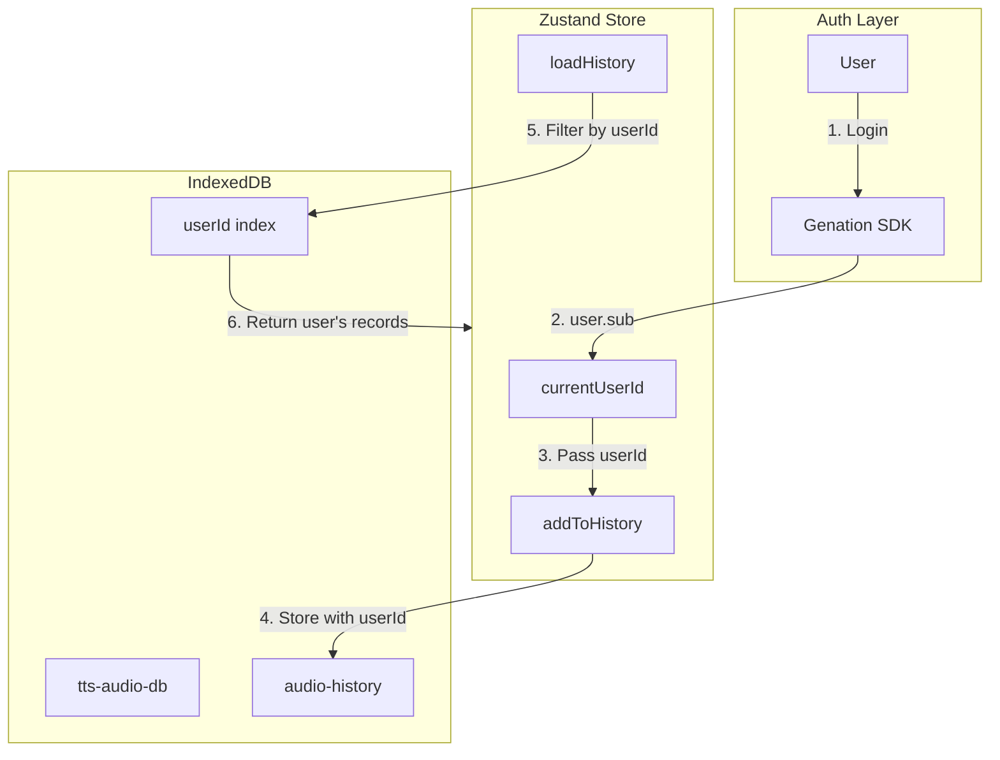

# Feature Specification - User-Specific History Isolation

## Metadata

| Field              | Value                 |
| ------------------ | --------------------- |
| **Feature ID**     | REQ-015               |
| **Feature Name**   | User-Specific History |
| **Status**         | ✅ Completed          |
| **Priority**       | P1 (High)             |
| **Owner**          | Development Team      |
| **Created**        | 2026-03-20            |
| **Target Release** | v1.2.0                |

---

## Overview

### Problem Statement

When multiple users share the same browser, history records were shared across users. This is a privacy and UX concern when users log in with different accounts.

### Solution

Store a `userId` field (from `user.sub` via Genation SDK) with each history record. Filter history by userId based on the current authentication state.

---

## Technical Design

### Mermaid Data Flow



### Database Schema

```typescript
interface StoredHistoryRecord extends Omit<TtsHistoryItem, "audioUrl"> {
  userId?: string; // Optional for legacy compatibility
  audio: Blob; // Not blob URL - Blob is persisted
}
```

### Auth Integration

```typescript
// src/app/(main)/page.tsx
const { user, isAuthenticated } = useAuth();

useEffect(() => {
  const userId = isAuthenticated && user?.sub ? user.sub : null;
  if (userId !== prevUserIdRef.current) {
    setCurrentUserId(userId);
    loadHistory(); // Reload with new userId
  }
}, [user, isAuthenticated]);
```

### History Loading Logic

```typescript
// src/features/tts/store.ts
loadHistory: async () => {
  const userId = get().currentUserId;
  const dbItems = await getHistoryFromDB(
    config.tts.historyLimit,
    userId || undefined, // Pass undefined to getHistory to filter by userId
  );
  set({ history: dbItems, isHistoryLoaded: true });
};
```

### IndexedDB Functions

```typescript
// src/lib/storage/history.ts

// Save with userId
export async function saveHistoryItem(
  item: TtsHistoryItem,
  audioBlob: Blob,
  userId: string,
): Promise<void>;

// Load with userId filter
export async function getHistory(
  limit?: number,
  userId?: string, // Filter by userId if provided
): Promise<TtsHistoryItem[]>;

// Clear only current user's history
export async function clearUserHistory(userId: string): Promise<void>;
```

---

## State Management

| State           | Source                    | Purpose                     |
| --------------- | ------------------------- | --------------------------- |
| `currentUserId` | Zustand store             | Track logged-in user        |
| `history`       | IndexedDB + Zustand store | User-filtered history items |
| `storageInfo`   | Zustand store             | User's storage metrics      |

---

## Edge Cases

| #   | Case                                | Handling                                      |
| --- | ----------------------------------- | --------------------------------------------- |
| 1   | User logs out                       | History reloads (empty, since userId is null) |
| 2   | User logs in with different account | History reloads with new userId               |
| 3   | Legacy records without userId       | Attributed to current user on first access    |
| 4   | Anonymous user (not logged in)      | History saved with "anonymous" userId         |
| 5   | Browser shared by multiple users    | Each user's history is isolated               |

---

## Security Considerations

- **Data Isolation**: History filtered by `userId`, users cannot access others' records
- **Authentication Required**: Only authenticated users get user-specific history
- **Anonymous Fallback**: Unauthenticated users get "anonymous" prefixed records

---

## Definition of Done

- [x] Code implemented
- [x] History filtered by userId based on auth state
- [x] User isolation works (logout/login shows correct history)
- [x] Clear history only affects current user's data
- [x] Legacy records handled correctly
- [x] Build passes
- [x] No lint errors
