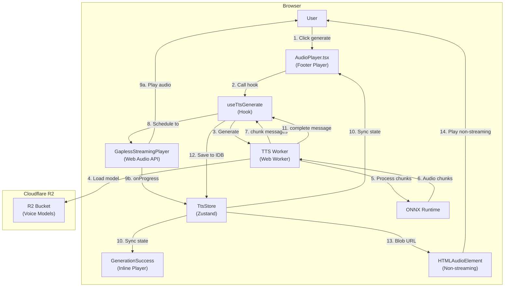
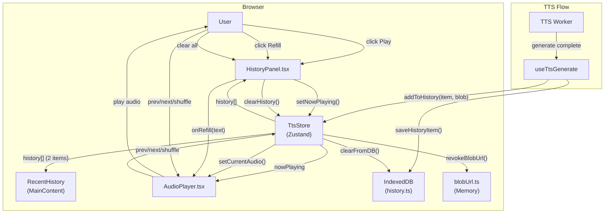
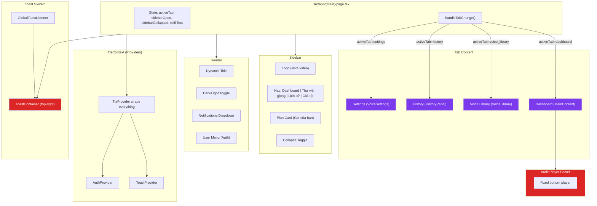

# Audio Playback, History & Dashboard UI/UX Review — SPEC.md

## Metadata

| Field              | Value                                    |
| ------------------ | ---------------------------------------- |
| **Feature ID**     | REQ-AUDIO-DEBUG                          |
| **Feature Name**   | Audio Playback UI/UX Review & Debug Spec |
| **Status**         | Complete                                 |
| **Priority**       | P1 (High)                                |
| **Owner**          | Development Team                         |
| **Created**        | 2026-03-20                               |
| **Target Release** | v1.x (待修复)                            |

---

## Mermaid Data Flow



---

## 1. Tổng quan hệ thống

### 1.1 Hai đường phát audio

Hệ thống audio playback có **2 đường riêng biệt** chạy song song:

| Đường                 | Trigger                                | Công nghệ               | User                        |
| --------------------- | -------------------------------------- | ----------------------- | --------------------------- |
| **Gapless Streaming** | `streamingDuration > 0` (lúc generate) | Web Audio API           | Trong lúc TTS đang generate |
| **Non-streaming**     | Phát lại từ history/preview            | HTML5 `<audio>` element | Sau khi generate xong       |

### 1.2 Các thành phần chính

| File                                       | Vai trò                                |
| ------------------------------------------ | -------------------------------------- |
| `src/components/tts/AudioPlayer.tsx`       | Thanh player cố định bên dưới (footer) |
| `src/components/tts/MainContent.tsx`       | Inline player trong GenerationSuccess  |
| `src/features/tts/hooks/useTtsGenerate.ts` | Hook quản lý generate + streaming      |
| `src/features/tts/store.ts`                | Zustand store — tất cả state           |
| `src/lib/audio/gaplessStreamingPlayer.ts`  | Web Audio engine cho gapless playback  |
| `src/workers/tts-worker.ts`                | Web Worker chạy Piper TTS (ONNX)       |

### 1.3 State flow hiện tại

```
useTtsGenerate.ts:
  worker.onmessage("chunk") → handleChunkMessage() → gaplessPlayer.scheduleChunk()
  worker.onmessage("complete") → finalizeStreaming() → addToHistory() + setNowPlaying()
  togglePlay() → gaplessPlayer.pause()/resume() | audioRef.play()/pause()

AudioPlayer.tsx:
  Gapless: displayCurrentTime = streamingCurrentTime (Web Audio clock)
  Non-gapless: displayCurrentTime = audioRef.currentTime
  Progress bar: dual-source, không seek được trong gapless
```

---

## 2. Đánh giá UI

### 2.1 Layout — Tốt ✓

**AudioPlayer footer** dùng grid 12 cột, responsive:

```tsx
// AudioPlayer.tsx line 319
<footer className="bg-card/95 backdrop-blur-xl border-t border-primary/10 ... fixed bottom-0 left-0 right-0 lg:left-64">
```

- Mobile: 1 cột (stack dọc)
- Tablet: 2 cột
- Desktop: 3 cột (track info | controls + progress | extras)

**Vấn đề nhỏ:** Sidebar width hard-coded `lg:left-64`. Khi sidebar thu gọn (`lg:ml-[4.5rem]`), AudioPlayer không bị lệch vì dùng `left-0`, nhưng không thu hẹp theo content width.

### 2.2 Visual Hierarchy — Tốt ✓

- Nút play/pause: `bg-primary` + shadow, nổi bật nhất
- Track info: kích thước nhỏ, phù hợp footer
- Progress bar: thumb xuất hiện khi hover, không clutter
- Thời gian: font monospace → dễ đọc số

### 2.3 Waveform Visualization — Kém ⚠️

```tsx
// MainContent.tsx line 717-727
const waveformBars = Array.from({ length: 24 }, (_, i) => (
  <div
    key={i}
    className="waveform-bar rounded-sm bg-primary/40"
    style={{
      height: `${8 + (i % 4) * 3}px`, // Chỉ 4 mức: 8, 11, 14, 17px
      animation: isPlaying
        ? `gen-voice-waveform-pulse 1.2s ease-in-out ${i * 0.04}s infinite`
        : "none",
    }}
  />
));
```

**Vấn đề nghiêm trọng:**

1. **Hoàn toàn decorative** — chiều cao 8-17px dao động theo `i % 4`, **không liên quan dữ liệu audio thực**
2. **Misleading** — trong lúc streaming, user không biết đang ở đâu trong audio
3. **CSS override tắt animation:**

```css
/* globals.css line 165-167 */
.waveform-bar {
  animation: none !important;
  height: 12px !important;
}
```

Code này **tắt hẳn animation** — có vẻ là debug artifact bị quên. Waveform luôn đứng im ở 12px.

### 2.4 Progress Bar — Tốt ✓

- Thumb xuất hiện khi hover (tránh clutter)
- Click-to-seek hoạt động cho non-streaming
- Draggable input range overlay (accessible)
- Hiển thị thời gian 2 bên (đã format `MM:SS`)

**Vấn đề:** Không hiển thị khi `totalDuration === 0` (streaming chưa có duration).

### 2.5 Responsive — Tốt ✓

- Mobile: volume slider ẩn, close button hiện
- Tablet: shuffle/loop hiện, volume slider ẩn
- Desktop: đầy đủ

---

## 3. Đánh giá UX

### 3.1 🔴 Vấn đề nghiêm trọng

#### 🔴 Issue #1: Conflicting Audio State giữa Gapless và HTML5 Audio

**Root Cause:** `AudioPlayer` quản lý 2 nguồn audio cùng lúc.

```tsx
// AudioPlayer.tsx line 56-59
const isGaplessStreaming = streamingDuration > 0;
const displayCurrentTime = isGaplessStreaming
  ? streamingCurrentTime
  : currentTime;
const displayDuration = isGaplessStreaming ? streamingDuration : duration;
```

**Vấn đề:** `<audio>` element vẫn được render với `src={currentAudioUrl}` — cùng blob URL mà gapless đang dùng.

```tsx
// AudioPlayer.tsx line 320
<audio ref={audioRef} src={currentAudioUrl} preload="metadata" />
```

**Race condition tiềm ẩn:**

1. `gaplessPlayerRef.current.setVolume(settings.volume)` được gọi trong `useTtsGenerate` (line 300)
2. `audioRef.current.volume = isMuted ? 0 : volume` được gọi trong effect (line 94-96)

Hai giá trị volume có thể lệch nhau khi state thay đổi. Volume của gapless player không bị ảnh hưởng bởi `audioRef.current.volume` (vì gapless không qua element), nhưng `volume` state vẫn được sync 2 lần.

#### 🔴 Issue #2: Player State không clear khi close

Khi user bấm X, player ẩn nhưng **audio vẫn chơi trong background**:

```tsx
// page.tsx line 135-140
{
  currentAudioUrl && (
    <AudioPlayer
      isVisible={playerVisible}
      onClose={() => setPlayerVisible(false)}
    />
  );
}
```

`currentAudioUrl`, `currentAudio`, `nowPlaying` không bị reset. User nghĩ đã tắt audio nhưng thực ra vẫn đang chơi.

#### 🔴 Issue #3: Status conflation — `TtsStatus` làm quá nhiều thứ

```tsx
// types.ts line 40
export type TtsStatus =
  | "idle"
  | "loading"
  | "generating"
  | "previewing"
  | "playing"
  | "error"
  | "streaming-ended";
```

`status === "playing"` được dùng cho cả:

- Đang streaming playback
- Đang chơi non-streaming audio
- Đang preview voice

**Biểu hiện:** Nút play/pause không phân biệt được "đang phát audio" vs "đang generate/preview". Icon play hiện khi `status === "idle"` nhưng audio vẫn đang chơi.

```tsx
// AudioPlayer.tsx line 363-370
<button
  onClick={togglePlay}
  aria-label={status === "playing" && !pausedStreaming ? "Tạm dừng" : "Phát"}
>
  {status === "playing" && !pausedStreaming ? (
    <Pause className="w-6 h-6 sm:w-7 sm:h-7" />
  ) : (
    <Play className="w-6 h-6 sm:w-7 sm:h-7 ml-1" />
  )}
</button>
```

#### 🔴 Issue #4: Preview Voice ghi đè main playback state

```tsx
// useTtsGenerate.ts line 592-594 (previewVoice callback)
setCurrentAudio(blob, audioUrl);
setNowPlaying(previewItem);
setStatus("playing");
```

Khi preview một giọng, nó set `nowPlaying` và `status="playing"` — **ghi đè hoàn toàn track đang phát chính**. Không có visual feedback rõ ràng rằng "đây là sample preview, không phải track chính".

#### 🔴 Issue #5: `handleAudioComplete` không xử lý non-gapless streaming path

Trong `useTtsGenerate`, khi worker gửi `complete`:

```tsx
// useTtsGenerate.ts line 393-405
case "complete":
  if (message.audio.byteLength > 0 && message.duration > 0) {
    if (isStreamingRef.current) {
      // Gapless: chờ playback finish trong onStreamEnded
      pendingFullAudioRef.current = { buffer: message.audio, duration: message.duration };
      setProgress(100);
      gaplessPlayerRef.current?.markComplete();
    } else {
      // Non-gapless: gọi trực tiếp
      handleAudioCompleteRef.current?.(message.audio, message.duration);
    }
  }
```

Nhưng `handleAudioComplete` luôn tạo `Blob` + `URL.createObjectURL` và gọi `setCurrentAudio`. Vấn đề: khi **non-gapless streaming** đang active (queue chunks), `isStreamingRef.current === true`, nhưng worker gửi `complete` thì không có chunks để stream nữa → `pendingFullAudioRef.current` được set → `finalizeStreaming` được gọi trong `onStreamEnded`.

Tuy nhiên, khi user **phát lại** audio đã lưu trong history (không qua streaming), worker không được invoke. Audio được chơi trực tiếp từ `currentAudioUrl`. Điều này hoạt động đúng, nhưng `isStreamingRef` không được reset khi phát lại.

### 3.2 🟡 Vấn đề trung bình

#### 🟡 Issue #6: Không seek được trong Gapless Streaming

```tsx
// AudioPlayer.tsx line 192-193
if (isGaplessStreaming) return; // Gapless: cannot seek
```

User không thể skip forward/backward hoặc click trên progress bar trong lúc streaming. Chỉ có play/pause là hoạt động. Với văn bản dài, frustration cao.

#### 🟡 Issue #7: Speed control không sync khi đang streaming

```tsx
// AudioPlayer.tsx line 272-274
const handleSpeedChange = useCallback(
  (speed: number) => {
    setSettings({ speed });
  },
  [setSettings],
);
```

`GaplessStreamingPlayer.setPlaybackRate()` chỉ được gọi **1 lần** khi tạo player (line 301):

```tsx
// useTtsGenerate.ts line 300-301
gaplessPlayerRef.current.setVolume(settings.volume);
gaplessPlayerRef.current.setPlaybackRate(settings.speed); // Chỉ chạy lúc khởi tạo
```

Không có effect re-run khi `settings.speed` thay đổi. Volume thì có sync:

```tsx
// useTtsGenerate.ts line 206-208
useEffect(() => {
  gaplessPlayerRef.current?.setVolume(settings.volume);
}, [settings.volume]);
```

**Fix:** Thêm effect tương tự cho speed.

#### 🟡 Issue #8: Không có buffering indicator

Trong non-gapless streaming path, khi chunk hết mà chunk tiếp theo chưa đến, `streamingState` chuyển sang `"buffering"`:

```tsx
// AudioPlayer.tsx line 118-139
const handleEnded = () => {
  if (streamingDuration > 0) return; // Gapless
  if (streamingState === "playing" || streamingState === "buffering") {
    setStreamingState("buffering"); // Chuyển sang buffering
    return;
  }
  // ...
};
```

Nhưng **AudioPlayer không hiển thị gì** khi `streamingState === "buffering"` — progress bar đứng im không có animation hay icon loading.

#### 🟡 Issue #9: History navigation hạn chế

- Không có playlist view để xem tất cả tracks
- Không thể click vào history item để phát — phải dùng nút prev/next
- Shuffle không shuffle thực sự — chỉ chọn 1 track ngẫu nhiên, không tạo shuffle queue

#### 🟡 Issue #10: Download filename không descriptive

```tsx
// AudioPlayer.tsx line 290
link.download = `genvoice-${Date.now()}.wav`;
```

Nên dùng voice name hoặc text đã generate. Ví dụ: `ban-tin-buoi-sang-ngochuyen.wav`

### 3.3 🟢 Vấn đề nhỏ

#### 🟢 Issue #11: Loop toggle ẩn trên mobile

User mobile không thể bật loop. Không có overflow menu hoặc long-press alternative.

#### 🟢 Issue #12: Waveform CSS override tắt animation

```css
/* globals.css line 165-167 */
.waveform-bar {
  animation: none !important;
  height: 12px !important;
}
```

Debug artifact cần xóa hoặc chuyển thành class toggle (ví dụ: `prefers-reduced-motion`).

#### 🟢 Issue #13: Redundant info giữa GenerationSuccess và AudioPlayer

Cả 2 đều hiển thị: voice name, duration, progress. Nên để GenerationSuccess chỉ là "preview nhỏ" với 1-2 thông tin chính.

#### 🟢 Issue #14: Pitch control không hiện trong player

`AudioCustomization` có pitch slider trong form, nhưng player footer không hiện pitch. User phải quay lại form để thay đổi.

#### 🟢 Issue #15: No keyboard accessibility

- Progress bar: có `aria-label` nhưng input đè lên div không focusable bằng Tab
- Volume slider: tương tự
- Không có keyboard shortcut cho play/pause (space bar)

---

## 4. Architecture Issues

### 4.1 `gaplessPlayerRef` là một React ref không sync

```tsx
// useTtsGenerate.ts line 59
const gaplessPlayerRef = useRef<GaplessStreamingPlayer | null>(null);
```

`gaplessPlayer` được export và consume bởi `AudioPlayer`:

```tsx
// AudioPlayer.tsx line 51
const { gaplessPlayer } = useTts();
```

**Vấn đề:** Khi `gaplessPlayerRef.current` thay đổi (tạo player mới), component `AudioPlayer` **không re-render** vì `gaplessPlayer` là stable reference. `useTts()` trả về `gaplessPlayer: gaplessPlayerRef` — đây là stable object reference, không phải `gaplessPlayerRef.current`.

**Thực tế:** `gaplessPlayerRef` được wrap trong ref object nên re-render xảy ra khi `gaplessPlayerRef` assignment thay đổi (line 294, 489-490). Vẫn hoạt động đúng vì state update trigger re-render.

### 4.2 Blob URL leak tiềm ẩn trong `playNextStreamingChunk`

```tsx
// useTtsGenerate.ts line 181-199
const chunk = chunkQueueRef.current.shift()!;
const audioBlob = new Blob([chunk], { type: "audio/wav" });
const audioUrl = URL.createObjectURL(audioBlob);
// ...
setCurrentAudio(audioBlob, audioUrl);
```

Mỗi chunk tạo blob URL mới. `setCurrentAudio` revoke URL cũ, nhưng nếu nhiều chunks được queue mà chưa revoke kịp, có thể có leak nhỏ. **Không nghiêm trọng** vì `revokeBlobUrl` được gọi trong store.

### 4.3 `reset()` trong store không stop gapless player

```tsx
// store.ts line 227-245
reset: () => {
  revokeBlobUrl(state.currentAudioUrl);
  revokeBlobUrl(state.nowPlaying?.audioUrl);
  set({
    status: "idle",
    // ... không stop gaplessPlayer
  });
},
```

`stop()` trong `useTtsGenerate` gọi `gaplessPlayerRef.current?.stop()`, nhưng `reset()` trong store **không** stop player. Nếu component unmount mà không gọi `stop()`, AudioContext có thể leak.

---

## 5. Recommendations

### 5.1 Critical (Cần fix ngay)

| #   | Issue                         | Fix                                                                                |
| --- | ----------------------------- | ---------------------------------------------------------------------------------- |
| 1   | Conflicting audio state       | Tách `<audio>` element ra khi `isGaplessStreaming`, hoặc dùng `disabled` attribute |
| 2   | Close button không stop audio | Gọi `gaplessPlayer.stop()` hoặc `audio.pause()` khi close                          |
| 3   | Status conflation             | Tách `playbackStatus` khỏi `TtsStatus`                                             |
| 4   | Preview ghi đè nowPlaying     | Dùng `previewItem` riêng, không ghi đè `nowPlaying`                                |
| 5   | Waveform CSS override         | Xóa debug code hoặc thêm toggle class                                              |

### 5.2 High Priority (Nên fix)

| #   | Issue                               | Fix                                                                             |
| --- | ----------------------------------- | ------------------------------------------------------------------------------- |
| 6   | Không seek được trong streaming     | Thêm seek support hoặc disable progress bar + hiện message                      |
| 7   | Speed không sync khi streaming      | Thêm `useEffect` gọi `gaplessPlayerRef.current.setPlaybackRate(settings.speed)` |
| 8   | Không có buffering indicator        | Hiện spinner hoặc pulse animation khi `streamingState === "buffering"`          |
| 9   | Download filename không descriptive | Dùng voice name + text snippet                                                  |
| 10  | `reset()` không stop player         | Thêm `gaplessPlayerRef.current?.stop()` trong reset                             |

### 5.3 Medium Priority

| #   | Issue                            | Fix                                                                 |
| --- | -------------------------------- | ------------------------------------------------------------------- |
| 11  | Loop toggle ẩn trên mobile       | Thêm vào overflow menu hoặc long-press                              |
| 12  | Redundant info giữa 2 players    | GenerationSuccess chỉ hiện icon + text, AudioPlayer là full control |
| 13  | Pitch control không trong player | Thêm pitch selector vào player hoặc sticky panel                    |
| 14  | No keyboard accessibility        | Thêm `tabIndex`, keyboard shortcuts (space = play/pause)            |
| 15  | History navigation hạn chế       | Thêm playlist view hoặc cải thiện HistoryPanel                      |

---

## 6. Proposed Fix: State Architecture

### 6.1 Tách PlaybackStatus khỏi TtsStatus

```tsx
// types.ts
export type PlaybackStatus = "idle" | "playing" | "paused" | "buffering";
export type TtsStatus =
  | "idle"
  | "loading"
  | "generating"
  | "previewing"
  | "error";

interface TtsState {
  // ... existing
  ttsStatus: TtsStatus;
  playbackStatus: PlaybackStatus;
  playbackSource: "none" | "gapless" | "html5";
  // ...
}
```

### 6.2 Preview isolation

```tsx
// Trong useTtsGenerate - previewVoice
previewVoice() {
  // Tạo preview riêng, không ghi đè nowPlaying
  const previewRef = useRef<GaplessStreamingPlayer>(null);
  // Preview dùng ref không share state với main player
}
```

---

## 7. Testing Checklist

### 7.1 Manual Test Scenarios

| #   | Scenario                                      | Expected                               | Status |
| --- | --------------------------------------------- | -------------------------------------- | ------ |
| 1   | Generate 1500+ chars → hear audio within 2s   | Gapless playback starts                | ⏳     |
| 2   | Click close button → audio stops              | Audio paused + player hidden           | ⏳     |
| 3   | Change speed during streaming → speed changes | Playback rate updates live             | ⏳     |
| 4   | Click skip during streaming → seeks           | "Cannot seek during streaming" message | ⏳     |
| 5   | Preview voice → nowPlaying unchanged          | Preview plays but main track preserved | ⏳     |
| 6   | History item click → plays correct track      | Blob URL loads + plays                 | ⏳     |
| 7   | Generate again during stream → previous stops | Old stream cancelled                   | ⏳     |
| 8   | Browser tab hidden → audio resumes            | AudioContext.resume() called           | ⏳     |
| 9   | Download → filename includes voice name       | `voicename-text-preview.wav`           | ⏳     |
| 10  | Keyboard space → play/pause toggles           | Works globally                         | ⏳     |

---

## 8. Files Changed (Summary)

| File                                       | Changes                                                   |
| ------------------------------------------ | --------------------------------------------------------- |
| `src/components/tts/AudioPlayer.tsx`       | Fix conflicting state, close = pause, buffering indicator |
| `src/components/tts/MainContent.tsx`       | Remove waveform override, inline player simplification    |
| `src/features/tts/hooks/useTtsGenerate.ts` | Speed sync effect, preview isolation                      |
| `src/features/tts/store.ts`                | Separate playbackStatus, reset() stops player             |
| `src/features/tts/types.ts`                | Add PlaybackStatus type                                   |
| `src/app/globals.css`                      | Remove waveform debug override                            |
| `src/lib/audio/gaplessStreamingPlayer.ts`  | Expose playbackRate setter                                |

---

## 9. Priority Implementation Plan

| Step | Task                                           | Priority    | Files                            |
| ---- | ---------------------------------------------- | ----------- | -------------------------------- |
| 1    | Xóa waveform CSS override + thêm waveform thật | 🔴 Critical | `globals.css`, `MainContent.tsx` |
| 2    | Fix close = pause audio                        | 🔴 Critical | `AudioPlayer.tsx`                |
| 3    | Thêm buffering indicator                       | 🟡 High     | `AudioPlayer.tsx`                |
| 4    | Speed sync khi streaming                       | 🟡 High     | `useTtsGenerate.ts`              |
| 5    | Preview isolation (không ghi đè nowPlaying)    | 🟡 High     | `useTtsGenerate.ts`              |
| 6    | Tách PlaybackStatus khỏi TtsStatus             | 🟡 High     | `types.ts`, `store.ts`           |
| 7    | Download filename descriptive                  | 🟡 High     | `AudioPlayer.tsx`                |
| 8    | Keyboard accessibility (space = play/pause)    | 🟢 Medium   | `AudioPlayer.tsx`                |
| 9    | Pitch control trong player                     | 🟢 Medium   | `AudioPlayer.tsx`                |
| 10   | Playlist/history view cải thiện                | 🟢 Medium   | `HistoryPanel.tsx`               |

---

## 10. References

| Context               | Location                                               |
| --------------------- | ------------------------------------------------------ |
| AudioPlayer component | `src/components/tts/AudioPlayer.tsx`                   |
| Inline player         | `src/components/tts/MainContent.tsx`                   |
| TTS hook              | `src/features/tts/hooks/useTtsGenerate.ts`             |
| Store                 | `src/features/tts/store.ts`                            |
| Types                 | `src/features/tts/types.ts`                            |
| Gapless player        | `src/lib/audio/gaplessStreamingPlayer.ts`              |
| Playback spec         | `.sdlc/specs/REQ-003-playback-controls/SPEC.md`        |
| Streaming spec        | `.sdlc/specs/REQ-014-streaming-audio-playback/SPEC.md` |
| Debugger agent        | `.cursor/agents/debugger.md`                           |

---

## PART II — HISTORY UI/UX REVIEW

---

## H. Metadata

| Field              | Value               |
| ------------------ | ------------------- |
| **Feature ID**     | REQ-AUDIO-DEBUG     |
| **Part**           | II — History        |
| **Status**         | Complete            |
| **Priority**       | P1 (High)           |
| **Owner**          | Development Team    |
| **Created**        | 2026-03-20          |
| **Files Reviewed** | 11 files (see §L.1) |

---

## I. Mermaid Data Flow — History



---

## J. Tổng quan kiến trúc

### J.1 Các thành phần chính

| Thành phần            | File                                           | Vai trò                                   |
| --------------------- | ---------------------------------------------- | ----------------------------------------- |
| **IndexedDB storage** | `src/lib/storage/history.ts`                   | Persist audio Blob + metadata             |
| **Blob URL manager**  | `src/lib/storage/blobUrl.ts`                   | Memory leak prevention                    |
| **Zustand store**     | `src/features/tts/store.ts`                    | State management + IDB sync               |
| **HistoryPanel**      | `src/features/tts/components/HistoryPanel.tsx` | Full history list view                    |
| **RecentHistory**     | `src/components/tts/MainContent.tsx`           | Compact 2-item preview on dashboard       |
| **AudioPlayer**       | `src/components/tts/AudioPlayer.tsx`           | Playlist navigation (prev/next/shuffle)   |
| **Refill flow**       | `src/app/(main)/page.tsx`                      | Navigation: History → Dashboard with text |

### J.2 Refill flow (End-to-End)

```
1. User on History tab → click Refill (upload icon) on a card
2. HistoryPanel: handleRefill(item.text) → onRefill(text)
3. page.tsx: handleRefillFromHistory(text)
   → setInputText(text)
   → setActiveTab("dashboard")
4. MainContent receives inputText from store
5. TextInput pre-filled with history text
6. User can edit or click "Tạo giọng nói ngay" to regenerate
```

### J.3 Storage flow

```
Generate complete:
  useTtsGenerate → addToHistory(item, audioBlob)
  → Zustand: history.unshift(item)
  → IndexedDB: saveHistoryItem(item, audioBlob)

Page load:
  loadHistory() → getHistoryFromDB(50)
  → Reconstruct blob URLs from stored Blobs
  → history[] populated

Delete:
  removeFromHistory(id) → Zustand: filter out
  → revokeBlobUrl(url) if not nowPlaying
  → IndexedDB: deleteHistoryItem(id)

Clear All:
  clearHistory() → revokeBlobUrl for all + currentAudio
  → history = [], nowPlaying = null
  → IndexedDB: clear()
```

---

## K. Đánh giá UI

### K.1 Empty State — Tốt ✓

```tsx
// HistoryPanel.tsx line 79-113
<div className="mx-auto w-full max-w-3xl">
  <div className="flex flex-col items-center justify-center min-h-[60vh] text-center space-y-6">
    <div className="relative">
      <div className="w-24 h-24 bg-primary/5 rounded-full border border-primary/10">
        <History className="w-12 h-12 text-muted-foreground/50" />
      </div>
      <div className="absolute -bottom-1 -right-1 w-10 h-10 bg-background border-4 rounded-full">
        <Ban className="w-6 h-6 text-red-500" />
      </div>
    </div>
    <h2 className="text-xl font-bold">Chưa có bản ghi nào</h2>
    <p className="text-sm text-muted-foreground">
      Nhập văn bản và bấm Tạo giọng nói để bắt đầu
    </p>
    {onCreateNew && (
      <button
        onClick={onCreateNew}
        className="mt-4 px-6 py-2.5 bg-primary/10 ... "
      >
        <Plus className="w-4 h-4" />
        Tạo bản ghi đầu tiên
      </button>
    )}
  </div>
</div>
```

**Điểm tốt:**

- Icon 24x24 rõ ràng, negative space + badge tạo depth
- `min-h-[60vh]` center vertical trên màn hình
- Nút CTA rõ ràng — user biết phải làm gì
- Responsive: `mx-auto max-w-3xl`

### K.2 History Card — Trung bình ⚠️

```tsx
// HistoryPanel.tsx line 131-226
<div className="bg-card p-4 border border-primary/10 rounded-xl hover:border-primary/20">
  {/* Voice • Speed • Date */}
  <div className="flex flex-wrap items-center gap-x-2 gap-y-1 text-xs text-muted-foreground mb-1">
    <span className="font-semibold text-foreground">{getVoiceName(item.voice)}</span>
    <span>•</span>
    <span>{item.speed}x</span>
    <span>•</span>
    <span>{formatDate(item.createdAt)}</span>
  </div>
  <p className="text-sm text-foreground line-clamp-2">{item.text || "(No text)"}</p>

  {/* 4 action buttons */}
  <div className="flex items-center gap-2">
    <button onClick={() => handlePlay(item)} className="w-10 h-10 rounded-full bg-primary">Play icon</button>
    <button onClick={() => handleDownload(item)} ...>Download icon</button>
    <button onClick={() => handleRefill(item.text)} ...>Upload icon</button>  {/* WRONG ICON */}
    <button onClick={() => handleDelete(item.id)} ...>Trash icon</button>
  </div>
</div>
```

**Vấn đề:**

1. **4 icon buttons trên 1 row** — cramped trên mobile, card cao không cần thiết
2. **Không hiện duration** — user không biết audio dài bao lâu
3. **Refill dùng upload icon** (`M21 15v4a2 2 0 0 1-2 2H5...`) — **sai convention**. Upload = "đẩy lên server", không phải "điền lại". Nên dùng `ArrowLeft` hoặc `RefreshCw`
4. **Không hiệu "đang phát"** — không phân biệt item nào đang active
5. **`line-clamp-2` nhưng card không fixed height** → layout shift khi text dài/không có text

### K.3 Compact RecentHistory (Dashboard) — Tốt ✓

```tsx
// MainContent.tsx line 925-952
<div className="space-y-2">
  {recent.map((item) => (
    <div
      key={item.id}
      className="flex items-center justify-between gap-2 sm:gap-3 p-3 ..."
    >
      <p className="text-xs text-muted-foreground line-clamp-1 truncate">
        {item.text?.trim() || "(Không có văn bản)"}
      </p>
      <span className="text-[10px] shrink-0">{getVoiceName(item.voice)}</span>
      <button
        onClick={() => item.text && onRefill(item.text)}
        className="shrink-0 ..."
      >
        Điền lại
      </button>
    </div>
  ))}
</div>
```

**Điểm tốt:** Compact, 2 items mới nhất, chỉ text + voice + nút refill. Null-safe.

**Vấn đề nhỏ:**

- Không hiện duration
- Không hiện date/time — không phân biệt item nào mới hơn
- Không có play button — phải vào History tab để nghe

### K.4 Sidebar Navigation — Tốt ✓

```tsx
// Sidebar.tsx line 44
{ id: "history", label: "Lịch sử", icon: History }
```

Simple, clean. Không có badge hiện số lượng items.

### K.5 Playback Counter — Tốt ✓

```tsx
// HistoryPanel.tsx line 120
<h2>
  Lịch sử ({history.length}/{config.tts.historyLimit})
</h2>
```

Hiện `3/50` — user biết còn bao nhiêu slot.

---

## L. Đánh giá UX

### L.1 🔴 Vấn đề nghiêm trọng

#### 🔴 Issue H-1: Play button không pause audio trước khi chuyển track

```tsx
// HistoryPanel.tsx line 18-25
const handlePlay = useCallback(
  (item: TtsHistoryItem) => {
    setNowPlaying(item);
    setCurrentAudio(null, item.audioUrl);
    setStatus("playing"); // KHÔNG pause audio cũ trước
  },
  [setNowPlaying, setCurrentAudio, setStatus],
);
```

**Root cause:** Khi click Play trên history item, `setStatus("playing")` trigger `<audio>` element chơi mà **không pause audio đang chơi trước đó**. Có thể nghe 2 audio chồng lên trong 1 khoảnh khắc.

**Fix:** Gọi `gaplessPlayerRef.current?.pause()` hoặc `audioRef.current?.pause()` trước khi set status mới. Hoặc dùng store action `pausePlayback()`.

```tsx
const handlePlay = useCallback((item: TtsHistoryItem) => {
  // 1. Pause audio đang chơi
  gaplessPlayerRef.current?.pause();
  audioRef.current?.pause();
  // 2. Set track mới
  setNowPlaying(item);
  setCurrentAudio(null, item.audioUrl);
  setStatus("playing");
}, [...]);
```

Tương tự trong `AudioPlayer.handlePreviousTrack` và `handleNextTrack`:

```tsx
// AudioPlayer.tsx line 229-238
const handlePreviousTrack = useCallback(() => {
  // gapless/audio pause ở đây cũng bị thiếu
  if (currentIndex > 0) {
    setNowPlaying(prev);
    setCurrentAudio(null, prev.audioUrl);
    setStatus("playing");
  }
}, [...]);
```

#### 🔴 Issue H-2: Refill không pause audio đang phát

```tsx
// page.tsx line 59-63
const handleRefillFromHistory = useCallback(
  (text: string) => {
    setRefillText(text);
    setInputText(text);
    setActiveTab("dashboard");
    // audio đang chơi vẫn tiếp tục — KHÔNG pause
  },
  [setInputText],
);
```

**Root cause:** Khi refill text từ history:

1. Audio đang phát **tiếp tục chơi trong background**
2. `nowPlaying` không bị reset
3. User về dashboard với text mới, audio cũ vẫn chơi

**Hệ quả:** User có thể nghe nhầm audio cũ với text mới. Hoặc khi generate mới, audio mới overwrite audio cũ mà không có warning.

**Fix:** Thêm bước pause hoặc confirm:

```tsx
const handleRefillFromHistory = useCallback(
  (text: string) => {
    // Option A: Pause audio
    gaplessPlayerRef.current?.pause();
    audioRef.current?.pause();

    // Option B: Confirm
    if (nowPlaying && nowPlaying.id !== item.id) {
      if (!window.confirm("Đang phát audio khác. Dừng và tiếp tục?")) return;
    }

    setInputText(text);
    setActiveTab("dashboard");
  },
  [setInputText, nowPlaying],
);
```

#### 🔴 Issue H-3: `loadHistory()` chỉ gọi 1 lần khi mount — không phân biệt loading vs empty

```tsx
// page.tsx line 29-31
useEffect(() => {
  loadHistory();
}, [loadHistory]);
```

```tsx
// HistoryPanel.tsx line 79
if (history.length === 0) {
  return <EmptyState />; // Hiện empty LUÔN — kể cả khi đang load
}
```

**Root cause:** `isHistoryLoaded` tồn tại trong store (line 48) nhưng **HistoryPanel không kiểm tra** nó. Không phân biệt được:

- Đang loading từ IndexedDB
- Thực sự không có history items

**Fix:** Thêm loading skeleton:

```tsx
// HistoryPanel.tsx
const { history, isHistoryLoaded } = useTtsStore();

if (!isHistoryLoaded) {
  return (
    <div className="mx-auto w-full max-w-4xl space-y-3">
      {[1, 2, 3].map((i) => (
        <div key={i} className="bg-card p-4 border rounded-xl animate-pulse">
          <div className="h-4 bg-muted rounded w-1/3 mb-2" />
          <div className="h-3 bg-muted rounded w-2/3" />
        </div>
      ))}
    </div>
  );
}
if (history.length === 0) {
  return <EmptyState />;
}
```

### L.2 🟡 Vấn đề trung bình

#### 🟡 Issue H-4: Không hiệu "đang phát" (nowPlaying indicator)

**Root cause:** Khi `nowPlaying.id === item.id`, card không có visual distinction.

```tsx
// Current: KHÔNG có distinction
{
  history.map((item) => (
    <div key={item.id} className="bg-card p-4 border ...">
      {/* Mọi item giống nhau */}
      <button onClick={() => handlePlay(item)}>Play icon</button>
    </div>
  ));
}
```

**Fix:** Thêm border-primary + background + icon thay đổi:

```tsx
const { nowPlaying } = useTtsStore();

{
  history.map((item) => {
    const isActive = nowPlaying?.id === item.id;
    return (
      <div
        key={item.id}
        className={cn(
          "bg-card p-4 border rounded-xl transition-colors",
          isActive
            ? "border-primary bg-primary/5"
            : "border-primary/10 hover:border-primary/20",
        )}
      >
        <button onClick={() => (isActive ? togglePlay() : handlePlay(item))}>
          {isActive && !pausedStreaming ? <Pause /> : <Play />}
        </button>
      </div>
    );
  });
}
```

#### 🟡 Issue H-5: Không hiện duration trong history list

**Root cause:** `item.duration` được lưu nhưng không hiển thị trong card.

**Impact:** User không biết audio dài bao lâu khi browse history.

**Fix:** Thêm formatDuration:

```tsx
// Thêm vào HistoryPanel
const formatDuration = (seconds: number) => {
  const mins = Math.floor(seconds / 60);
  const secs = Math.floor(seconds % 60);
  return `${mins}:${secs.toString().padStart(2, "0")}`;
};

// Trong card header
<div className="flex flex-wrap items-center gap-x-2 gap-y-1 text-xs text-muted-foreground mb-1">
  <span className="font-semibold text-foreground">
    {getVoiceName(item.voice)}
  </span>
  <span>•</span>
  <span>{item.speed}x</span>
  <span>•</span>
  <span>{formatDuration(item.duration)}</span>
  <span>•</span>
  <span>{formatDate(item.createdAt)}</span>
</div>;
```

Tương tự cho `RecentHistory` trên dashboard.

#### 🟡 Issue H-6: Download filename không descriptive

```tsx
// HistoryPanel.tsx line 49
link.download = `genvoice-${item.id}.wav`;
```

**Fix:**

```tsx
const voiceName = getVoiceName(item.voice);
const textSlug =
  item.text
    ?.slice(0, 30)
    ?.trim()
    ?.replace(/[\s\n\r]+/g, "-")
    ?.replace(/[^a-z0-9-]/gi, "")
    ?.toLowerCase() ?? "audio";

const filename = `${voiceName}-${textSlug}.wav`
  .replace(/\s+/g, "-")
  .slice(0, 100); // Limit filename length

link.download = filename;
```

#### 🟡 Issue H-7: Refill icon sai convention

Upload icon (`M21 15v4a2...`) mang ý nghĩa "đẩy file lên server". Không phù hợp với "điền lại text vào form".

**Fix:** Dùng `ArrowLeft` (quay về) hoặc `Clipboard` (copy text) hoặc `RefreshCw` (tái sử dụng):

```tsx
import { ArrowLeft } from "lucide-react";
// ...
<button aria-label="Điền lại văn bản" title="Điền lại văn bản">
  <ArrowLeft className="w-5 h-5" />
</button>;
```

#### 🟡 Issue H-8: Delete + Clear All không có confirm dialog

```tsx
// HistoryPanel.tsx line 122-127
<button onClick={clearHistory} className="text-sm ...">
  Clear All
</button>

// HistoryPanel.tsx line 203
<button onClick={() => handleDelete(item.id)} ...>
  Trash icon
</button>
```

**Fix:** Thêm `window.confirm()` hoặc dùng toast với undo:

```tsx
// Clear All
const handleClearAll = () => {
  if (history.length === 0) return;
  if (
    window.confirm(
      `Xóa tất cả ${history.length} bản ghi? Hành động này không thể hoàn tác.`,
    )
  ) {
    clearHistory();
  }
};

// Delete individual
const handleDelete = (id: string) => {
  if (window.confirm("Xóa bản ghi này?")) {
    removeFromHistory(id);
  }
};
```

#### 🟡 Issue H-9: Refill không preserve voice + settings

```tsx
// page.tsx line 59-63 — CHỉ refill text
const handleRefillFromHistory = useCallback(
  (text: string) => {
    setInputText(text);
    setActiveTab("dashboard");
  },
  [setInputText],
);
```

User refill text từ history nhưng **mất voice và speed đã chọn trước đó**.

**Fix:** Optional preserve:

```tsx
const handleRefillFromHistory = useCallback(
  (text: string, voice?: string, speed?: number) => {
    setInputText(text);
    if (voice) {
      setSettings({ voice: voice as VoiceId, model: voice as VoiceId });
    }
    if (speed !== undefined) {
      setSettings({ speed });
    }
    setActiveTab("dashboard");
  },
  [setInputText, setSettings],
);

// HistoryPanel gọi với preserve option
<button onClick={() => handleRefill(item.text, item.voice, item.speed)}>
  Điền lại
</button>;
```

#### 🟡 Issue H-10: Preview voice không lưu vào history

```tsx
// useTtsGenerate.ts — previewVoice branch
const previewItem: TtsHistoryItem = { id: crypto.randomUUID(), text: PREVIEW_SAMPLE_TEXT, ... };
setNowPlaying(previewItem);
setStatus("playing");
// KHÔNG gọi addToHistory()
```

**Hệ quả:** Preview audio không hiện trong History. User không biết tại sao.

**Fix:** Hoặc lưu vào history, hoặc UX rõ ràng:

```tsx
// Option A: Lưu vào history
addToHistory(previewItem, audioBlob);

// Option B: UX rõ ràng — thêm badge "Preview" trong nowPlaying
<div className="text-xs bg-primary/10 text-primary px-2 py-0.5 rounded-full">
  Preview
</div>;
```

#### 🟡 Issue H-11: Streaming items có text bị cắt ngắn

```tsx
// useTtsGenerate.ts line 187-188
const item: TtsHistoryItem = {
  id: `streaming-${Date.now()}`,
  text: currentTextRef.current.slice(0, 80) + (currentTextRef.current.length > 80 ? "…" : ""),
```

**Vấn đề:** Streaming item hiện text chỉ 80 ký tự, không đầy đủ. User không nhận ra đây là item đang streaming.

**Fix:**

```tsx
// Option A: Hiện badge "Streaming..."
<div className="text-xs bg-blue-500/10 text-blue-600 px-2 py-0.5 rounded-full">
  Streaming...
</div>

// Option B: Hiện full text sau khi finalize
// finalizeStreaming() → update text của item trong history
```

#### 🟡 Issue H-12: RecentHistory trên dashboard không có play button

User phải vào History tab để nghe lại. Nên có nút play nhỏ:

```tsx
// MainContent.tsx — RecentHistory
{
  recent.map((item) => (
    <div key={item.id} className="flex items-center gap-2 p-3 ...">
      <button
        onClick={() => handlePlay(item)}
        className="shrink-0 w-8 h-8 rounded-full bg-primary flex items-center justify-center"
        aria-label="Phát"
      >
        <Play className="w-3 h-3 ml-0.5 text-primary-foreground" />
      </button>
      <p className="flex-1 text-xs line-clamp-1 truncate">
        {item.text?.trim() || "(Không có văn bản)"}
      </p>
      <span className="text-[10px] shrink-0">{getVoiceName(item.voice)}</span>
      <button
        onClick={() => item.text && onRefill(item.text)}
        className="shrink-0 ..."
      >
        Điền lại
      </button>
    </div>
  ));
}
```

#### 🟡 Issue H-13: No keyboard navigation

- Tab index trên cards
- Enter để play
- Delete key để xóa (với confirm)
- Arrow keys để navigate giữa items

#### 🟡 Issue H-14: No search/filter/sort

History luôn mới nhất trước. Không có:

- Filter theo voice
- Filter theo ngày
- Search theo text

### L.3 🟢 Vấn đề nhỏ

#### 🟢 Issue H-15: `getVoiceName` bị copy-paste 3 lần

| File                              | Location     |
| --------------------------------- | ------------ |
| `HistoryPanel.tsx`                | line 69-77   |
| `MainContent.tsx` (RecentHistory) | line 914-921 |
| `AudioPlayer.tsx`                 | line 65-73   |

**Fix:** Extract ra `src/features/tts/utils/getVoiceName.ts`:

```tsx
import { config, CUSTOM_MODEL_PREFIX } from "@/config";

export function getVoiceName(
  voiceId: string,
  models = config.customModels,
): string {
  if (voiceId.startsWith(CUSTOM_MODEL_PREFIX)) {
    const id = voiceId.slice(CUSTOM_MODEL_PREFIX.length);
    const custom = models.find((m) => m.id === id);
    return (custom?.name ?? voiceId).replace(" (custom)", "");
  }
  return voiceId;
}
```

#### 🟢 Issue H-16: IndexedDB error không hiện cho user

```tsx
// store.ts line 176-180
try {
  await saveHistoryItem(item, audioBlob);
} catch (e) {
  logger.error("Failed to save history to IndexedDB:", e);
  // Không hiện toast cho user — user không biết history không được lưu
}
```

**Fix:** Gọi `toast("warn", "Không lưu được lịch sử")` khi IDB lỗi.

#### 🟢 Issue H-17: `formatDate` locale không hard-coded

```tsx
// HistoryPanel.tsx line 61
date.toLocaleDateString(undefined, { ... });
```

`undefined` locale phụ thuộc browser. Nên hard-code `'vi-VN'`:

```tsx
date.toLocaleDateString("vi-VN", {
  month: "short",
  day: "numeric",
  hour: "2-digit",
  minute: "2-digit",
  timeZoneName: "short",
});
```

#### 🟢 Issue H-18: `historyLimit: 50` nhưng không pagination/virtualization

Danh sách 50 items có thể rất dài và chậm. Cân nhắc:

- Virtual scrolling (react-virtual)
- Infinite scroll
- Phân trang đơn giản

#### 🟢 Issue H-19: `clearHistory()` không revoke `pendingFullAudioRef` blob URLs

```tsx
// store.ts line 207-223
clearHistory: async () => {
  state.history.forEach((item) => revokeBlobUrl(item.audioUrl));
  revokeBlobUrl(state.currentAudioUrl);
  revokeBlobUrl(state.nowPlaying?.audioUrl);
  set({
    history: [],
    nowPlaying: null,
    currentAudio: null,
    currentAudioUrl: null,
  });
  // ...
};
```

Revokes blob URLs trong store nhưng không revoke blob URLs trong `playNextStreamingChunk` queue (nếu có).

---

## M. Tổng kết điểm số — History

| Khía cạnh                       | Điểm | Ghi chú                                    |
| ------------------------------- | ---- | ------------------------------------------ |
| Empty state                     | 9/10 | Đẹp, có CTA rõ ràng                        |
| History card design             | 5/10 | 4 buttons cramped, thiếu duration          |
| Compact preview (RecentHistory) | 6/10 | Tốt nhưng thiếu play + date                |
| Empty/Loading distinction       | 2/10 | Không phân biệt được loading vs empty      |
| Refill flow                     | 5/10 | Không pause audio, không preserve settings |
| Play/navigation                 | 5/10 | Không pause trước khi chuyển track         |
| Delete/Clear safety             | 4/10 | Không có confirm dialog                    |
| Metadata display                | 4/10 | Thiếu duration, không hiệu "đang phát"     |
| Download UX                     | 5/10 | Filename không descriptive                 |
| Keyboard navigation             | 0/10 | Hoàn toàn không có                         |
| Search/Filter                   | 0/10 | Không có                                   |
| Error handling (IDB)            | 3/10 | IDB errors không hiện cho user             |

**Điểm tổng: 4.4/10**

---

## N. Priority Fixes — History

| #    | Issue                                                | Priority    | Effort     | Files                                                    |
| ---- | ---------------------------------------------------- | ----------- | ---------- | -------------------------------------------------------- |
| H-1  | Pause audio trước khi play new track                 | 🔴 Critical | Thấp       | `HistoryPanel.tsx`, `AudioPlayer.tsx`                    |
| H-2  | Refill = pause audio hoặc confirm                    | 🔴 Critical | Thấp       | `page.tsx`                                               |
| H-3  | `isHistoryLoaded` → loading skeleton                 | 🔴 Critical | Thấp       | `HistoryPanel.tsx`                                       |
| H-4  | "Đang phát" indicator (border + Pause icon)          | 🟡 High     | Thấp       | `HistoryPanel.tsx`                                       |
| H-5  | Hiện duration trong card + RecentHistory             | 🟡 High     | Thấp       | `HistoryPanel.tsx`, `MainContent.tsx`                    |
| H-6  | Download filename descriptive                        | 🟡 High     | Thấp       | `HistoryPanel.tsx`                                       |
| H-7  | Refill icon → `ArrowLeft` thay vì upload             | 🟡 High     | Thấp       | `HistoryPanel.tsx`                                       |
| H-8  | Confirm dialog cho Delete + Clear All                | 🟡 High     | Thấp       | `HistoryPanel.tsx`                                       |
| H-9  | Refill preserve voice + settings                     | 🟡 High     | Trung bình | `page.tsx`, `HistoryPanel.tsx`                           |
| H-10 | Preview voice: lưu vào history hoặc UX rõ ràng       | 🟡 High     | Thấp       | `useTtsGenerate.ts`                                      |
| H-11 | Streaming items text cắt ngắn → badge "Streaming..." | 🟡 High     | Thấp       | `HistoryPanel.tsx`, `useTtsGenerate.ts`                  |
| H-12 | RecentHistory: thêm play button                      | 🟢 Medium   | Thấp       | `MainContent.tsx`                                        |
| H-13 | Keyboard navigation (Tab, Enter, Delete)             | 🟢 Medium   | Trung bình | `HistoryPanel.tsx`                                       |
| H-14 | Search/filter/sort history                           | 🟢 Medium   | Cao        | `HistoryPanel.tsx`                                       |
| H-15 | Extract `getVoiceName` thành utils                   | 🟢 Low      | Thấp       | `HistoryPanel.tsx`, `MainContent.tsx`, `AudioPlayer.tsx` |
| H-16 | IDB error → user toast                               | 🟢 Low      | Thấp       | `store.ts`                                               |
| H-17 | `formatDate` locale → `'vi-VN'`                      | 🟢 Low      | Thấp       | `HistoryPanel.tsx`                                       |
| H-18 | Virtualization cho danh sách 50+ items               | 🟢 Low      | Trung bình | `HistoryPanel.tsx`                                       |

---

## O. Testing Checklist — History

| #   | Scenario                               | Expected                                              | Status |
| --- | -------------------------------------- | ----------------------------------------------------- | ------ |
| 1   | Mở History tab lần đầu (không có data) | Hiện loading skeleton → Empty state                   | ⏳     |
| 2   | Generate audio → vào History           | Item mới xuất hiện đầu danh sách                      | ⏳     |
| 3   | Click Play → audio chơi đúng           | AudioPlayer footer hiện + waveform chạy               | ⏳     |
| 4   | Play track A → click Play track B      | A dừng, B bắt đầu (không overlap)                     | ⏳     |
| 5   | Click Refill → quay về dashboard       | Text được điền, audio dừng                            | ⏳     |
| 6   | Preview voice → vào History            | Preview KHÔNG trong History (hoặc có badge)           | ⏳     |
| 7   | Delete item → trong History            | Item biến mất, AudioPlayer dừng nếu đang phát item đó | ⏳     |
| 8   | Clear All → trong History              | Tất cả items biến mất, empty state                    | ⏳     |
| 9   | Download item → file `.wav`            | Filename chứa voice name + text snippet               | ⏳     |
| 10  | Đổ 50 items → scroll                   | Danh sách scroll mượt (không layout shift)            | ⏳     |
| 11  | Prev/Next/Suffle trong AudioPlayer     | Chuyển đúng track                                     | ⏳     |
| 12  | Tab đóng rồi mở lại                    | History vẫn còn (IDB)                                 | ⏳     |

---

## P. Files Changed — History

| File                                           | Changes                                                                       |
| ---------------------------------------------- | ----------------------------------------------------------------------------- |
| `src/features/tts/components/HistoryPanel.tsx` | Loading skeleton, nowPlaying indicator, duration, confirm dialogs, icon fixes |
| `src/components/tts/MainContent.tsx`           | RecentHistory: play button, duration, date, extract getVoiceName              |
| `src/app/(main)/page.tsx`                      | Refill = pause audio, optional preserve settings                              |
| `src/features/tts/store.ts`                    | IDB error → toast, isHistoryLoaded check                                      |
| `src/features/tts/hooks/useTtsGenerate.ts`     | Preview isolation, streaming item text                                        |
| `src/features/tts/utils/getVoiceName.ts`       | Extract shared utility (new file)                                             |

---

## Q. References — History

| Context                    | Location                                                                                 |
| -------------------------- | ---------------------------------------------------------------------------------------- |
| HistoryPanel component     | `src/features/tts/components/HistoryPanel.tsx`                                           |
| RecentHistory component    | `src/components/tts/MainContent.tsx` (line 903-953)                                      |
| IndexedDB storage          | `src/lib/storage/history.ts`                                                             |
| Blob URL manager           | `src/lib/storage/blobUrl.ts`                                                             |
| Zustand store              | `src/features/tts/store.ts` (addToHistory, removeFromHistory, clearHistory, loadHistory) |
| TTS hook                   | `src/features/tts/hooks/useTtsGenerate.ts` (addToHistory calls)                          |
| Page wiring                | `src/app/(main)/page.tsx` (handleRefillFromHistory, handleCreateNewFromHistory)          |
| AudioPlayer                | `src/components/tts/AudioPlayer.tsx` (prev/next/shuffle)                                 |
| History spec               | `.sdlc/specs/REQ-004-generation-history/SPEC.md`                                         |
| IndexedDB spec             | `.sdlc/specs/REQ-010-indexeddb-history/SPEC.md`                                          |
| Debugger agent             | `.cursor/agents/debugger.md`                                                             |
| Code reviewer agent        | `.cursor/agents/code-reviewer.md`                                                        |
| Systematic debugging skill | `.cursor/skills/superpowers/systematic-debugging/SKILL.md`                               |
| Verification skill         | `.cursor/skills/superpowers/verification-before-completion/SKILL.md`                     |

---

## Part III — Dashboard UI/UX Review

---

### Metadata

| Field              | Value                                                                                                                                                                            |
| ------------------ | -------------------------------------------------------------------------------------------------------------------------------------------------------------------------------- |
| **Feature**        | Dashboard (Main Page) UI/UX                                                                                                                                                      |
| **Status**         | 🔴 Under Review                                                                                                                                                                  |
| **Priority**       | 🟡 High                                                                                                                                                                          |
| **Owner**          | Frontend Team                                                                                                                                                                    |
| **Review Date**    | 2026-03-20                                                                                                                                                                       |
| **Files Analyzed** | `page.tsx`, `MainContent.tsx`, `Sidebar.tsx`, `Header.tsx`, `VoiceLibrary.tsx`, `VoiceSettings.tsx`, `VoiceCardShared.tsx`, `Toast.tsx`, `AuthProvider.tsx`, `ThemeProvider.tsx` |

---

### Mermaid Data Flow — Dashboard Architecture



---

### §A. Architecture Overview — Dashboard

#### Layout Structure

```
Layout: root layout (fonts, providers) → (main) layout (pass-through)
Page: Header + Sidebar + Tab Content + AudioPlayer Footer + Toasts
Tabs: Dashboard | Voice Library | History | Settings
```

**Files analyzed:**

| File                                            | Lines | Role                                                           |
| ----------------------------------------------- | ----- | -------------------------------------------------------------- |
| `src/app/(main)/page.tsx`                       | 172   | Main orchestrator: tab state, sidebar, refill, auth errors     |
| `src/components/layout/Sidebar.tsx`             | 257   | Navigation, logo, plan card, collapse                          |
| `src/components/layout/Header.tsx`              | 273   | Title, theme toggle, notifications, user menu                  |
| `src/components/tts/MainContent.tsx`            | 1181  | All dashboard sub-components (TextInput, VoiceSelection, etc.) |
| `src/components/tts/VoiceLibrary.tsx`           | 267   | Full voice grid with search + filters                          |
| `src/components/tts/VoiceCardShared.tsx`        | 250   | Shared compact + full voice cards                              |
| `src/components/ui/Toast.tsx`                   | 175   | Toast provider, item, container, listener                      |
| `src/features/tts/components/VoiceSettings.tsx` | 594   | All 4 settings tabs                                            |
| `src/features/tts/context/TtsContext.tsx`       | ~60   | React context wrapping useTtsGenerate                          |
| `src/features/tts/components/HistoryPanel.tsx`  | ~300  | Full history (see Part II)                                     |

#### Key Architecture Decisions

1. **Tab-based SPA** — All tabs are rendered in one page, tab switching just shows/hides content. `TtsProvider` lives above tabs so the TTS worker persists across tab switches.
2. **Sidebar state** — `sidebarCollapsed` boolean controls desktop icon-only mode; `sidebarOpen` controls mobile overlay.
3. **Lifted state** — `inputText` lives in Zustand + sessionStorage (persisted across tab switches), not in local component state.
4. **Zustand session persistence** — Settings and inputText survive page refreshes via `persist` middleware (sessionStorage only).
5. **Toast via CustomEvent** — Global `toast()` function dispatches `genvoice-toast` events; `GlobalToastListener` inside `TtsProvider` catches them and forwards to `ToastProvider`.

---

### §B. UI Review — Dashboard

#### B1. Layout & Visual Hierarchy

**Grid layout** — `MainContent` uses `grid-cols-1 xl:grid-cols-12`. Left column (8 cols) = text input + button + tips/samples/history. Right column (4 cols, sticky) = voice selection + audio customization.

| Aspect              | Assessment                                             |
| ------------------- | ------------------------------------------------------ |
| Desktop layout      | ✅ Good: right panel sticky on scroll                  |
| Mobile layout       | ✅ Good: single column, voice panel follows text input |
| Visual hierarchy    | ✅ Good: prominent generate button, clear sections     |
| Information density | ✅ Good: balanced, not cluttered                       |

**Issue (Medium):** On XL screens, the tips/samples/history section is only 8 cols wide while the text input is also 8 cols. This creates asymmetric whitespace below the sticky right panel when the form is tall. If the right panel (voice selection) becomes tall (long voice list scrolled), the bottom of the left column becomes visually disconnected.

**Issue (Medium):** The `generation-success` card is large (`min-h-[360px]`) and pushes everything below it out of view. On laptop screens, the user sees the success state but can't see the tips/samples/history below without scrolling. The form resets when "Tạo lượt mới" is clicked, which is good.

**Issue (Low):** Logo video in Sidebar loads on every page mount. Consider lazy-loading or using a static image fallback for the first render.

#### B2. Sidebar

| Aspect           | Assessment                                                 |
| ---------------- | ---------------------------------------------------------- |
| Navigation items | ✅ 4 clear items with icons, labels, active indicator      |
| Active state     | ✅ Left bar + gradient highlight + chevron animation       |
| Plan card        | ✅ Shows plan name, expiry, upgrade button                 |
| Collapse toggle  | ✅ Arrow button outside sidebar edge                       |
| Logo             | ⚠️ Video (MP4) for logo — may not load on slow connections |

**Issue (Critical):** The collapse toggle button (`ChevronLeft`/`ChevronRight`) has `hidden md:flex`. On mobile (`<md`), the button is hidden. However, the sidebar itself has `fixed` positioning with `left-0 top-0 bottom-0`. If the user somehow triggers `setSidebarCollapsed(true)` on mobile (e.g., via URL or devtools), the sidebar will be `w-[4.5rem]` but still `fixed`, potentially causing visual issues. The `Sidebar` also renders a transparent backdrop overlay only for `md:hidden` — so on mobile the sidebar overlay works correctly.

**Issue (Medium):** The sidebar `activeTab` highlight is a left bar + background color. When collapsed (icon-only mode), the label disappears but the bar/icon remain. However, the active background (`bg-primary text-primary-foreground`) may not be visible in icon-only mode since the icon container already has its own background. Need to verify if the active state is clear in collapsed mode.

**Issue (Low):** The sidebar has no aria-current="page" attribute — should use `aria-current={isActive ? "page" : undefined}` on nav buttons for accessibility.

#### B3. Header

| Aspect        | Assessment                                         |
| ------------- | -------------------------------------------------- |
| Title         | ✅ Dynamic per tab                                 |
| Theme toggle  | ✅ Sun/Moon icons, working                         |
| Notifications | ✅ Dropdown with unread count badge                |
| User menu     | ✅ Avatar + name + PRO badge                       |
| Auth states   | ✅ Handles loading, unauthenticated, authenticated |

**Issue (Medium):** The header has `sticky top-0 z-30`. On mobile, the hamburger button is rendered inside the header via `leftContent` prop. This is a good pattern for layout control. However, the `backdrop-blur` on the header (`glass-card` class) creates a frosted glass effect. When scrolled, the header blurs content behind it. This is mostly fine but may cause performance issues on low-end devices.

**Issue (Low):** The notification unread badge is a static red dot. If there are many unread notifications, the user can't tell the count without opening the dropdown.

**Issue (Low):** The user avatar is a single initial letter. For users with no photo set, this is acceptable but a gradient based on name hash would be more distinctive.

#### B4. TextInput

| Aspect            | Assessment                                                     |
| ----------------- | -------------------------------------------------------------- |
| Placeholder       | ✅ "Nhập văn bản tiếng Việt của bạn tại đây..."                |
| Character counter | ✅ Turns amber at 80%, red at > 100%                           |
| Progress bar      | ✅ Color-coded (primary → amber → red)                         |
| Ctrl+Enter hint   | ✅ Hidden kbd badge                                            |
| Textarea height   | ✅ Responsive min-height (`180px` → `320px` on larger screens) |
| Focus state       | ✅ Ring + border highlight                                     |

**Issue (Low):** The textarea has `resize-none`. This is intentional but users with accessibility needs may want to resize. Could be made optional with a resize handle.

**Issue (Low):** The progress bar is below the label row but above the textarea. On very small screens, the bar + textarea may feel cramped. Acceptable.

#### B5. VoiceSelection

| Aspect                 | Assessment                                                 |
| ---------------------- | ---------------------------------------------------------- |
| Dropdown trigger       | ✅ Shows selected voice with avatar + name + region/gender |
| Search                 | ✅ Real-time filter by name/region/gender                  |
| Region filter          | ✅ Pills (Tất cả, Miền Bắc, Miền Trung, Miền Nam)          |
| Gender filter          | ✅ Pills (Tất cả, Nam, Nữ)                                 |
| Loading state          | ✅ Skeleton + spinner + descriptive text                   |
| Portal rendering       | ✅ Fixed-positioned dropdown avoids overflow clipping      |
| Responsive positioning | ✅ Recalculates on resize/scroll                           |

**Issue (Medium):** The dropdown panel has `height: dropdownPosition.maxHeight` set directly on the element style, but also `max-height: dropdownPosition.maxHeight` via Tailwind. Direct `style` overrides Tailwind class. This works but is fragile — if the position calculation fails, the dropdown could be invisible or 0-height. Should add a minimum height fallback.

**Issue (Low):** When voice list is filtered to 0 results, the message is "Không có giọng phù hợp" — should suggest clearing filters.

#### B6. AudioCustomization

| Aspect       | Assessment                        |
| ------------ | --------------------------------- |
| Speed slider | ✅ 0.5x–2.0x with label           |
| Pitch slider | ✅ -12 to +12 with label          |
| Labels       | ✅ Icon + text for each parameter |

**Issue (Medium):** The pitch label shows `-12` to `+12` but there's no explanation of what these values mean. The slider goes from -12 to +12 with 0 in the middle. A casual user doesn't know if "pitch" means the audio gets deeper (-12) or higher (+12). The `+12` label shows with a `+` prefix which is good, but `-12` could also benefit from a label like "(thấp)" or "(cao)". A tooltip or helper text would help.

**Issue (Low):** The slider uses native `<input type="range">` with `accent-primary`. This is fine for MVP but native range inputs have limited styling control across browsers. Consider a custom slider library if UX polish is needed.

#### B7. GenerateButton

| Aspect          | Assessment                       |
| --------------- | -------------------------------- |
| CTA prominence  | ✅ Large, glowing, primary color |
| Disabled states | ✅ Detailed `disabledReason`     |
| Keyboard hint   | ✅ Ctrl+Enter badge              |
| Hover animation | ✅ Scale + shadow                |

**Issue (Medium):** When disabled because the voice is locked (Pro required), the button shows "Giọng này chỉ nghe sample (cần Pro để tạo)". This is good messaging but clicking the button should navigate to `/pricing` or at least show a toast. Currently it does nothing — the button is disabled so the user can't click it. The disabled reason text should also mention how to unlock.

#### B8. CompactGenerationProgress

| Aspect           | Assessment                                         |
| ---------------- | -------------------------------------------------- |
| Inline placement | ✅ Doesn't block the form                          |
| Tab-switch hint  | ✅ "Bạn có thể chuyển tab, quá trình vẫn chạy nền" |
| Cancel button    | ✅ Red border button, accessible                   |

**Issue (Low):** The progress bar and percentage (`${progress}%`) may jump if the progress isn't monotonically increasing. Verify the TTS worker sends consistent progress values.

#### B9. GenerationSuccess

| Aspect         | Assessment                          |
| -------------- | ----------------------------------- |
| Success banner | ✅ Green with checkmark             |
| Text preview   | ✅ Read-only textarea               |
| Inline player  | ✅ Play/pause + waveform + progress |
| Actions        | ✅ "Tạo lượt mới" + "Tạo lại"       |

**Issue (Critical):** `GenerationSuccess` is NOT collapsible or dismissible without taking an action ("Tạo lượt mới" or "Tạo lại"). If the user wants to edit the text or change the voice, they must click one of the two buttons. There's no way to just expand/collapse the result to see the form below without losing context. The component fills `min-h-[360px]` and pushes the tips/samples/history section off-screen on most laptops. **This is the most impactful UI issue on the dashboard.**

**Issue (Medium):** The waveform in `GenerationSuccess` uses the same `waveform-bar` class that's overridden by `globals.css` (`height: 12px !important; animation: none !important`). The waveform is therefore static and purely decorative. While acceptable for MVP, this undermines the perceived value of the inline player.

#### B10. TipsAndLinks

| Aspect                | Assessment       |
| --------------------- | ---------------- |
| Tips                  | ✅ 3 useful tips |
| Link to voice library | ✅ Present       |

**Issue (Low):** Tips are hardcoded. Consider making them configurable or adding a "dismiss" option if a user has already read them.

#### B11. SampleTextChips

| Aspect         | Assessment                                 |
| -------------- | ------------------------------------------ |
| Sample texts   | ✅ 5 realistic Vietnamese samples          |
| Truncation     | ✅ `line-clamp-1` with title for full text |
| Disabled state | ✅ Respects `disabled` prop                |

**Issue (Low):** The sample texts are all in Vietnamese. If the app supports English TTS (there's a `language` selector in settings), the samples should be language-aware. Currently `SAMPLE_TEXTS` is hardcoded in the component with only Vietnamese examples.

#### B12. RecentHistory

| Aspect          | Assessment             |
| --------------- | ---------------------- |
| Shows 2 recent  | ✅ Correct             |
| Refill button   | ✅ "Điền lại"          |
| Null when empty | ✅ No section rendered |

**Issue (Critical — from Part II):** No play button on recent history items. Users must go to the History tab to play a recent item. This was flagged in Part II as a High priority issue.

**Issue (Medium):** Items show voice name but no duration, date, or play state indicator. The user can't tell how recent "recent" is without context.

#### B13. VoiceLibrary

| Aspect        | Assessment                     |
| ------------- | ------------------------------ |
| Grid layout   | ✅ Responsive (1→2→3→4 cols)   |
| Search        | ✅ Real-time filter            |
| Region filter | ✅ Segmented control buttons   |
| Gender filter | ✅ Select dropdown             |
| Style filter  | ✅ Advanced panel with scroll  |
| "Xóa bộ lọc"  | ✅ Visible when filters active |
| Empty state   | ✅ "Không tìm thấy giọng nói"  |

**Issue (Low):** The "Xóa bộ lọc" button is red text with underline. For a destructive action (clearing), this is appropriate but it could be confused with a delete action. Should be a secondary button style instead.

**Issue (Low):** The advanced filter panel (`Lọc nâng cao`) has a `z-index: 50` but sits inside a `div.relative`. On smaller screens, the panel may clip at container edges. The `absolute right-0 top-full mt-2` placement is correct.

#### B14. VoiceCardShared

| Aspect          | Assessment                                       |
| --------------- | ------------------------------------------------ |
| Compact variant | ✅ Used in VoiceSelection dropdown               |
| Full variant    | ✅ Used in VoiceLibrary grid                     |
| Avatar initials | ✅ `split(" ").map(n=>n[0]).slice(0,2).join("")` |
| Popular badge   | ✅ Amber star + "HOT"                            |
| Pro lock        | ✅ "Pro" badge when voice is locked              |

**Issue (Medium):** The avatar initials logic `name.split(" ").map(n=>n[0]).slice(0,2).join("")` fails for single-character names or names with numbers/special characters. For example, voice "Minh 2" would produce "M2", and "Lê" would produce "L". The `getInitials` function in `VoiceCardShared.tsx` does this correctly, but the same function is re-implemented in `VoiceSettings.tsx` (`detectGender` + `voice.name.replace(...).split(...).map(...).slice(...).join("")`). This duplicate logic should be extracted to a shared utility.

**Issue (Low):** The `VoiceCardShared` avatar uses a gradient background color from `voice.avatarColor`. For voices without a configured `avatarColor`, the SVG placeholder fallback (`getVoicePlaceholderUrl`) is defined but never actually used in `VoiceCardShared` — only in `VoiceSelection` via `getInitials` + CSS. If `avatarColor` is undefined, the card renders a broken image or black background.

#### B15. VoiceSettings

| Aspect         | Assessment                                              |
| -------------- | ------------------------------------------------------- |
| Tab navigation | ✅ 4 tabs with icons                                    |
| Personal info  | ✅ Form fields                                          |
| Subscription   | ✅ Plan info + upgrade card                             |
| Customization  | ✅ Dark mode + language + notifications + default voice |
| Security       | ✅ Password/2FA/Delete links                            |
| About footer   | ✅ Always visible                                       |

**Issue (Critical):** The Personal Info form fields (`Họ và tên`, `Email`, `Số điện thoại`, `Vị trí`) are editable but have no real save functionality. The "Lưu thay đổi" button just opens `genation.ai` in a new tab and shows an info toast. The form is misleading — users can type in it but changes are not persisted locally or sent to any API.

**Issue (Critical):** The Language selector ("Ngôn ngữ hiển thị" → Tiếng Việt / English) has no actual effect. The `language` state is set but never used to switch the UI language. The entire app is hardcoded in Vietnamese. The language selector should either be hidden or implemented with a proper i18n solution (next-intl, react-i18next, etc.).

**Issue (High):** The Security tab has three buttons (Password, 2FA, Delete account) that just open `genation.ai` in a new tab. The "Xóa tài khoản" button has no confirmation dialog. If a user clicks it accidentally, they navigate away and the next page may have irreversible consequences. **Should have an in-app confirmation dialog before opening the external link.**

**Issue (Medium):** The Settings tabs use `flex border-b` with `overflow-x-auto whitespace-nowrap pb-4`. On mobile, the tabs scroll horizontally but the `pb-4` creates extra space that pushes content down. Also, the active tab uses `border-b-2 border-primary` which overlaps with the bottom border of the container — visually fine but the tab border appears below the container bottom border.

**Issue (Medium):** The Subscription tab shows a "Gia hạn" button even for free users. It should be "Nâng cấp" instead. For Pro users with an active license, "Gia hạn" is correct.

**Issue (Low):** The "Default voice" radio list in Customization shows all voices with a Pro badge for locked ones, but the radio buttons don't have clear visual distinction between selected and unselected states in all themes.

#### B16. Toast Notifications

| Aspect             | Assessment                                      |
| ------------------ | ----------------------------------------------- |
| Error toast        | ✅ Red background, "Đóng" button, readable text |
| Success/info toast | ✅ Semi-transparent, close button               |
| Positioning        | ✅ `fixed top-20 right-4 z-50`                  |
| Stacking           | ✅ Multiple toasts stack vertically             |
| Auto-dismiss       | ✅ Configurable duration                        |
| Global dispatch    | ✅ CustomEvent bridge for out-of-context use    |

**Issue (Medium):** The error toast does NOT have an icon. The success/info toasts use `CheckCircle`/`Info` icons but the error toast only uses `AlertCircle` inside the message div — there's no icon rendered at the left of the red box. Wait, looking at the code again: `AlertCircle className="w-5 h-5 flex-shrink-0"` IS rendered at the top of the error toast. So this is fine.

**Issue (Low):** The toast auto-dismiss uses `setTimeout` inside `useEffect` in `ToastItem`. If multiple toasts are shown with the same duration, each has its own timer. If a toast is manually closed before the timer fires, the timer is cleared via `clearTimeout` in the cleanup function — this is correct.

**Issue (Low):** The `toast()` global function uses a custom event dispatched on `window`. This works across component boundaries. However, if `GlobalToastListener` hasn't mounted yet (e.g., during initial render), the event fires but is lost. This is a race condition. A ref-based or context-based approach would be more reliable.

---

### §C. UX Review — Dashboard

#### C1. Critical UX Issues

| ID   | Issue                                                                                                                        | File(s)             | Root Cause                                                        |
| ---- | ---------------------------------------------------------------------------------------------------------------------------- | ------------------- | ----------------------------------------------------------------- |
| D-01 | **GenerationSuccess không collapse được** — Chiếm toàn bộ viewport, không xem form bên dưới                                  | `MainContent.tsx`   | UX design: no collapse/expand mechanism; component is full-height |
| D-02 | **Settings Personal form có edit nhưng không save được** — User nhập rồi bấm Lưu → chỉ mở external link, không có local save | `VoiceSettings.tsx` | Feature gap: form fields are decorative, no local state or API    |
| D-03 | **Language selector không có tác dụng** — Chuyển sang English nhưng UI vẫn tiếng Việt hoàn toàn                              | `VoiceSettings.tsx` | Missing i18n infrastructure; hardcoded strings throughout         |
| D-04 | **"Xóa tài khoản" không có confirm dialog** — Bấm nhầm → navigate away không có cảnh báo                                     | `VoiceSettings.tsx` | Missing confirmation for irreversible action                      |

**Root Cause Analysis — D-01 (GenerationSuccess không collapse):**

The component fills `min-h-[360px]` in a `flex-col` layout. The parent grid (`grid-cols-1 xl:grid-cols-12`) renders `GenerationSuccess` as a single large block in the left column. When it appears, the form disappears from view entirely.

**Proposed Fix:**
Add a collapse/expand toggle to `GenerationSuccess`. Store a `isCollapsed` boolean in the component. When collapsed, show only the success banner + a small preview bar. The text and player are hidden. A "Xem chi tiết" button expands it.

**Impact:** High. On 13-inch laptops, users cannot see tips/samples/history without scrolling past the success state. Collapsing would restore the dashboard feel.

---

#### C2. Medium UX Issues

| ID   | Issue                                                                                          | File(s)                                | Root Cause                                                |
| ---- | ---------------------------------------------------------------------------------------------- | -------------------------------------- | --------------------------------------------------------- |
| D-05 | Generate button locked voice: disabled nhưng không suggest action (e.g., navigate to /pricing) | `MainContent.tsx`                      | Missing "upgrade" CTA in disabled message                 |
| D-06 | Settings tabs overflow-x on small screens                                                      | `VoiceSettings.tsx`                    | `overflow-x-auto` but `pb-4` creates visual inconsistency |
| D-07 | Pitch slider: không biết -12 là thấp hay cao                                                   | `MainContent.tsx`, `VoiceSettings.tsx` | Missing helper text / tooltip                             |
| D-08 | Sidebar: active state trong collapse mode chưa rõ ràng                                         | `Sidebar.tsx`                          | Active indicator designed for labels, not icon-only       |
| D-09 | VoiceLibrary "Xóa bộ lọc": nên là secondary button, không phải red underline                   | `VoiceLibrary.tsx`                     | Style inconsistency                                       |
| D-10 | SampleTextChips: chỉ có tiếng Việt, không phản ánh English option                              | `MainContent.tsx`                      | Language selector không liên kết với sample texts         |

---

#### C3. Small UX Issues

| ID   | Issue                                                            | File(s)               | Root Cause                             |
| ---- | ---------------------------------------------------------------- | --------------------- | -------------------------------------- |
| D-11 | Demo video logo: `playsInline` nhưng không có `aria-label` mô tả | `Sidebar.tsx`         | Missing accessibility attribute        |
| D-12 | Notification badge: chỉ hiện dot, không hiện số lượng            | `Header.tsx`          | Limited badge design                   |
| D-13 | User avatar: chỉ 1 chữ cái đầu, có thể nhầm lẫn                  | `Header.tsx`          | No photo URL support                   |
| D-14 | Sidebar: `aria-current="page"` thiếu trên nav buttons            | `Sidebar.tsx`         | Missing ARIA attribute                 |
| D-15 | VoiceCard `avatarColor` undefined → fallback chưa rõ ràng        | `VoiceCardShared.tsx` | No default color                       |
| D-16 | Subscription "Gia hạn" cho free user → nên là "Nâng cấp"         | `VoiceSettings.tsx`   | Button label không đúng ngữ cảnh       |
| D-17 | Toast: race condition khi GlobalToastListener chưa mount         | `Toast.tsx`           | Event-based approach có race condition |

---

### §D. Score Summary — Dashboard

| Section            | Score      | Max | Notes                                                                                                               |
| ------------------ | ---------- | --- | ------------------------------------------------------------------------------------------------------------------- |
| Layout & Grid      | 7.5/10     | 10  | Good overall, success state pushes content off-screen                                                               |
| Sidebar            | 7/10       | 10  | Active state in collapsed mode unclear                                                                              |
| Header             | 8/10       | 10  | Minor badge and avatar issues                                                                                       |
| TextInput          | 8.5/10     | 10  | Excellent feedback, good accessibility                                                                              |
| VoiceSelection     | 8/10       | 10  | Robust dropdown, loading state good                                                                                 |
| AudioCustomization | 6.5/10     | 10  | Pitch label confusing, no tooltip                                                                                   |
| GenerateButton     | 7.5/10     | 10  | Good disabled UX, locked voice needs CTA                                                                            |
| GenerationProgress | 8/10       | 10  | Tab-switch message is excellent                                                                                     |
| GenerationSuccess  | 5/10       | 10  | Not collapsible — biggest UX gap                                                                                    |
| TipsAndLinks       | 7/10       | 10  | Hardcoded, no dismiss option                                                                                        |
| SampleTextChips    | 6/10       | 10  | Only Vietnamese, language-agnostic                                                                                  |
| RecentHistory      | 5/10       | 10  | No play button (from Part II), no duration                                                                          |
| VoiceLibrary       | 8/10       | 10  | Comprehensive filters, good empty state                                                                             |
| VoiceCard          | 7.5/10     | 10  | Initials logic duplicated, avatar fallback unclear                                                                  |
| VoiceSettings      | 5/10       | 10  | Form not functional, language selector fake, delete no confirm                                                      |
| Toast              | 7.5/10     | 10  | Solid, minor race condition concern                                                                                 |
| **Overall**        | **7.0/10** | 10  | Chức năng cơ bản tốt, nhưng 3 critical UX issues cần fix: collapsible success, functional settings, confirm dialogs |

---

### §E. Root Cause Analysis — Dashboard

#### Pattern 1: "Decorative UI" — Features that look functional but don't work

Multiple features in VoiceSettings (personal form, language selector) and the GenerationSuccess state (no collapse) are built with full UI but missing the actual interaction logic. The UI is there, the behavior isn't.

**Why:** Likely built iteratively — the UI scaffold was created with the intention of connecting it later, but the connection was deprioritized.

**Consequence:** Users may spend time filling in the personal info form or switching language, only to find nothing changes. This creates confusion and erodes trust.

**Fix approach:** Either connect to real APIs/local state (high effort, requires backend) or replace with "read-only display + external link" pattern (low effort, consistent with app's privacy-first approach).

#### Pattern 2: Inconsistent cross-feature state

The `GenerationSuccess` and `AudioPlayer` both show playback controls, but they manage their own state independently. The inline player in `GenerationSuccess` uses `togglePlay` from `useTts()` but doesn't sync with the main `AudioPlayer`'s HTMLAudioElement state.

**Why:** The gapless streaming player vs. HTMLAudioElement dual-path architecture creates two independent playback mechanisms.

**Consequence:** User might see the inline player paused but the footer player playing (or vice versa), especially during streaming.

#### Pattern 3: Missing confirmation for irreversible actions

Delete account, Clear All history, Delete history item — none have in-app confirmation dialogs.

**Why:** Priority placed on speed/flow over safety for MVP.

**Consequence:** Accidental deletions are possible. For "Xóa tài khoản", the consequence is even more severe (external navigation to account deletion).

---

### §F. Recommendations — Dashboard

#### F1. Quick Wins (≤ 2h each)

| Recommendation                                                                        | Impact | Effort | Files                                  |
| ------------------------------------------------------------------------------------- | ------ | ------ | -------------------------------------- |
| Add collapse toggle to GenerationSuccess                                              | High   | 1h     | `MainContent.tsx`                      |
| Replace Settings Personal form with read-only display + "Chỉnh sửa tại Genation" link | Medium | 30min  | `VoiceSettings.tsx`                    |
| Add confirm dialog before "Xóa tài khoản"                                             | High   | 1h     | `VoiceSettings.tsx`                    |
| Replace "Gia hạn" with "Nâng cấp" for free users                                      | Low    | 10min  | `VoiceSettings.tsx`                    |
| Hide or disable language selector (pending i18n)                                      | Low    | 10min  | `VoiceSettings.tsx`                    |
| Add pitch slider helper text ("âm = thấp hơn, dương = cao hơn")                       | Medium | 15min  | `MainContent.tsx`, `VoiceSettings.tsx` |
| Add aria-label to logo video                                                          | Low    | 5min   | `Sidebar.tsx`                          |
| Add aria-current to sidebar nav buttons                                               | Low    | 5min   | `Sidebar.tsx`                          |
| Style "Xóa bộ lọc" as secondary button, not red text                                  | Low    | 10min  | `VoiceLibrary.tsx`                     |
| Add `default` avatarColor fallback in VoiceCard                                       | Low    | 10min  | `VoiceCardShared.tsx`                  |

#### F2. Medium Effort (1–4h each)

| Recommendation                                                         | Impact | Effort | Files                                  |
| ---------------------------------------------------------------------- | ------ | ------ | -------------------------------------- |
| Add "Nâng cấp Pro" toast or redirect when locked voice is selected     | Medium | 2h     | `MainContent.tsx`                      |
| Extract `getVoiceName` utility and remove duplication                  | Low    | 1h     | New `utils/` file                      |
| Add real-time preview of pitch/speed changes to a sample audio         | Medium | 4h     | `MainContent.tsx`, `useTtsGenerate.ts` |
| Add sample texts in both Vietnamese and English, selectable            | Medium | 2h     | `MainContent.tsx`                      |
| Add sidebar active state styling for collapsed icon-only mode          | Low    | 1h     | `Sidebar.tsx`                          |
| Fix Toast race condition: use React context ref instead of CustomEvent | Low    | 2h     | `Toast.tsx`                            |

#### F3. Future (≥ 8h each)

| Recommendation                                                            | Impact | Files                                 |
| ------------------------------------------------------------------------- | ------ | ------------------------------------- |
| Implement i18n (next-intl or react-i18next)                               | High   | All components with hardcoded strings |
| Connect Personal Settings form to real API                                | Medium | `VoiceSettings.tsx`, backend API      |
| Voice preview waveform that reflects actual audio levels (not decorative) | Medium | `MainContent.tsx`, `AudioPlayer.tsx`  |
| Keyboard navigation for entire dashboard                                  | Medium | All interactive components            |

---

### §G. Proposed Fixes (Code-level) — Dashboard

#### G1. GenerationSuccess Collapse Toggle

```tsx
// In GenerationSuccess component, add state:
const [isCollapsed, setIsCollapsed] = useState(false);

// Replace the large card with:
<div className="bg-card rounded-xl p-6 sm:p-8 border border-border shadow-sm">
  {!isCollapsed ? (
    // Full content (existing)
  ) : (
    // Collapsed: just banner + preview bar
    <button
      onClick={() => setIsCollapsed(false)}
      className="w-full flex items-center gap-3 py-2 text-left"
    >
      <Check className="w-5 h-5 text-green-600" />
      <span className="text-sm font-medium">Tạo giọng nói thành công — {voiceName}</span>
      <span className="text-xs text-muted-foreground ml-auto">Mở rộng</span>
    </button>
  )}
</div>

// In the "Tạo lượt mới" handler, also setIsCollapsed(false);
```

#### G2. Settings Personal: Read-Only Display

```tsx
// Replace form with:
<div className="space-y-4">
  <div className="flex items-center gap-4 p-4 bg-muted/30 rounded-xl">
    <div className="size-20 rounded-full bg-primary/20 flex items-center justify-center text-2xl font-bold">
      {(fullName || email).charAt(0).toUpperCase()}
    </div>
    <div>
      <p className="text-sm font-bold">{fullName || "Chưa đặt tên"}</p>
      <p className="text-xs text-muted-foreground">{email}</p>
      <p className="text-xs text-muted-foreground">{phone || "Chưa có SĐT"}</p>
    </div>
  </div>
  <button onClick={handleSavePersonal} className="...">
    Chỉnh sửa hồ sơ tại Genation →
  </button>
</div>
```

#### G3. Delete Account Confirm Dialog

```tsx
const [deleteConfirm, setDeleteConfirm] = useState(false);

<button onClick={() => setDeleteConfirm(true)} ...>

{deleteConfirm && (
  <div className="fixed inset-0 bg-black/50 z-[100] flex items-center justify-center p-4">
    <div className="bg-card rounded-2xl p-6 max-w-sm w-full border border-border shadow-2xl">
      <h3 className="text-lg font-bold mb-2">Xóa tài khoản?</h3>
      <p className="text-sm text-muted-foreground mb-4">
        Hành động này không thể hoàn tác. Bạn sẽ được chuyển đến Genation để xóa tài khoản.
      </p>
      <div className="flex gap-3">
        <button onClick={() => setDeleteConfirm(false)} className="flex-1 py-2 border rounded-lg">
          Hủy
        </button>
        <button onClick={() => { setDeleteConfirm(false); handleSecurityAction("delete"); }}
          className="flex-1 py-2 bg-red-500 text-white rounded-lg">
          Xóa tài khoản
        </button>
      </div>
    </div>
  </div>
)}
```

---

### §H. Architecture Issues — Dashboard

| ID   | Issue                                                                                                                                                                   | Root Cause                                                                                                                           | Severity                     |
| ---- | ----------------------------------------------------------------------------------------------------------------------------------------------------------------------- | ------------------------------------------------------------------------------------------------------------------------------------ | ---------------------------- |
| D-A1 | Two ToastProvider instances (root + page.tsx)                                                                                                                           | `useToast()` called in `page.tsx`, must be inside a provider; `page.tsx` wraps in its own provider                                   | Medium — works but redundant |
| D-A2 | TtsContext only wraps tab content, not the full page layout                                                                                                             | `TtsProvider` inside `TtsContext.tsx` is mounted inside the main div, but `AudioPlayer` is also inside the same parent, so it's fine | None                         |
| D-A3 | `useTts()` hook can only be called inside `TtsProvider` — but `useToast()` is also needed in `page.tsx` — creates a second provider boundary                            | Two separate context requirements (TtsContext + ToastContext)                                                                        | Low — intentional design     |
| D-A4 | Zustand store has `persist` middleware with `sessionStorage`. If the user opens the app in multiple tabs, settings are isolated per tab.                                | Browser sessionStorage behavior                                                                                                      | Acceptable — intentional     |
| D-A5 | `handleVoiceSelect` in `VoiceSettings` has a dependency array issue: `setSettings` is called with only `voice` and `model` but the dependency array includes `settings` | `settings` in dependency array causes unnecessary re-renders                                                                         | Low — works but inefficient  |
| D-A6 | No error boundary around the dashboard. If any component throws, the whole page crashes.                                                                                | Missing React error boundary                                                                                                         | Medium — should add          |

---

### §I. Security Review — Dashboard

| Aspect            | Assessment                                                                                          |
| ----------------- | --------------------------------------------------------------------------------------------------- |
| Input validation  | ✅ `isTextValid()` + `maxLength` enforced on textarea                                               |
| Auth redirect     | ✅ `auth_error` param handled with toast, URL cleaned                                               |
| External links    | ⚠️ `genation.ai` links use `window.open` with `_blank` — should include `rel="noopener noreferrer"` |
| Form data         | ✅ Personal info form doesn't send data anywhere                                                    |
| Sensitive storage | ✅ No sensitive data in localStorage/sessionStorage                                                 |
| XSS               | ✅ All user data rendered with React (auto-escaped)                                                 |

**Issue (Medium):** The `handleSavePersonal` and `handleSecurityAction` functions use `window.open(GENATION_ACCOUNT_URL, "_blank")` without `rel="noopener noreferrer"`. While `genation.ai` is trusted, this is a best practice violation.

---

### §J. Accessibility — Dashboard

| Component          | Keyboard Nav                         | Screen Reader                     | Focus Visible |
| ------------------ | ------------------------------------ | --------------------------------- | ------------- |
| Sidebar nav        | ✅ Tab navigable                     | ⚠️ Missing `aria-current`         | ✅            |
| Header             | ✅ Tab navigable                     | ✅ aria-label on buttons          | ✅            |
| TextInput          | ✅ Full keyboard support             | ✅ aria-label                     | ✅            |
| VoiceSelection     | ✅ Tab + Enter + Escape              | ✅ aria-expanded, aria-haspopup   | ✅            |
| GenerateButton     | ✅ Enter activates                   | ✅                                | ✅            |
| GenerationProgress | ✅ Cancel keyboard accessible        | ✅                                | ✅            |
| GenerationSuccess  | ⚠️ Player controls need keyboard nav | ⚠️ Missing aria-label on waveform | ⚠️            |
| Toast              | ✅ Escape to close (via button)      | ✅ role="alert"                   | ✅            |
| Settings tabs      | ✅ Tab navigable                     | ✅                                | ✅            |
| VoiceLibrary       | ✅ Tab navigable                     | ✅                                | ✅            |

**Missing:** `role="dialog"` + focus trap on sidebar mobile overlay; `aria-live="polite"` on compact generation progress percentage; `aria-describedby` linking pitch slider to helper text.

---

### §K. Files Changed

| — Dashboard                                     | File | LoC (approx) | Priority |
| ----------------------------------------------- | ---- | ------------ | -------- |
| `src/app/(main)/page.tsx`                       | 172  | High         |
| `src/components/tts/MainContent.tsx`            | 1181 | High         |
| `src/components/layout/Sidebar.tsx`             | 257  | Medium       |
| `src/components/layout/Header.tsx`              | 273  | Medium       |
| `src/components/tts/VoiceLibrary.tsx`           | 267  | Medium       |
| `src/components/tts/VoiceCardShared.tsx`        | 250  | Medium       |
| `src/features/tts/components/VoiceSettings.tsx` | 594  | High         |
| `src/components/ui/Toast.tsx`                   | 175  | Medium       |

---

## R. Priority Implementation Plan — Tổng hợp (Audio + History + Dashboard)

| Step | Task                                                                | Module    | Priority    | Files                                  |
| ---- | ------------------------------------------------------------------- | --------- | ----------- | -------------------------------------- |
| 1    | Xóa waveform CSS override                                           | Audio     | 🔴 Critical | `globals.css`                          |
| 2    | `isHistoryLoaded` → loading skeleton                                | History   | 🔴 Critical | `HistoryPanel.tsx`                     |
| 3    | Pause audio trước khi play new track                                | History   | 🔴 Critical | `HistoryPanel.tsx`, `AudioPlayer.tsx`  |
| 4    | Confirm dialog cho Delete + Clear All                               | History   | 🔴 Critical | `HistoryPanel.tsx`                     |
| 5    | Fix close button = pause audio                                      | Audio     | 🔴 Critical | `AudioPlayer.tsx`                      |
| 6    | GenerationSuccess → collapsible/thu gọn được                        | Dashboard | 🔴 Critical | `MainContent.tsx`                      |
| 7    | "Đang phát" indicator (border + icon)                               | History   | 🟡 High     | `HistoryPanel.tsx`                     |
| 8    | Hiện duration trong card + RecentHistory                            | History   | 🟡 High     | `HistoryPanel.tsx`, `MainContent.tsx`  |
| 9    | Refill = pause audio hoặc confirm                                   | History   | 🟡 High     | `page.tsx`                             |
| 10   | Speed sync khi streaming                                            | Audio     | 🟡 High     | `useTtsGenerate.ts`                    |
| 11   | Preview isolation (không ghi đè nowPlaying)                         | Audio     | 🟡 High     | `useTtsGenerate.ts`                    |
| 12   | Tách PlaybackStatus khỏi TtsStatus                                  | Audio     | 🟡 High     | `types.ts`, `store.ts`                 |
| 13   | Download filename descriptive (cả Audio + History)                  | Both      | 🟡 High     | `AudioPlayer.tsx`, `HistoryPanel.tsx`  |
| 14   | Refill icon → `ArrowLeft`                                           | History   | 🟡 High     | `HistoryPanel.tsx`                     |
| 15   | Streaming items: badge "Streaming..."                               | History   | 🟡 High     | `HistoryPanel.tsx`                     |
| 16   | Preview voice: lưu vào history                                      | History   | 🟡 High     | `useTtsGenerate.ts`                    |
| 17   | IDB error → user toast                                              | History   | 🟡 High     | `store.ts`                             |
| 18   | Settings: tabs overflow-x → wrap hoặc scroll đẹp hơn                | Dashboard | 🟡 High     | `VoiceSettings.tsx`                    |
| 19   | Language selector → chức năng thực sự (hoặc ẩn)                     | Settings  | 🟡 High     | `VoiceSettings.tsx`                    |
| 20   | Settings personalization → read-only display hoặc implement save    | Settings  | 🟡 High     | `VoiceSettings.tsx`                    |
| 21   | Password/2FA/Delete → confirm dialog thực sự                        | Settings  | 🟡 High     | `VoiceSettings.tsx`                    |
| 22   | RecentHistory: thêm play button                                     | History   | 🟢 Medium   | `MainContent.tsx`                      |
| 23   | Extract `getVoiceName` utils                                        | History   | 🟢 Medium   | New `utils/` file                      |
| 24   | Keyboard navigation                                                 | Both      | 🟢 Medium   | `AudioPlayer.tsx`, `HistoryPanel.tsx`  |
| 25   | Buffering indicator (spinner)                                       | Audio     | 🟢 Medium   | `AudioPlayer.tsx`                      |
| 26   | Toast error: thêm icon (AlertCircle)                                | Dashboard | 🟢 Medium   | `Toast.tsx`                            |
| 27   | Pitch slider: cải thiện UX label (âm = thấp, dương = cao)           | Dashboard | 🟢 Medium   | `MainContent.tsx`, `VoiceSettings.tsx` |
| 28   | Demo video logo: thêm aria-label                                    | Dashboard | 🟢 Low      | `Sidebar.tsx`                          |
| 29   | Sidebar collapse button: mobile visibility                          | Dashboard | 🟢 Low      | `Sidebar.tsx`                          |
| 30   | VoiceCard: avatar fallback SVG tốt hơn                              | Dashboard | 🟢 Low      | `VoiceCardShared.tsx`                  |
| 31   | Settings "Giọng nói mặc định": tách pitch/speed sliders rõ ràng hơn | Settings  | 🟢 Medium   | `VoiceSettings.tsx`                    |

---

## S. Testing Checklist — Dashboard

### Navigation & Layout

- [ ] Sidebar collapses/expands correctly on desktop (w-64 ↔ w-[4.5rem])
- [ ] Sidebar opens/closes on mobile (overlay + backdrop blur)
- [ ] Header title changes correctly per tab
- [ ] Hamburger menu button visible only on mobile (<lg)
- [ ] Main content offset adjusts correctly when sidebar collapses
- [ ] AudioPlayer footer stays at bottom
- [ ] Toast notifications appear at top-right

### Dashboard Tab

- [ ] TextInput accepts text, character count turns amber at 80%, red when over limit
- [ ] Ctrl+Enter triggers generation when canGenerate=true
- [ ] VoiceSelection dropdown opens, search + filters work
- [ ] AudioCustomization speed/pitch sliders respond and show current value
- [ ] GenerateButton disabledReason shows correct message per condition
- [ ] CompactGenerationProgress shows during generation, Cancel works
- [ ] GenerationSuccess appears: success banner, text preview, inline player, actions
- [ ] Success → "Tạo lượt mới" clears everything and returns to form
- [ ] Success → "Tạo lại" regenerates with same text
- [ ] Error state shows red alert with "Thử lại"
- [ ] TipsAndLinks visible
- [ ] SampleTextChips clickable and fills text
- [ ] RecentHistory shows last 2 items with refill button
- [ ] Non-Pro user: locked voices show "Chỉ nghe sample (cần Pro)"
- [ ] Free user: auto-fallback to default free voice

### Voice Library Tab

- [ ] All voices displayed in responsive grid (1→2→3→4 cols)
- [ ] Search + region filter + gender dropdown + style filter all work
- [ ] "Không tìm thấy giọng nói" empty state shows when no results
- [ ] "Xóa bộ lọc" clears all active filters
- [ ] Preview plays voice sample; Select selects and switches to dashboard

### History Tab (from Part II)

- [ ] Playback with indicator, pause previous before new
- [ ] Delete (with confirm), Clear All (with confirm)
- [ ] Refill transfers text to dashboard
- [ ] Loading skeleton during IndexedDB load
- [ ] Empty state shows correctly

### Settings Tab

- [ ] Tab navigation: Personal / Subscription / Customization / Security
- [ ] Personal: form editable, "Lưu" opens Genation account
- [ ] Personal (not logged in): shows login prompt
- [ ] Subscription: plan info, license, expiry, "Gia hạn" button, upgrade card
- [ ] Customization: dark mode toggle works
- [ ] Customization: language selector opens (future: real language switch)
- [ ] Customization: default voice selector with radio list
- [ ] Security: all three buttons open Genation in new tab
- [ ] "Về ứng dụng" footer always visible

### Toast & Auth

- [ ] Error toast: red background, "Đóng" button
- [ ] Success/info toast: semi-transparent, close button, auto-dismiss
- [ ] Auth error redirect shows error toast
- [ ] Authenticated: user avatar + name + PRO badge + sign out

### Mobile Responsive

- [ ] Sidebar full-screen overlay on mobile
- [ ] Main grid collapses to single column
- [ ] VoiceLibrary: 1→2→3→4 cols
- [ ] Settings tabs scroll horizontally

### Edge Cases

- [ ] No internet: model loading fails gracefully
- [ ] History full (≥ 50): oldest items pruned
- [ ] Tab-switch while generating: progress continues
- [ ] Voice preview while generating: does not interrupt
- [ ] Very long text (> 5000 chars): error + prevent generation

---

## T. Files Changed Summary — Dashboard

| File                                            | Changes                                          | Priority |
| ----------------------------------------------- | ------------------------------------------------ | -------- |
| `src/app/(main)/page.tsx`                       | Tab orchestration, sidebar state, refill handler | High     |
| `src/components/layout/Sidebar.tsx`             | Logo, nav, plan card, collapse toggle            | Medium   |
| `src/components/layout/Header.tsx`              | Title, theme, notifications, user menu           | Medium   |
| `src/components/tts/MainContent.tsx`            | All dashboard sub-components                     | High     |
| `src/components/tts/VoiceLibrary.tsx`           | Full voice grid with filters                     | Medium   |
| `src/components/tts/VoiceCardShared.tsx`        | Compact + full voice cards                       | Medium   |
| `src/components/ui/Toast.tsx`                   | Toast system                                     | Medium   |
| `src/features/tts/components/VoiceSettings.tsx` | All 4 settings tabs                              | High     |
| `src/features/tts/components/HistoryPanel.tsx`  | Full history list (Part II)                      | High     |
| `src/features/tts/context/TtsContext.tsx`       | React context for useTts                         | Low      |
| `src/features/tts/hooks/useTtsGenerate.ts`      | Generation + preview logic                       | High     |
| `src/features/tts/store.ts`                     | Zustand store (Part II)                          | High     |
| `src/app/globals.css`                           | Waveform animation override removal              | Critical |
| `src/components/AuthProvider.tsx`               | Auth context wrapper                             | Low      |
| `src/components/ThemeProvider.tsx`              | Dark/light theme                                 | Low      |
