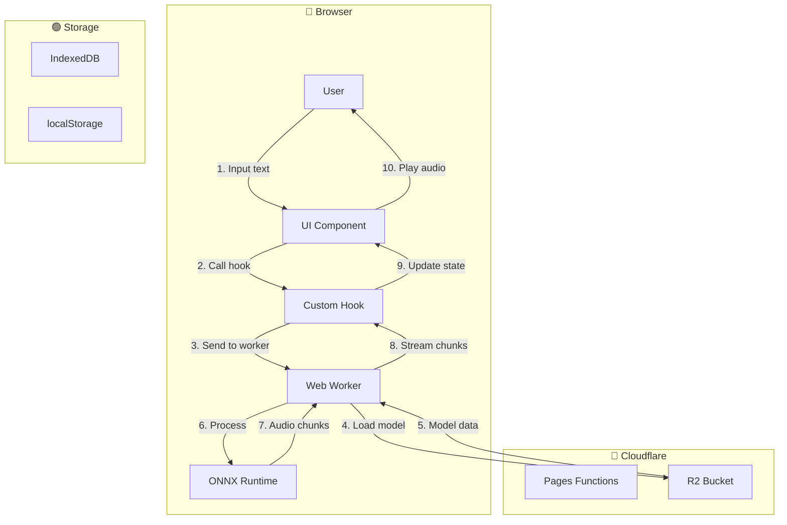

# Feature Specification Template (TTS App)

> Use this template when creating a new feature specification. Copy this file to
> `.sdlc/specs/REQ-XXX-{feature-name}/SPEC.md`

---

## 📋 Metadata

| Field              | Value                                                  |
| ------------------ | ------------------------------------------------------ |
| **Feature ID**     | REQ-XXX                                                |
| **Feature Name**   | [Feature Name]                                         |
| **Status**         | Draft / In Review / Approved / In Progress / Completed |
| **Priority**       | P0 (Critical) / P1 (High) / P2 (Medium) / P3 (Low)     |
| **Owner**          | [Owner Name]                                           |
| **Created**        | YYYY-MM-DD                                             |
| **Target Release** | vX.Y.Z                                                 |

---

## 🔀 Mermaid Data Flow

> **REQUIRED** - Add Mermaid flowchart at the TOP so human can understand data
> flow instantly

### Flow Legend

| Box Color | Meaning                                 |
| --------- | --------------------------------------- |
| Blue      | Actor/Client/External                   |
| Purple    | Internal Layer (Component/Hook/Service) |
| Green     | Storage (IndexedDB/localStorage/R2)     |
| Red       | Error/Exception                         |

### Client-Side Flow Example



---

## 🎯 Overview

### Problem Statement

[What problem does this feature solve? Why do we need this?]

### Goals

- [Primary goal - what are we achieving?]
- [Secondary goals]

### Non-Goals

- [What this feature will NOT do]
- [What's out of scope]

---

## 👥 User Stories

### Story 1: [User Story Title]

**As a** [user role] **I want** [action/feature] **So that** [benefit]

**Acceptance Criteria:**

- [ ] [Criterion 1]
- [ ] [Criterion 2]
- [ ] [Criterion 3]

### Story 2: [User Story Title]

...

---

## 🏗️ Technical Design

### Architecture Overview

[How does this feature fit into the existing architecture?]

### Component Structure

```
src/features/{feature}/
├── components/
│   ├── {FeatureName}.tsx
│   └── {SubComponent}.tsx
├── hooks/
│   └── use{FeatureName}.ts
├── services/
│   └── {feature}Service.ts
├── types.ts
└── index.ts
```

### State Management

| State     | Solution                             | Justification |
| --------- | ------------------------------------ | ------------- |
| [State 1] | [React useState / Zustand / Context] | [Why]         |

### API Design (if needed)

#### Endpoints (Cloudflare Pages Functions)

| Method | Endpoint          | Description               |
| ------ | ----------------- | ------------------------- |
| GET    | /api/models       | List available TTS models |
| GET    | /api/model/{name} | Get specific model file   |

#### Request/Response Format

```typescript
// Request DTO
interface TtsRequest {
  text: string;
  model: string;
  voice?: string;
  speed?: number;
}

// Response DTO
interface TtsResponse {
  audio: Blob;
  duration: number;
  format: "wav";
}
```

---

### Time complexity

[Time complexity of the feature]

## 🔄 Flow Diagrams

### Main Flow

```
[User] → [Input] → [Validate] → [Process] → [Output] → [Display]
```

### Error Flow

```
[Error] → [Catch] → [User Feedback] → [Log]
```

---

## ⚠️ Edge Cases

| Case                         | Handling                 |
| ---------------------------- | ------------------------ |
| Empty text input             | Show validation error    |
| Model loading fails          | Show error, allow retry  |
| Browser doesn't support WASM | Show compatibility error |
| Audio playback fails         | Fallback to download     |
| IndexedDB quota exceeded     | Warn user, offer cleanup |

---

## 🔐 Security Considerations

- [ ] Input sanitization (text length, special characters)
- [ ] Model loading from trusted source only
- [ ] No sensitive data in logs
- [ ] User consent for audio usage

---

## 📊 Monitoring & Logging

### Key Metrics

- [Metric 1: e.g., Generation success rate]
- [Metric 2: e.g., Average generation time]

### Logs Required

- [Event: Model load start/success/fail]
- [Event: Generation start/complete/error]

---

## 🧪 Testing Strategy

### Component Tests

- [Test: Component renders correctly]
- [Test: User interaction triggers expected behavior]

### Integration Tests

- [Test: Worker communication]
- [Test: IndexedDB operations]

---

## 📦 Dependencies

### Internal

| Module   | Dependency |
| -------- | ---------- |
| [module] | [reason]   |

### External

| Library         | Version | Purpose       |
| --------------- | ------- | ------------- |
| onnxruntime-web | ^1.16   | TTS inference |
| tailwindcss     | ^3.4    | Styling       |

---

## ⏱️ Implementation Timeline

| Phase   | Tasks            | Estimated Effort |
| ------- | ---------------- | ---------------- |
| Phase 1 | [Task 1, Task 2] | [X] hours        |
| Phase 2 | [Task 3, Task 4] | [Y] hours        |

---

## 📝 Notes & Discussion

### Meeting Notes

- [Date]: [Topic] - [Decision]

### Open Questions

- [Question 1]
- [Question 2]

---

## ✅ Definition of Done

- [ ] Code implemented following conventions
- [ ] All tests pass
- [ ] No lint errors
- [ ] Code formatted
- [ ] Documentation updated
- [ ] Human approved
