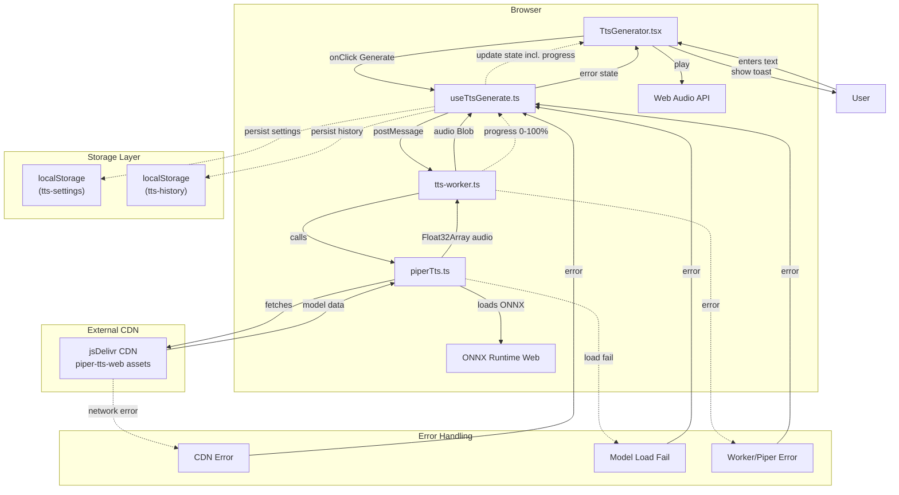

# Feature Specification - Piper TTS Engine

## 📋 Metadata

| Field              | Value            |
| ------------------ | ---------------- |
| **Feature ID**     | REQ-001          |
| **Feature Name**   | Piper TTS Engine |
| **Status**         | Completed        |
| **Priority**       | P1 (High)        |
| **Owner**          | Development Team |
| **Created**        | 2026-03-10       |
| **Target Release** | v1.0.0           |

---

## 🔀 Mermaid Data Flow

> **REQUIRED** - Mermaid flowchart at the TOP so human can understand data flow instantly.

### Flow Legend

| Box Color | Meaning                                 |
| --------- | --------------------------------------- |
| Blue      | Actor/Client/External                   |
| Purple    | Internal Layer (Component/Hook/Service) |
| Green     | Storage (IndexedDB/localStorage)        |
| Red       | Error/Exception                         |
| Orange    | CDN/External Services                   |

### Client-Side Flow



---

## 1. Overview

**Feature Name:** Piper TTS Engine  
**One-paragraph summary:** Client-side text-to-speech engine using Piper neural TTS with WebAssembly, enabling browser-based Vietnamese and English speech synthesis without server dependencies.

### Problem Statement

Users need to convert Vietnamese text to speech directly in the browser for:

- Offline accessibility when network is unavailable
- Reduced latency compared to server-side API calls
- Zero API costs for high-volume usage
- Privacy: audio processing stays on-device

### Goals

- Ensure all TTS processing runs **client-side** (no server API calls)
- Integrate Piper TTS engine (via `@mintplex-labs/piper-tts-web`) for client-side speech synthesis
- Support multiple voices (Vietnamese + English) with on-demand downloading
- Provide progress feedback during model loading and synthesis
- Cache downloaded voice models for faster subsequent loads
- Convert WAV output for Web Audio API playback

### Non-Goals

- Server-side TTS processing
- Real-time streaming synthesis (batch processing only)
- Custom voice training or fine-tuning
- Multi-speaker voice synthesis
- ASR (speech-to-text) in this feature
- Server-side storage or database (all data stays client-side)

### Success Criteria

| Metric                                | Target                                            |
| ------------------------------------- | ------------------------------------------------- |
| First-generation latency (short text) | < 10 seconds                                      |
| Cached voice load time                | < 1 second                                        |
| Generation success rate               | > 95%                                             |
| Bundle size increase                  | < 5MB (WASM + ONNX)                               |
| Browser compatibility                 | Chrome, Firefox, Safari, Edge (latest 2 versions) |
| Cloudflare Pages compatibility        | Works on Cloudflare Pages (Edge runtime)          |

---

## 2. User Stories

### Story 1: Generate Vietnamese Speech

**As a** Vietnamese user **I want** to enter text and hear it spoken **So that** I can preview TTS output in my native language

**Acceptance Criteria:**

- [ ] Textarea accepts up to 5000 characters (configurable via `config.tts.maxTextLength`)
- [ ] Voice dropdown shows at minimum: Vietnamese (vi_VN-mid-ori), English Female, English Male
- [ ] Generate button disabled when text is empty or only whitespace
- [ ] Progress percentage displayed during generation (0-100%)
- [ ] Audio auto-plays after successful generation
- [ ] Error toast shows friendly message on failure (not raw error)

**Priority:** P0 (Must Have)

---

### Story 2: Playback Controls

**As a** user **I want** to control audio playback **So that** I can review the generated speech

**Acceptance Criteria:**

- [ ] Play/Pause toggle button visible after generation
- [ ] Stop button resets playback to beginning
- [ ] Audio continues playing if user scrolls page
- [ ] Multiple generations create new audio (not replace)

**Priority:** P0 (Must Have)

---

### Story 3: Generation History

**As a** user **I want** to access previously generated audio **So that** I can replay or reuse them

**Acceptance Criteria:**

- [ ] History panel shows last 50 generations
- [ ] Each entry displays: text preview (truncated), voice name, timestamp
- [ ] Click on history item replays that audio
- [ ] "Refill" button loads history text back into textarea
- [ ] History persists across browser sessions (localStorage)

**Priority:** P1 (High)

---

### Story 4: Voice Model Caching

**As a** user **I want** downloaded voice models cached locally **So that** subsequent uses are faster

**Acceptance Criteria:**

- [ ] First use triggers voice model download from CDN
- [ ] Download progress shown to user
- [ ] Cached voices load without network on return visits
- [ ] Settings panel shows list of cached voices with sizes
- [ ] User can delete individual cached voices

**Priority:** P1 (High)

---

### Story 5: Settings Persistence

**As a** user **I want** my preferences saved **So that** I don't need to re-select them each visit

**Acceptance Criteria:**

- [ ] Selected voice persists after page reload
- [ ] Speech speed (0.5x - 2.0x) persists
- [ ] Settings stored in localStorage key: `tts-settings`

**Priority:** P1 (High)

---

## 3. Technical Design

### 3.1 Architecture Diagram

See **Mermaid Data Flow** at the top of this document for the full client-side flow (UI → Hook → Worker → PiperLib → ONNX/CDN → audio playback and persistence).

### 3.1.1 Technical Constraints

| Constraint              | Requirement                                                         |
| ----------------------- | ------------------------------------------------------------------- |
| **Deployment Target**   | Cloudflare Pages                                                    |
| **Processing Location** | Client-side only (browser)                                          |
| **Worker Support**      | Must work with Cloudflare Workers (Edge runtime restrictions apply) |
| **No Node.js APIs**     | Cannot use `fs`, `path`, `crypto` - use Web APIs only               |
| **WASM Compatibility**  | Must work with Cloudflare's WASM limits                             |
| **Storage**             | Use `localStorage` / `IndexedDB` - no server-side storage           |

> **Note:** Since TTS runs client-side, Cloudflare Pages serves only static assets (HTML/JS/CSS). All TTS processing happens in user's browser, so Edge runtime limitations don't directly affect TTS performance.

### 3.2 Data Model

```typescript
// src/features/tts/types.ts

interface TtsRequest {
  text: string;
  model: string;
  voice?: string;
  speed?: number;
}

interface TtsResponse {
  audio: Blob;
  duration: number;
  format: "wav";
}

interface TtsVoice {
  id: string;
  name: string;
  gender: "male" | "female";
}

interface TtsModel {
  name: string;
  size: number;
  voices: TtsVoice[];
}

interface TtsSettings {
  model: string;
  voice: string;
  speed: number;
  volume: number;
}

type TtsStatus = "idle" | "loading" | "generating" | "playing" | "error";

// src/features/tts/store.ts
interface TtsHistoryItem {
  id: string;
  text: string;
  model: string;
  voice: string;
  speed: number;
  audioUrl: string;
  duration: number;
  createdAt: number;
}
```

### 3.3 Module Structure

```
src/
├── lib/piper/
│   └── piperTts.ts           # Piper wrapper class
├── workers/
│   └── tts-worker.ts          # Web Worker for TTS
├── features/tts/
│   ├── components/
│   │   ├── TtsGenerator.tsx  # Main UI
│   │   ├── AudioPlayer.tsx   # Playback controls
│   │   └── HistoryPanel.tsx  # History list
│   ├── hooks/
│   │   └── useTtsGenerate.ts # Generation hook
│   ├── types.ts              # TypeScript types
│   ├── store.ts              # Zustand store
│   └── index.ts              # Barrel export
├── lib/storage/
│   └── history.ts            # History operations
├── config.ts                 # App configuration
└── app/
    └── page.tsx              # Home page
```

### 3.4 API Surface

#### PiperTts Class API

```typescript
// src/lib/piper/piperTts.ts

class PiperTts {
  async loadModel(config?: PiperConfig): Promise<void>;
  async getAvailableVoices(): Promise<PiperVoice[]>;
  async synthesize(
    text: string,
    options: PiperTtsOptions,
    onProgress?: (progress: number) => void,
  ): Promise<Float32Array>;
  async downloadVoice(
    voiceId: string,
    onProgress?: (progress: number) => void,
  ): Promise<void>;
  async getStoredVoices(): Promise<string[]>;
  async removeVoice(voiceId: string): Promise<void>;
  async terminate(): Promise<void>;
}
```

#### Zustand Store

```typescript
// src/features/tts/store.ts

interface TtsState {
  settings: TtsSettings;
  status: TtsStatus;
  progress: number;
  currentAudio: Blob | null;
  currentAudioUrl: string | null;
  history: TtsHistoryItem[];
  error: string | null;

  // Actions
  setSettings: (settings: Partial<TtsSettings>) => void;
  setStatus: (status: TtsStatus) => void;
  setProgress: (progress: number) => void;
  addToHistory: (item: TtsHistoryItem) => void;
  removeFromHistory: (id: string) => void;
  setError: (error: string | null) => void;
}
```

### 3.5 Business Logic

#### Text Validation Flow

```
1. User enters text
2. isTextValid(text, maxTextLength) called
3. If invalid: show alert with error message, disable Generate button
4. If valid: enable Generate button
```

#### Generation Flow

```
1. User clicks "Generate"
2. Set status to "generating", reset progress to 0
3. Post message to worker with { type: "generate", payload: {...} }
4. Worker calls piperTtsEngine.synthesize()
5. Progress updates via onProgress callback (0-100%)
6. On completion: worker returns Float32Array audio
7. Convert to Blob with type "audio/wav"
8. Save to history via addHistoryItem()
9. Set currentAudio in store, auto-play
10. Set status to "playing"
```

#### Error Handling

```typescript
function toFriendlyErrorMessage(raw: string): string {
  if (/Entry not found|not valid JSON/i.test(raw)) {
    return "Voice or model data could not be loaded. The selected voice may be unavailable or the CDN returned an error.";
  }
  return raw;
}
```

---

## 4. Edge Cases & Error Handling

| Case                          | Handling                                                             | Error Code           |
| ----------------------------- | -------------------------------------------------------------------- | -------------------- |
| Empty text input              | Disable Generate button, show validation                             | N/A                  |
| Text exceeds maxLength (5000) | Show alert: "Text exceeds maximum length"                            | `TEXT_TOO_LONG`      |
| Voice model load failure      | Show friendly error, offer retry button                              | `MODEL_LOAD_FAILED`  |
| CDN network failure           | Show error: "Unable to download voice model. Check your connection." | `CDN_ERROR`          |
| Browser doesn't support WASM  | Show compatibility error in UI                                       | `WASM_UNSUPPORTED`   |
| Audio playback fails          | Offer download as WAV fallback                                       | `PLAYBACK_FAILED`    |
| IndexedDB quota exceeded      | Warning toast, suggest clearing history                              | `STORAGE_FULL`       |
| Worker initialization fails   | Show error, disable generation                                       | `WORKER_INIT_FAILED` |

---

## 5. Security Considerations

| Concern          | Mitigation                                                                          |
| ---------------- | ----------------------------------------------------------------------------------- |
| Input validation | Text length limited to 5000 chars, no special character restrictions needed for TTS |
| CDN trust        | Only load from jsDelivr (trusted CDN), voices from Piper project                    |
| Data exposure    | Audio processed in-memory only, history stored in user's localStorage               |
| XSS via text     | Text passed directly to TTS engine (not rendered as HTML)                           |

---

## 📊 Monitoring & Logging

### Key Metrics

- Generation success rate (successful generations / total attempts)
- Average generation time by text length
- Voice model download success rate
- Cache hit rate for cached voices

### Logs Required

- Event: TTS session create start/success/fail
- Event: Synthesis start/complete/error
- Event: Voice download start/complete/error
- Event: Worker init success/fail

---

## 6. Testing Strategy

### Unit Tests

| Test                  | File                                       | Scenario                  |
| --------------------- | ------------------------------------------ | ------------------------- |
| `convertWavToFloat32` | `src/lib/piper/piperTts.ts`                | Handles 8/16/32-bit WAV   |
| `convertWavToFloat32` | `src/lib/piper/piperTts.ts`                | Stereo to mono conversion |
| `isTextValid`         | `src/lib/text-processing/textProcessor.ts` | Empty/valid/too long      |

### Component Tests

| Test                                       | File                                           |
| ------------------------------------------ | ---------------------------------------------- |
| Renders with voice dropdown                | `src/features/tts/components/TtsGenerator.tsx` |
| Generate disabled when text empty          | `src/features/tts/components/TtsGenerator.tsx` |
| Progress indicator shows during generation | `src/features/tts/components/TtsGenerator.tsx` |
| Error state displays correctly             | `src/features/tts/components/TtsGenerator.tsx` |
| History panel shows items                  | `src/features/tts/components/HistoryPanel.tsx` |

### Integration Tests

| Test        | Scenario                                             |
| ----------- | ---------------------------------------------------- |
| Full flow   | Enter text → Generate → Audio plays                  |
| Persistence | Change voice → Reload page → Voice selected          |
| Offline     | Download voice → Disconnect network → Generate works |
| History     | Generate 2x → Check history shows 2 items            |

---

## 7. Implementation Plan

### Phase 1: Core Infrastructure (Est. 6 hours)

| Step | Task                                   | Files                                             | Dependency | Status  |
| ---- | -------------------------------------- | ------------------------------------------------- | ---------- | ------- |
| 1.1  | Install dependencies                   | `@mintplex-labs/piper-tts-web`, `onnxruntime-web` | -          | ✅ Done |
| 1.2  | Create PiperTts wrapper class          | `src/lib/piper/piperTts.ts`                       | 1.1        | ✅ Done |
| 1.3  | Create Web Worker for TTS              | `src/workers/tts-worker.ts`                       | 1.2        | ✅ Done |
| 1.4  | Add WASM/ONNX config to next.config.ts | `next.config.ts`                                  | 1.1        | ✅ Done |

### Phase 2: State Management (Est. 3 hours)

| Step | Task                       | Files                                      | Dependency | Status  |
| ---- | -------------------------- | ------------------------------------------ | ---------- | ------- |
| 2.1  | Define TypeScript types    | `src/features/tts/types.ts`                | -          | ✅ Done |
| 2.2  | Create Zustand store       | `src/features/tts/store.ts`                | 2.1        | ✅ Done |
| 2.3  | Create useTtsGenerate hook | `src/features/tts/hooks/useTtsGenerate.ts` | 2.2, 1.3   | ✅ Done |

### Phase 3: UI Components (Est. 5 hours)

| Step | Task                          | Files                                           | Dependency | Status  |
| ---- | ----------------------------- | ----------------------------------------------- | ---------- | ------- |
| 3.1  | Create TtsGenerator component | `src/features/tts/components/TtsGenerator.tsx`  | 2.3        | ✅ Done |
| 3.2  | Create AudioPlayer component  | `src/features/tts/components/AudioPlayer.tsx`   | -          | ✅ Done |
| 3.3  | Create HistoryPanel component | `src/features/tts/components/HistoryPanel.tsx`  | 2.2        | ✅ Done |
| 3.4  | Create Settings panel         | `src/features/tts/components/VoiceSettings.tsx` | -          | ✅ Done |

### Phase 4: Utilities & Integration (Est. 3 hours)

| Step | Task                      | Files                                      | Dependency | Status  |
| ---- | ------------------------- | ------------------------------------------ | ---------- | ------- |
| 4.1  | Add text validation       | `src/lib/text-processing/textProcessor.ts` | -          | ✅ Done |
| 4.2  | Implement history storage | `src/lib/storage/history.ts`               | -          | ✅ Done |
| 4.3  | Integrate into app page   | `src/app/page.tsx`                         | 3.1-3.4    | ✅ Done |
| 4.4  | Add config defaults       | `src/config.ts`                            | -          | ✅ Done |

### Phase 5: Testing & Polish (Est. 4 hours)

| Step | Task                     | Files                | Dependency | Status  |
| ---- | ------------------------ | -------------------- | ---------- | ------- |
| 5.1  | Write unit tests         | Test files for utils | Phase 1-4  | ✅ Done |
| 5.2  | Write component tests    | Vitest/RTL tests     | Phase 3    | ✅ Done |
| 5.3  | Error handling polish    | All components       | Phase 3    | ✅ Done |
| 5.4  | Performance optimization | Worker, hooks        | Phase 1-2  | ✅ Done |

### Suggested PRs

| PR        | Scope                | Files                                                                          | Est. Size |
| --------- | -------------------- | ------------------------------------------------------------------------------ | --------- |
| **PR #1** | PiperTts Core        | `piperTts.ts`, `tts-worker.ts`, `next.config.ts`                               | Medium    |
| **PR #2** | Types + Store + Hook | `types.ts`, `store.ts`, `useTtsGenerate.ts`                                    | Small     |
| **PR #3** | UI Components        | `TtsGenerator.tsx`, `AudioPlayer.tsx`, `HistoryPanel.tsx`, `VoiceSettings.tsx` | Large     |
| **PR #4** | Integration + Utils  | `page.tsx`, `textProcessor.ts`, `history.ts`, `config.ts`                      | Medium    |
| **PR #5** | Tests + Polish       | Test files, error handling                                                     | Medium    |

### ⏱️ Implementation Timeline (Updated)

| Week   | Phase     | Focus                                  |
| ------ | --------- | -------------------------------------- |
| Week 1 | Phase 1-2 | Core infrastructure + state management |
| Week 2 | Phase 3   | UI components                          |
| Week 3 | Phase 4   | Integration + utilities                |
| Week 4 | Phase 5   | Testing + polish + release             |

---

## 8. Open Questions

1. **Voice Preview:** Should we add a "preview" button to hear a sample before generating full text?
2. **Concurrent Requests:** Should we support queueing multiple generation requests?
3. **Text Preprocessing:** Do we need SSML-like tag support for pronunciation hints?
4. **Analytics:** Should we add anonymous usage analytics to track popular voices/languages?
5. **Mobile Optimization:** Is the current UI optimized for touch devices?

---

## Dependencies

### External

| Library                      | Version | Purpose                      |
| ---------------------------- | ------- | ---------------------------- |
| @mintplex-labs/piper-tts-web | ^1.0    | Piper TTS WebAssembly engine |
| onnxruntime-web              | ^1.24   | ONNX Runtime for inference   |
| zustand                      | ^5.0    | State management             |

### Internal

| Module                  | Dependency Reason        |
| ----------------------- | ------------------------ |
| features/tts/store      | Zustand state management |
| features/tts/components | UI rendering             |
| lib/text-processing     | Text validation          |
| lib/storage/history     | History operations       |

---

## ✅ Definition of Done

- [ ] Code implemented following `.sdlc/context/conventions.md`
- [ ] All tests pass (`npm run test`)
- [ ] No lint errors (`npm run lint`)
- [ ] Code formatted (`npm run format`)
- [ ] Build passes (`npm run build`)
- [ ] Documentation updated (JSDoc, README if needed)
- [ ] Human reviewed and approved
